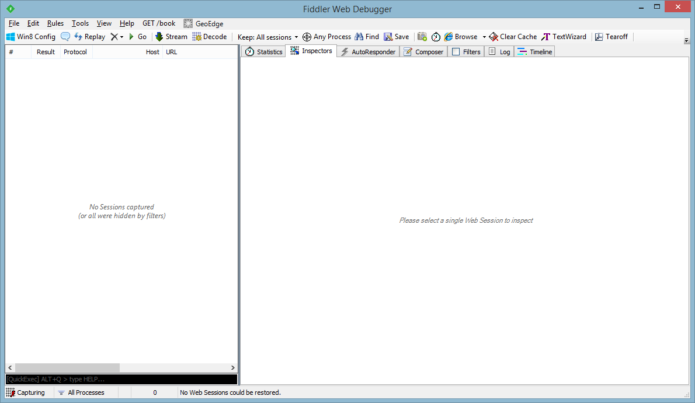
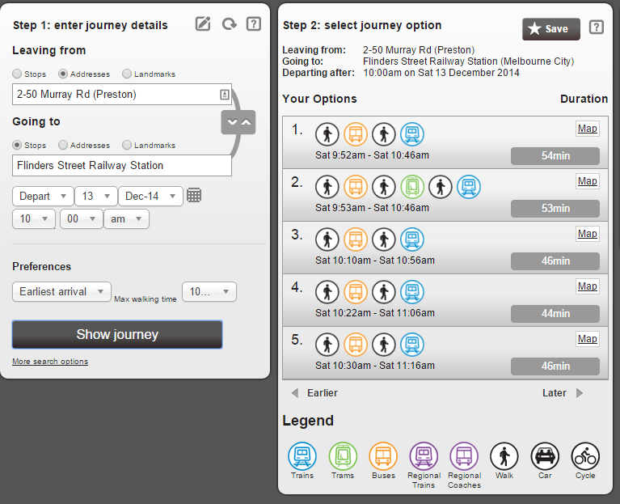
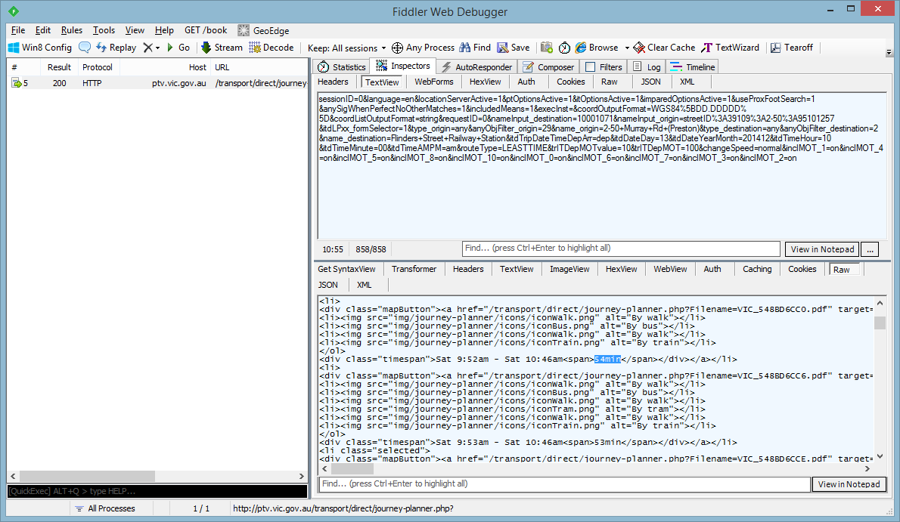

+++
title = "Heady House Hunting with D"
short = "in which I scrape `realestate.com.au` to find a house for my family"
date = 2015-01-13

[taxonomies]
tags=["d"]
+++

Several months ago, my family found ourselves in the most tedious of quests: searching for a new house. Our old house was showing all the signs of advanced age: weakened structural integrity, cracks in the walls, failing appliances - and there was only so much we could do to patch around the fundamental issues. "Enough," said we, "it's time to go."

So with high spirits and higher expectations, we plugged in our basic criteria into a real estate website - and then felt the despair rise as hundreds of results flooded in. This simply wouldn't do! None of us had the time or will to individually appraise over four hundred houses, especially when we'd have to keep looking at new houses as they entered the market.

<!-- more -->

We needed a more systematic approach to this problem. I compiled a list of criteria for the house - what do we need? What would be nice to have? What _don't_ we want? This let us nail down what our hypothetical house would require, and gave us a base upon which we could start investigating potential candidates. The only problem with that, of course, was that we still had to manually look at each house and determine whether they fit the criteria.

As you can imagine, this was not a satisfactory solution for anyone involved. I thought about the problem at hand, and thought of a simple approach. If we know what we're looking for, why not filter the list and *automatically* find suitable houses?

# Step 0: Getting Started
To begin with, I needed to decide what I was going to write this little project in. The choice of language or framework doesn't particularly matter in the short-term, but I wanted something that I was familiar with and would make my life easier.

With this in mind, I chose [D](http://dlang.org/) and [vibe.d](http://vibed.org/). I knew how to use both well, and D's ability to model strongly-typed data combined with its performance made it a winning choice for me. vibe.d allowed me to asynchronously connect to websites and collect data. I decided that I wanted the resulting houses to be displayed as a webpage, so it was a fairly straightforward task to use vibe.d to present a simple listing of houses.

I made the early decision to not invest too much time or effort into this; after all, it was an experimental hack with no guarantees as to whether it would produce workable results. As a result, general code quality is poor, with many losses in efficiency; acceptable for a proof-of-concept, but not ideal for production code.

I wrote a few helper methods to ease the collection of data, as well as HTTP communication. What these are used for will be explained later on:

```d
// Attempt to match a regular expression, and convert it to the specified type
Type getRegexMatch(string Regex, Type = string)(string toMatch);
// Return all the matches for a given regular expression
string[] getRegexMatches(string Regex)(string toMatch);
// Send a HTTP request to a given URL, and then call the handler with the response
void httpRequest(string url, scope void delegate(string, scope HTTPClientResponse) responder);
// Send a POST request with URL-encoded variables to a given URL, and then call the handler with the response
void httpPost(string url, string[string] vars, scope void delegate(scope HTTPClientResponse) responder);
```

# Step 1: The List
The first order of business is to produce a complete list of houses that we can analyze. We already have a good starting point for this: the search results that we obtained with our basic criteria.

For this, I chose to [scrape](http://en.wikipedia.org/wiki/Data_scraping) realestate.com.au. The idea was simple: get the [first page of results that fit our basic criteria](http://www.realestate.com.au/buy/property-house-with-4-bedrooms-between-0-400000-in-melbourne+-+northern+region+vic/list-1?newOrEstablished=established&numParkingSpaces=2&numBaths=2&maxBeds=any), get the link to each house, head to the next page, and then repeat until complete.

There are several approaches that can be taken when scraping a webpage. I wanted quick results, so I decided to use [regular expressions (regexes)](http://en.wikipedia.org/wiki/Regular_expression) which are used to extract data from text using specially-prepared expressions. In general, regexes are the [wrong tool for parsing webpages](http://stackoverflow.com/questions/1732348/regex-match-open-tags-except-xhtml-self-contained-tags/1732454#1732454), but a simple use case like this doesn't need more.

vibe.d is used to request the results page; upon getting the page back, we can break out our toolset on it. As webpages are HTML, and HTML is textual, data can be easily extracted from the page.

Inspecting the source HTML of the page, we notice that links to a house look like this:

```html
<a href="/property-house-vic-reservoir-3092468912" class="name" rel="listingName">18 Fake Street, Reservoir, Vic 3073</a>
```

All we need to do is to extract the URL from that link (the `/property-house-vic-reservoir-3092468912`), which can be done with a simple regular expression:

```re
<a href='/(.+?)' class='name' rel='listingName'>
```

After storing all the results from the above regular expression, we can then use another regular expression to extract the next page link (which looks like `<li class="nextLink"><a href="/buy/omitted-for-clarity" rel="newSearchPage">Next</a>`):

```re
<li class="nextLink"><a href="(.+?)"
```

Repeat the above two steps for each page and before long, we'll have a complete list of URLs to houses that satisfy the basic criteria. That's the easy part done.

# Step 2: Basic Data
Now that we've got our fancy list of house URLs, how do we turn this into something useful? Why, it's just as simple as Step 1: we visit each house URL, and extract all the relevant data.

The page for each house contains vital information that we can collect and use for our needs. A sample page can be seen [here](house1.html); its structure is similar to the real page, but I've simplified it in order to highlight the core data (images courtesy of [placekitten](http://placekitten.com/)). Some analysis of the HTML later, and we can create simple regular expressions that can be used to extract all the relevant data points on the page, including, but not limited to, the address, suburb, post code, land size, price, and more.

Since most of these are presented in the same way, the resulting regular expressions are quite similar. They all function in the same fashion: they extract the contents of a given HTML tag. For example, here are two of the expressions:

Getting the description of the house (Example: `<p class="body">Lorem ipsum dolor sit amet, consectetur adipiscing elit.</p>`):

```re
<p class="body">(.*?)</p>
```

Getting the number of bedrooms (Example: `<li>Bedrooms:<span>4</span></li>`):

```re
<li>Bedrooms:<span>([0-9]+?)</span></li>
```

Once all is well and done, we now have basic data about each house. Not enough to finish our quest, but enough to start with.

We take all of the data pertaining to a single house, and store it in a D structure. This process is then repeated for each house, with the resulting structs being placed in a list. This forms the basis of our database of houses, but we're not done yet.

```d
struct Suburb
{
    uint postCode;
    string name;
}

enum HomeBroadband
{
    None,
    NBN,
    Cable,
    ADSL2,
    Unknown
}

enum HomeTelephone
{
    None,
    Landline,
    NBNLandline,
    Unknown
}

struct House
{
    string name;
    Suburb suburb;
    string price; // Price is not always a number (see auctions, etc)
    uint landSize = 0;
    uint travelTime = 0;
    string url;
    string imageUrl;
    string description;
    string agencyName;
    uint bedrooms;
    uint bathrooms;
    uint toilets;
    uint garageSpaces;
    HomeBroadband broadband = HomeBroadband.Unknown;
    HomeTelephone telephone = HomeTelephone.Unknown;
}

House[] houses;

void housePageResults(string url, scope HTTPClientResponse response)
{
    auto text = response.bodyReader.readAllUTF8();

    House house;
    house.name =
        text.getRegexMatch!`<span itemprop="streetAddress">(.*?)</span>`;

    auto suburb =
        text.getRegexMatch!`<span itemprop="addressLocality">(.+?)</span>`;

    auto postCode =
        text.getRegexMatch!(`<span itemprop="postalCode">([0-9]+?)</span>`, uint);

    house.suburb = Suburb(postCode, suburb);

    house.price =
        text.getRegexMatch!`<span class="priceText">(.+?)</span>`;

    // Repeat the above for the remaining fields

    houses ~= house;

    // Get additional data here
}
```

# Step 3: Additional Data
When it comes to searching for a house, it's what the real estate agent _isn't_ telling you that could make or break your final decision. Of importance to us was availability of public transport and internet/landline services - for obvious reasons, an agent (or the listing they prepare) won't tell you whether either of these two are lacking.

What can we do to help inform our decision making process and ensure we're seeing the full picture? As it turns out, these two criteria can be checked online via other services. The basic data we collected before provides us the address of each house - we simply automatically submit it to these external services, and get the information we need.

For my use case, I needed to automatically check the length of a public transport journey from a given address to the city using the [Public Transport of Victoria Journey Planner](http://ptv.vic.gov.au/journey#jpsearch%5Baction%5D=showPlanner), as well as checking telecommunications availability via the [Optus website](http://www.optus.com.au/shop/broadband/home-broadband).

There's a general approach that can be taken to automating both of these - use a web debugging proxy, such as [Fiddler](http://www.telerik.com/fiddler), send a request to the service with sample data, observe the communication between the website and the service via Fiddler, and then replicate the communication in our program.

To demonstrate this, here's what I did for the journey planner:

1. Launch Fiddler, and have it capture web traffic:

    

2. Fill out the Journey Planner form with sample data (in this case, the address of a shopping centre), and submit the request to the service by pressing Show Journey.

    

3. Stop capturing in Fiddler, and look at the resulting request and response for the form that was just submitted.

    

From the resulting Fiddler dump, we can begin to divine what we need to know for automating this service. First, we can see that the request (the text under TextView in the top-half) submitted is [URL-encoded](http://en.wikipedia.org/wiki/Percent-encoding#The_application.2Fx-www-form-urlencoded_type); this lets us know *how* to send the data to the service. After that, we can break down the request data; the names of each field in the request are fairly self-explanatory, giving us everything we need to construct our very own request.

Next up, understanding the response (bottom-half of the window). Looking at the response in Raw view, something becomes apparent: this is actually more HTML! Since we only need *one* thing from this response, the travel time (`<span>54min</span>`), this is a problem easily solved with, you guessed it, regular expressions:

Extract the time span from the response:

```html
<div class="timespan">.*?<span>(.*?)</span></div>
```

Extract the number of hours and minutes from the time span:

```re
([0-9]+)h
```

```re
([0-9]+)min
```

Finally, we need to combine what we know in order to automate the process. We know what the request is composed of, and how to interpret the response - so what's left is automation busywork. We take the URL from Fiddler (which can be seen in the left half) and then write some code that will submit a [POST request](http://en.wikipedia.org/wiki/POST_%28HTTP%29) with URL-encoded data that conforms to the aforementioned format, applies our regular expression to the response to extract the travel time, and then adds this to the house's entry in our database. Congratulations - we've successfully automated the process of finding out the travel time to a given destination (in this case, the city) for a given house.

I implemented this as an asynchronous process so that multiple houses could be updated at once. To this end, the function takes in a result handler that gets called once the website provides a result; in hindsight, this was not the ideal way to implement this as it led to code cleanliness issues.

```d
void getJourneyToFlinders(
    string origin, SysTime time, void delegate(uint) resultHandler)
{
    string[string] vars;
    vars["sessionID"] = "0";
    vars["type_origin"] = "any";
    vars["name_origin"] = origin;
    vars["type_destination"] = "any";
    vars["name_destination"] = "Flinders Street Railway Station";
    // Many, many more variables removed for readability - default values

    bool pm = (time.hour >= 12);
    auto hour = pm ? time.hour - 12 : time.hour;
    vars["itdDateDay"] = time.day.to!string;
    vars["itdDateYearMonth"] =
        time.year.to!string ~ time.month.to!ubyte.to!string.rightJustify(2, '0');
    vars["itdTimeHour"] = hour.to!string;
    vars["itdTimeMinute"] = time.minute.to!string;
    vars["itdTimeAMPM"] = pm ? "pm" : "am";

    httpPost(`http://ptv.vic.gov.au/transport/direct/journey-planner.php`, vars,
        (scope HTTPClientResponse response)
        {
            auto text = response.bodyReader.readAllUTF8();

            auto timeString =
                text.getRegexMatch!(`<div class="timespan">.*?<span>(.*?)</span></div>`);

            if (timeString.empty)
                return;

            auto minutes = timeString.getRegexMatch!(`([0-9]+)min`, uint);
            auto hour = timeString.getRegexMatch!(`([0-9]+)h`, uint);

            if (hour != uint.init)
                minutes += hour * 60;

            resultHandler(minutes);
        });
}
```

That's an application of the general process. I did much the same thing for the Optus website; the biggest difference was that the response was in JSON, which allowed me to easily interpret it and extract the relevant information about connectivity. Of note is that this technique could be applied to *any* service - by taking what we already know (i.e. the address, the suburb, etc) and plugging it into another service, we can rapidly collect more data of use.

# Step 4: Filter and Score
Alright! We've collected all the data we need. There's always more data available, but this is enough for our purposes. Now, to the fun part: using what we have to deliver judgement upon each house. Currently, we have our 400+ strong database of houses - each fully decked out with relevant information - but no way of trawling through them and sorting out the gems from the lost causes.

We start off with the basics: an elementary filter, designed to eliminate houses that simply won't do, other criteria be damned. For us, this meant filtering out everything with a public transport travel time of over 70 minutes, wrongly categorized homes (naughty real estate agents putting certain properties under the wrong category means we have to detect them via keywords in the description), and houses with a price (if available) over a certain threshold. This filter could be arbitrarily tightened, but I chose to keep it relatively loose in order to ensure only the worst of the worst were being removed from consideration.

```d
bool checkHouse(House a)
{
    if (a.travelTime > 70)
        return false;

    // Filter out units
    if (a.description.canFindLowercase("unit development"))
        return false;

    // Repeat the above for "under construction" and "town planning" so that non-existent properties are filtered out

    auto priceThousands = a.attemptedPriceInThousands;
    if (priceThousands > 450)
        return false;

    return true;
}

houses = houses.filter!(checkHouse).array();
```

This eliminates most of the garbage, but it doesn't help us with our fundamental problem: how do we sort through what's left? As you may have guessed from the title of this section, the solution is quite simple, and rather elegant: we numerically score each house based on the data we have available.

This scoring system is completely arbitrary - the value is meaningless out of context, and solely exists to act as sorting criteria. With that out of the way, we begin with 1000 as a starting score. This number can be whatever we like - remember, the end user doesn't have to see it.

```d
@property auto score()
{
    int score = 1000;
```

After that, boost the score based on the number of bedrooms, bathrooms, toilets and garage spaces:

```d
    score += bedrooms * 10;
    score += bathrooms * 10;
    score += toilets * 10;
    score += garageSpaces * 20;
```

Since we want a land size of around 550 square metres - any smaller and it'd get claustrophobic, any larger and it'd be troublesome to maintain - we utilize a clamped quadratic curve to prioritize houses with around that land size:


```d
    float landsizeCoefficient(float x)
    {
        auto quadratic = 1/100.0f * (x - 550.0f);
        return max(min(1.15 * (1 - (quadratic * quadratic)), 1), 0);
    }
    score += 500 * landsizeCoefficient(landSize);
```

We apply a series of penalties to push back undesirable qualities. The first penalty is simple: the longer the travel time, the higher the penalty (a travel time of 50 minutes drops 500 points, in comparison to 68 minutes, which drops 680 points). The other two penalties push back homes which are inconvenient to investigate / purchase so that more convenient options are presented first:

```d
    score -= travelTime * 10;
    score -= price.canFindLowercase("auction") * 500;
    score -= price.canFindLowercase("price upon application") * 500;
```

Another series of simple penalties - we don't want a fireplace or a carport, and if it doesn't have a garage, drop it a thousand points:

```d
    score -= description.canFindLowercase("fireplace") * 250;
    score -= description.canFindLowercase("carport") * 250;
    score -= !description.canFindLowercase("garage") * 1000;
```

The final criteria to be considered is telecommunications availability. Very important, so any deficiencies are harshly punished. As a result of the variability of the Optus service checker, definitive results were not always available, so unknown connectivity is handled as a special case:

```d
    if (broadband == HomeBroadband.NBN)
        score += 400;
    else if (broadband == HomeBroadband.Cable)
        score += 100;
    else if (broadband == HomeBroadband.ADSL2)
        score += 50;
    else
        score -= 800;

    if (telephone == HomeTelephone.Unknown)
        score += 25;
    else if (telephone != HomeTelephone.None)
        score += 100;
    else
        score -= 800;
```

To finish, we return our calculated score:

```d
    return score;
}
```

There were additional criteria in the original code - for example, certain suburbs were penalized - but I've elided them in the interest of simplicity of demonstration.

Now that we've defined a scoring function, we simply sort by each house's score, and we're done:

```d
houses.sort!((a,b) => a.score > b.score);
```

# Step 5: Present with Seasoning
The last step remains: presenting all of the data. The use of vibe.d makes this easy; [Diet templates](http://vibed.org/templates/diet) allow us to quickly assemble a content-rich layout. As Diet templates allow for the combination of D code with layout, all I had to do was write a function to render a house, and then loop over the list of houses (which was passed in as a parameter to the template).

Using [Bootstrap](http://getbootstrap.com/) allowed me to concentrate on presenting the content without having to worry about styling concerns. Its grid system ensured that I could easily use more complicated layouts, such as the two-column layout used by the list of houses.

The function to render a house is quite simple: we define our basic layout - heading and body - and then fill it with data. A few helper functions (unshown), such as `renderTableRow`, are used to ensure that adding new data to the layout is easy. In the interest of showing the basic concept, only a few data points are shown in the code below.

```pug
- void renderHouse(T)(ref T house)
    div(class="panel panel-primary")
        div.panel-heading
            h3.panel-title= house.address ~ " " ~ house.suburb.postCode.to!string
            b= house.price
            i Calculated score: #{house.score}
        div.panel-body
            a(href=house.url)
                img.img-responsive(src=house.imageUrl, style="margin: auto;")
            h4 General
            table.table
                tbody
                    - renderTableRow("Agency name", house.agencyName);
                    - renderTableRow("Land size", house.landSize, "%s m²");
            ...

            p!= house.description
```

D's [ranges](http://dlang.org/phobos/std_range.html) make it easy to iterate over the list two at a time. We zip together two ranges, both of which provide a view of the original list with a stride of 2, and then render each house in the resulting zipped range. This is a quick and easy way to produce the desired result, and lets us easily tweak the layout in future.

```pug
div.container-fluid
    - foreach (e; zip(StoppingPolicy.longest, houses.stride(2), houses.dropOne().stride(2)))
        div.row
            - foreach (house; e)
                div.col-md-6
                    - renderHouse(house);
```

The final result, with two sample houses, can be seen [here](houselist.html). With real data, this produced a list of ~40 houses with all relevant information included - a definite improvement over the original 400 houses!

# Conclusion
There's still much that can be done to improve the quality of the results. More data can be pulled in from other sources; for example, publically accessible property reports could be accessed to determine the age of the property, as well as potentially missing data like the land size. The sky's the limit when it comes to pulling in data and coming up with new heuristics; I chose to leave it here because the results were good enough, but someone interested in further developing the concept could improve it considerably.

Of note is that these techniques are not restricted to this particular use case. They can be used for much more than this; whenever dealing with a large number of potential choices, one could utilize a similar strategy to reduce the size of the list of candidates. For example, this could be applied to searching for cars - the same bag of tricks can be used to great effect.

In the end, I was able to successfully use this to narrow the deluge of houses into something manageable; from there, we found a house that met our needs. I was surprised at how easy it was to produce decent results with limited effort; with only a few hours of work, I'd managed to vastly cut down on the number of houses that had to be investigated. With all of this in mind, this experiment worked beautifully despite its flaws.