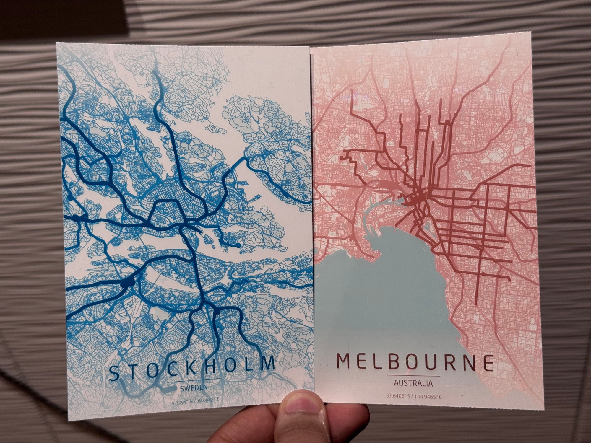

One day, I was looking at Bluesky and saw [olaren](https://bsky.app/profile/olaren.dev) [post](https://bsky.app/profile/olaren.dev/post/3mdbekwx5as2u) about [her fork of maptoposter](https://git.olaren.dev/Olaren/maptoposter), based on [originalankur's original](https://github.com/originalankur/maptoposter). Her fork is designed to emphasise transit networks, which I am ideologically primed to love (#fuckcars, btw).

Upon seeing the post, my empty walls, and my [Canon Selphy CP1500](https://www.usa.canon.com/shop/p/selphy-cp1500) (a postcard photo printer), an idea came to mind. I decided I'd print a poster for every city I've spent any amount of substantive time in - places I've either been to many times, or visited as an adult with memories worth keeping - and put them up on the wall in the order in which I first visited them.

<!-- more -->

I [forked maptoposter myself](https://github.com/philpax/maptoposter/pull/1) (a fork of a fork!) to add support for custom fonts, configurable output sizes, and to handle rendering the ocean correctly (turns out nobody's tried to posterise Sydney. _Good._). The idea was to use the font of each city's transit system, and to use a shared colour system for every city within the same country.

# Proving the concept

I started out with Melbourne and Stockholm - the two cities that I've lived in for extended periods - and picked out a colour scheme and font for each. Melbourne was assigned the `terracotta` theme with **Neo Sans Pro** (Metro Trains Melbourne's old brand font; more details below), and Stockholm was assigned the `ocean` theme with **FF Meta** (used by SL, Stockholm's transit authority). The results came out well:



With the concept proven, it was time to scale up.

# Scaling up

I compiled a list of 27 cities across 17 countries[^cities] and started working with Claude to assign colour schemes and research fonts. Conveniently, there are exactly 17 existing colour themes in maptoposter and 17 countries on my list, so every country gets its own scheme.

[^cities]: I have been to more cities than this, but I either don't remember them or they were stopovers. I was tempted to put Hong Kong in, but my time outside was limited to about five or six hours, so it felt unfair to claim visiting status for that. Cool airport train, though!

The font research was one of the more tedious aspects of the process. I wanted to use the *actual* font for each city wherever possible, and only settle for a substitute where the real font was either undocumented, proprietary with no public equivalent, or simply didn't exist (some cities just don't have a distinctive font, as far as I can tell. Please correct me if I'm wrong.). Claude's initial suggestions were decent, but relied on reuse of existing fonts where a more appropriate font couldn't be found (e.g. sharing **Neo Sans Pro**, assigned to Melbourne, with Brisbane and Adelaide, and such).

After a bit of back and forth, we were able to secure more accurate fonts through research (i.e. broadening the scope and looking at government guidelines to see what fonts are traditionally used for their branding), and for where a documented font could not be found, we elected to use fonts that spoke to the vibe of each city. I say "we" here, but it was largely Claude with some prodding from me, and I have to say that I'm pretty happy with the choices. They may not be typographically-accurate, but they're vibe-accurate, at least in my heart!

I generated the full set of commands and ran them in parallel using [mprocs](https://github.com/pvolok/mprocs). I initially attempted to run all 24 jobs on [my laptop](../../Hardware/Laptop.md), but ran out of RAM (running dozens of Python processes churning through tens of thousands of paths is memory-intensive, as it turns out). I spun up a `zellij` session on [my server](../../Hardware/Server.md), and let it burn through the remaining posters. Much better![^serial]

[^serial]: I wouldn't have run into RAM issues if I ran these one-by-one, but the process can take tens of minutes (between gathering the paths and rendering them), which led me to take full advantage of my computational resources.

# The result


What follows is every city, grouped by country, with the command used to generate it and the reasoning behind the colour scheme and font choices.

---

# Australia

Every Australian city shares the `terracotta` theme, defined by its warm ochre tones and dusty reds. My reasoning for choosing this was to evoke the Outback; even though I've never been (and thus it will not feature here), it is still an iconic Australiana palette.

## Melbourne

<CityPoster image="melbourne.png">

```sh
uv run src/maptoposter/__main__.py \
  --location "-37.8136, 144.9631" \
  -t Melbourne -s Australia -r 20000 \
  -T terracotta -S 4x6 --dpi 600 \
  -f fonts/NeoSans/NeoSansProRegular.OTF
```

Claude's reasoning:
> **Neo Sans Pro** was the brand typeface of Metro Trains Melbourne for years — a geometric sans-serif with distinctively rounded terminals that give it a friendly, modern feel. Melbourne has since moved to [Network Sans](https://okinterrupt.website/Network-Sans), a custom typeface that isn't publicly available, so Neo Sans Pro remains the best accessible option. Melbourne was the starting point for this entire project, so it felt right to use the closest thing to the real thing.

</CityPoster>

## Sydney

<CityPoster image="sydney.png">

```sh
uv run src/maptoposter/__main__.py \
  --location "-33.8688, 151.2093" \
  -t Sydney -s Australia -r 22000 \
  -T terracotta -S 4x6 --dpi 600 \
  -f "fonts/New Frank Regular.otf"
```

Claude's reasoning:
> **New Frank** is the custom typeface designed by Miles Newlyn for Transport for NSW's wayfinding system, rolled out across Sydney's train stations, ferry wharves, and light rail stops from 2013 onwards. It's a humanist sans with generous proportions, designed specifically for legibility in busy station environments. The 22km radius captures the full spread of Sydney's rail network from Bondi to Parramatta.

</CityPoster>

## Brisbane

<CityPoster image="brisbane.png">

```sh
uv run src/maptoposter/__main__.py \
  --location "-27.4698, 153.0251" \
  -t Brisbane -s Australia -r 18000 \
  -T terracotta -S 4x6 --dpi 600 \
  -f fonts/Lato/Lato-Regular.ttf
```

Claude's reasoning:
> **Lato** is the Queensland Government's current web design standard, and the closest thing Brisbane's TransLink network has to a consistent typeface — the system doesn't have a bespoke transit font the way Melbourne or Sydney do. Lato's warm, humanist character suits Brisbane's subtropical informality, and its open letterforms look great at the wide letter-spacing the poster format uses. It's also visually distinct from Neo Sans (Melbourne) and New Frank (Sydney), which was important to avoid the Australian cities all blurring together.

</CityPoster>

## Adelaide

<CityPoster image="adelaide.png">

```sh
uv run src/maptoposter/__main__.py \
  --location "-34.9285, 138.6007" \
  -t Adelaide -s Australia -r 15000 \
  -T terracotta -S 4x6 --dpi 600 \
  -f fonts/Archivo/static/Archivo-Regular.ttf
```

Claude's reasoning:
> Adelaide Metro has no documented brand typeface at all — it's one of the few Australian state transit systems without a distinctive typographic identity. **Archivo** is a precise grotesque with subtle warmth, chosen because Adelaide is Australia's most rationally planned city — Colonel Light's perfect grid — and Archivo has that same sense of measured order with just enough personality to not feel sterile.

</CityPoster>

---

# Japan

Claude's reasoning:
> The `japanese_ink` theme — warm washi-paper backgrounds with sumi-e ink tones, a deep vermillion accent for subway lines, and muted greys for the supporting network — felt like the only honest choice for Japan. It references the traditional ink-wash aesthetic without being kitsch about it.

## Tokyo

<CityPoster image="tokyo.png">

```sh
uv run src/maptoposter/__main__.py \
  --location "35.6762, 139.6503" \
  -t Tokyo -s Japan -r 25000 \
  -T japanese_ink -S 4x6 --dpi 600 \
  -f fonts/a-ttf-shin-go-pro/ATTFShinGoProRegular.ttf
```

Claude's reasoning:
> **Shin Go** (新ゴ) by Morisawa is the typeface you'll see across Tokyo Metro, JR East, and dozens of other Japanese rail operators. It's a modern gothic (sans-serif) that's become the de facto standard for Japanese transit signage. The 25km radius is large but necessary to capture Tokyo's sprawl out to places like Kichijoji and Tachikawa.

</CityPoster>

## Osaka

<CityPoster image="osaka.png">

```sh
uv run src/maptoposter/__main__.py \
  --location "34.6937, 135.5023" \
  -t Osaka -s Japan -r 18000 \
  -T japanese_ink -S 4x6 --dpi 600 \
  -f "fonts/Parisine/Parisine Regular/Parisine Regular.otf"
```

Claude's reasoning:
> Here's a fun bit of transit typography trivia: Osaka Metro adopted **Parisine** — the typeface designed by Jean François Porchez for the Paris Métro — in 2015 as part of a signage overhaul. It's a surprising choice that creates an unexpected link between two cities in this collection. Using Parisine for Osaka instead of Shin Go also gives it a distinct visual identity from Tokyo and Kyoto, which share the same font.

</CityPoster>

## Kyoto

<CityPoster image="kyoto.png">

```sh
uv run src/maptoposter/__main__.py \
  --location "35.0116, 135.7681" \
  -t Kyoto -s Japan -r 10000 \
  -T japanese_ink -S 4x6 --dpi 600 \
  -f fonts/a-ttf-shin-go-pro/ATTFShinGoProRegular.ttf
```

Claude's reasoning:
> **Shin Go** again, maintaining consistency with Tokyo. Kyoto's municipal subway and the various private railways serving the city all use this same typographic family. The 10km radius is tighter, reflecting Kyoto's more compact footprint compared to Tokyo and Osaka.

</CityPoster>

---

# United States

Claude's reasoning:
> The `midnight_blue` theme — deep navy backgrounds with gold accents — suggests American gravitas and the brass-and-marble aesthetic of grand transit stations like Grand Central and Union Station.

## New York

<CityPoster image="new_york.png">

```sh
uv run src/maptoposter/__main__.py \
  --location "40.7580, -73.9855" \
  -t "New York" -s "United States" -r 22000 \
  -T midnight_blue -S 4x6 --dpi 600 \
  -f fonts/helvetica-neue-5/HelveticaNeueRoman.otf
```

Claude's reasoning:
> **Helvetica Neue** has been the MTA's standard since Massimo Vignelli's landmark 1970 signage redesign of the New York City Subway. It's one of the most iconic pairings of typeface and transit system in the world. The 22km radius captures Manhattan, Brooklyn, Queens, and the Bronx.

</CityPoster>

## Washington

<CityPoster image="washington.png">

```sh
uv run src/maptoposter/__main__.py \
  --location "38.9072, -77.0369" \
  -t Washington -s "United States" -r 18000 \
  -T midnight_blue -S 4x6 --dpi 600 \
  -f fonts/helvetica-neue-5/HelveticaNeueRoman.otf
```

Claude's reasoning:
> WMATA (the Washington Metro) also uses **Helvetica Neue** for its signage — a common thread across many American transit systems. The midnight blue and gold theme feels particularly apt for DC, echoing the city's monumental architecture and federal gravitas.

</CityPoster>

## San Francisco

<CityPoster image="san_francisco.png">

```sh
uv run src/maptoposter/__main__.py \
  --location "37.7749, -122.4194" \
  -t "San Francisco" -s "United States" -r 16000 \
  -T midnight_blue -S 4x6 --dpi 600 \
  -f fonts/helvetica-neue-5/HelveticaNeueRoman.otf
```

Claude's reasoning:
> BART's signage also uses **Helvetica Neue** variants, completing the American Helvetica trifecta. The 16km radius is enough to capture the city proper and the Bay's western shore, with the transit lines reaching out toward Oakland.

</CityPoster>

---

# Sweden

My choice of `ocean` was designed to allude to the maritime nature of the country, especially in Stockholm and Gothenburg's history, while capturing the "cool Nordic" vibe of Sweden as a whole.

## Stockholm

<CityPoster image="stockholm.png">

```sh
uv run src/maptoposter/__main__.py \
  --location "59.3294, 18.0686" \
  -t Stockholm -s Sweden -r 10000 \
  -T ocean -S 4x6 --dpi 600 \
  -f fonts/Meta-Font/meta-normal.ttf
```

Claude's reasoning:
> **FF Meta** by Erik Spiekermann is used by SL (Storstockholms Lokaltrafik) across the Stockholm transit network. It's a humanist sans-serif that was designed as, in Spiekermann's words, the "complete antithesis of Helvetica." Stockholm was one of the two proof-of-concept cities for this project.

</CityPoster>

## Gothenburg

<CityPoster image="gothenburg.png">

```sh
uv run src/maptoposter/__main__.py \
  --location "57.7089, 11.9746" \
  -t Gothenburg -s Sweden -r 10000 \
  -T ocean -S 4x6 --dpi 600 \
  -f "fonts/Univers Condensed/universcondensed_medium.ttf"
```

Claude's reasoning:
> **Univers Condensed** is Västtrafik's official signage typeface, confirmed in their 2023 signage manual. This was a great find — I initially suggested reusing FF Meta from Stockholm, but the user pushed back and I dug deeper. The condensed cut gives Gothenburg's poster a noticeably different character from Stockholm's, despite sharing the same colour scheme.

</CityPoster>

---

# Norway

Claude's reasoning:
> The `blueprint` theme — deep fjord blues with white and pale blue line work — evokes technical drawings and the Norwegian coast. Norway's cities have a precision and quiet confidence that suits the structured, almost architectural feel of this palette.

## Oslo

<CityPoster image="oslo.png">

```sh
uv run src/maptoposter/__main__.py \
  --location "59.9139, 10.7522" \
  -t Oslo -s Norway -r 12000 \
  -T blueprint -S 4x6 --dpi 600 \
  -f fonts/frutiger/Frutiger.ttf
```

Claude's reasoning:
> **Frutiger** is used across Oslo's public transport network, operated by Ruter. Adrian Frutiger's classic humanist sans-serif was originally designed for airport signage (Charles de Gaulle), and its exceptional legibility has made it a favourite of transit systems worldwide.

</CityPoster>

## Bergen

<CityPoster image="bergen.png">

```sh
uv run src/maptoposter/__main__.py \
  --location "60.3913, 5.3221" \
  -t Bergen -s Norway -r 8000 \
  -T blueprint -S 4x6 --dpi 600 \
  -f fonts/frutiger/Frutiger.ttf
```

Claude's reasoning:
> **Frutiger** again, maintaining the Norwegian transit family. Bergen's Skyss system follows the same typographic conventions. The 8km radius is compact, reflecting Bergen's smaller footprint, but the dramatic topography — the city squeezed between fjords and mountains — should make for a striking poster.

</CityPoster>

---

# New Zealand

Claude's reasoning:
> The `forest` theme — deep greens and earthy tones — was an obvious match for New Zealand. It reflects the native bush, the mountain landscapes, and the country's clean, green identity. Neither city has meaningful public transit, so the posters are really about the geography.

## Christchurch

<CityPoster image="christchurch.png">

```sh
uv run src/maptoposter/__main__.py \
  --location "-43.5321, 172.6362" \
  -t Christchurch -s "New Zealand" -r 12000 \
  -T forest -S 4x6 --dpi 600 \
  -f fonts/Space_Grotesk/static/SpaceGrotesk-Regular.ttf
```

Claude's reasoning:
> Christchurch has no rail system and no distinctive transit typeface. **Space Grotesk** was chosen because Christchurch post-earthquake is a city that's been literally rebuilt from scratch — new architecture, new public spaces, a new identity. Space Grotesk's geometric, forward-looking character captures that "new city" energy.

</CityPoster>

## Queenstown

<CityPoster image="queenstown.png">

```sh
uv run src/maptoposter/__main__.py \
  --location "-45.0312, 168.6626" \
  -t Queenstown -s "New Zealand" -r 6000 \
  -T forest -S 4x6 --dpi 600 \
  -f fonts/Barlow/Barlow-Regular.ttf
```

Claude's reasoning:
> Queenstown has essentially no public transit to speak of. **Barlow** was chosen for its roots in California public infrastructure signage — it has slightly rounded terminals and a friendly legibility that reads as outdoorsy and unpretentious, very fitting for an adventure town. At 6km radius, this is the smallest map in the collection, but Lake Wakatipu should dominate beautifully.

</CityPoster>

---

# Thailand

Claude's reasoning:
> The `neon_cyberpunk` theme — near-black backgrounds with magenta and cyan lines — was too perfect for Bangkok to pass up. Those neon-soaked Sukhumvit Road nights, the BTS Skytrain cutting through towers of light, the Chao Phraya as a dark slash through the city. No other theme came close.

## Bangkok

<CityPoster image="bangkok.png">

```sh
uv run src/maptoposter/__main__.py \
  --location "13.7563, 100.5018" \
  -t Bangkok -s Thailand -r 20000 \
  -T neon_cyberpunk -S 4x6 --dpi 600 \
  -f fonts/Kanit/Kanit-Regular.ttf
```

Claude's reasoning:
> **Kanit** was designed by Cadson Demak, a Thai type foundry, with Latin letterforms whose angular geometry is derived from Thai script structures. Even the uppercase Latin characters have a distinctive sharpness you won't find in a Western-designed font. Bangkok's transit operators (BTS and MRT) don't have a single documented brand typeface, so this is a cultural choice rather than a transit-authentic one — but it's a much more honest representation of the city than slapping Helvetica on it.

</CityPoster>

---

# India

Claude's reasoning:
> The `bubblegum` theme — vibrant pinks and deep magentas — captures the colour and festival energy of Indian cities. It's bold, unapologetic, and impossible to ignore, much like Bangalore itself.

## Bangalore

<CityPoster image="bangalore.png">

```sh
uv run src/maptoposter/__main__.py \
  --location "12.9716, 77.5946" \
  -t Bangalore -s India -r 15000 \
  -T bubblegum -S 4x6 --dpi 600 \
  -f fonts/d-din/D-DIN.otf
```

Claude's reasoning:
> **DIN** is the actual typeface used by Namma Metro (Bangalore's metro system) for its English-language signage, paired with Kannada script. It's a typeface with deep roots in German engineering standards that's found a second life in transit systems around the world.

</CityPoster>

---

# Germany

Claude's reasoning:
> The `noir` theme — pure black background with white lines — suits Berlin's gritty, industrial edge. It's the most austere palette in the collection, and it matches the city's character perfectly.

## Berlin

<CityPoster image="berlin.png">

```sh
uv run src/maptoposter/__main__.py \
  --location "52.5200, 13.4050" \
  -t Berlin -s Germany -r 20000 \
  -T noir -S 4x6 --dpi 600 \
  -f fonts/Fira_Sans_Condensed/FiraSansCondensed-Regular.ttf
```

Claude's reasoning:
> BVG's actual typeface is **FF Transit**, designed by Erik Spiekermann (the same designer behind Stockholm's FF Meta). Since FF Transit is commercial and hard to source, **Fira Sans Condensed** serves as the substitute here — [recommended by the font community](https://www.reddit.com/r/fonts/comments/13qffe1/looking_for_a_freeware_alternative/) as the closest free alternative, with a similar condensed, infrastructure-oriented character.

</CityPoster>

---

# Spain

Claude's reasoning:
> The `sunset` theme — warm terracotta and peach tones — captures the Mediterranean light that defines Barcelona. Warm evenings on La Rambla, the golden stone of the Eixample, Gaudí's facades catching the late afternoon sun.

## Barcelona

<CityPoster image="barcelona.png">

```sh
uv run src/maptoposter/__main__.py \
  --location "41.3874, 2.1686" \
  -t Barcelona -s Spain -r 14000 \
  -T sunset -S 4x6 --dpi 600 \
  -f fonts/helvetica-neue-5/HelveticaNeueRoman.otf
```

Claude's reasoning:
> TMB (Transports Metropolitans de Barcelona) uses **Helvetica Neue** for its signage, sharing the same typeface as the American cities but given an entirely different feel by the warm colour palette.

</CityPoster>

---

# United Kingdom

Claude's reasoning:
> The `monochrome_blue` theme — understated blues on a near-white background — captures the classic restraint of British design. It's the most reserved palette in the collection, which felt right for London's quiet confidence.

## London

<CityPoster image="london.png">

```sh
uv run src/maptoposter/__main__.py \
  --location "51.5074, -0.1278" \
  -t London -s "United Kingdom" -r 24000 \
  -T monochrome_blue -S 4x6 --dpi 600 \
  -f fonts/johnston-itc/johnston-itc/johnstonitcstd-medium.otf
```

Claude's reasoning:
> **Johnston** (in its ITC incarnation) is one of the most famous transit typefaces in the world, designed by Edward Johnston in 1916 for the London Underground. TfL's current version (New Johnston) is proprietary, but Johnston ITC preserves the essential character — those distinctive diamond-shaped tittles and the perfect circle of the 'O'. The 24km radius is the largest in the collection, necessary to capture the full extent of the Overground and Tube network.

</CityPoster>

---

# Italy

Claude's reasoning:
> The `warm_beige` theme — sandstone tones and soft browns — evokes Mediterranean warmth, aged plaster walls, and the golden light of southern Italian cities.

## Palermo

<CityPoster image="palermo.png">

```sh
uv run src/maptoposter/__main__.py \
  --location "38.1157, 13.3615" \
  -t Palermo -s Italy -r 10000 \
  -T warm_beige -S 4x6 --dpi 600 \
  -f fonts/Fraunces/static/Fraunces_72pt-Regular.ttf
```

Claude's reasoning:
> **Fraunces** is the boldest font choice in the collection: it's a serif. Specifically an old-style soft serif with baroque-inflected curves and a slightly organic quality. Palermo is crumbling baroque palaces, Arab-Norman mosaics, and chaotic street markets — Fraunces captures that layered, imperfect grandeur. AMAT Palermo (the city's transit operator) has no distinctive brand font, so this is a purely aesthetic choice.

</CityPoster>

---

# Switzerland

Claude's reasoning:
> The `feature_based` theme is deliberately minimalist — near-monochrome with white backgrounds and dark grey lines. Choosing the most austere, functional palette in the collection for Switzerland was an intentional nod to Swiss design philosophy: form follows function, nothing is superfluous, every element earns its place.

## Zurich

<CityPoster image="zurich.png">

```sh
uv run src/maptoposter/__main__.py \
  --location "47.3769, 8.5417" \
  -t Zurich -s Switzerland -r 12000 \
  -T feature_based -S 4x6 --dpi 600 \
  -f fonts/frutiger/Frutiger.ttf
```

Claude's reasoning:
> **Frutiger** is the typeface used by ZVV (Zürcher Verkehrsverbund) and VBZ, and it was essentially born in Swiss transit — Adrian Frutiger designed it for Charles de Gaulle airport, but its Swiss roots run deep. Using Frutiger with the most minimal colour scheme in the collection makes Zurich's poster a quiet tribute to Swiss typographic tradition.

</CityPoster>

---

# France

Claude's reasoning:
> The `pastel_dream` theme — soft, muted tones with a warm paper-like background — captures Parisian elegance. It's refined without being precious, and the muted palette lets the complexity of Paris's dense transit network speak for itself.

## Paris

<CityPoster image="paris.png">

```sh
uv run src/maptoposter/__main__.py \
  --location "48.8566, 2.3522" \
  -t Paris -s France -r 18000 \
  -T pastel_dream -S 4x6 --dpi 600 \
  -f "fonts/Parisine/Parisine Regular/Parisine Regular.otf"
```

Claude's reasoning:
> **Parisine** was designed by Jean François Porchez specifically for the Paris Métro, optimised for legibility in the tunnels and on platform signage. It's one of the great bespoke transit typefaces — up there with Johnston for London and Shin Go for Tokyo. I originally suggested Fira Sans as a substitute, but the real thing was sourced in the end. Parisine also makes a surprise appearance on the Osaka poster — Osaka Metro adopted it in 2015.

</CityPoster>

---

# Czechia

Claude's reasoning:
> The `autumn` theme — golden tones, warm browns, and deep reds — captures Prague's famous golden-hour light. The city practically glows at sunset, all that baroque and Art Nouveau architecture catching the warm light, and this palette tries to bottle that feeling.

## Prague

<CityPoster image="prague.png">

```sh
uv run src/maptoposter/__main__.py \
  --location "50.0755, 14.4378" \
  -t Prague -s "Czechia" -r 12000 \
  -T autumn -S 4x6 --dpi 600 \
  -f fonts/d-din/D-DIN.otf
```

Claude's reasoning:
> DPP (Dopravní podnik Praha, Prague's transit operator) uses **DIN**-family signage throughout the metro and tram network. DIN's engineering heritage gives Prague's poster a precise, Central European character.

</CityPoster>

---

# Portugal

Claude's reasoning:
> The `copper_patina` theme — aged verdigris and teal on a light background — evokes the patina on Lisbon's maritime-era tilework and the famous azulejo tiles found throughout the city. It's the colour of old copper roofs and harbour-side facades, weathered by Atlantic air.

## Lisbon

<CityPoster image="lisbon.png">

```sh
uv run src/maptoposter/__main__.py \
  --location "38.7223, -9.1393" \
  -t Lisbon -s Portugal -r 12000 \
  -T copper_patina -S 4x6 --dpi 600 \
  -f fonts/Josefin_Sans/static/JosefinSans-Regular.ttf
```

Claude's reasoning:
> Metropolitano de Lisboa has no single documented brand typeface. **Josefin Sans** was chosen for its clear Art Deco DNA — the city's metro stations are famous for their tile art, much of it in Art Deco and Art Nouveau styles, and Josefin Sans mirrors that clean-lines-with-elegance aesthetic.

</CityPoster>

---

# Belgium

Claude's reasoning:
> The `emerald` theme — deep greens with bright accents on a dark background — nods to Brussels' Art Nouveau heritage (think Victor Horta's green-tinted ironwork) and the city's association with the European institutions.

## Brussels

<CityPoster image="brussels.png">

```sh
uv run src/maptoposter/__main__.py \
  --location "50.8503, 4.3517" \
  -t Brussels -s Belgium -r 12000 \
  -T emerald -S 4x6 --dpi 600 \
  -f fonts/univers/UniversRegular.ttf
```

Claude's reasoning:
> **Univers** is the typeface used by STIB/MIVB (Brussels' bilingual transit operator) for its signage. Designed by Adrian Frutiger — the same designer behind Zurich and Oslo's Frutiger — Univers is the more structured, systematic sibling, fitting for a city that hosts the European Parliament.

</CityPoster>
