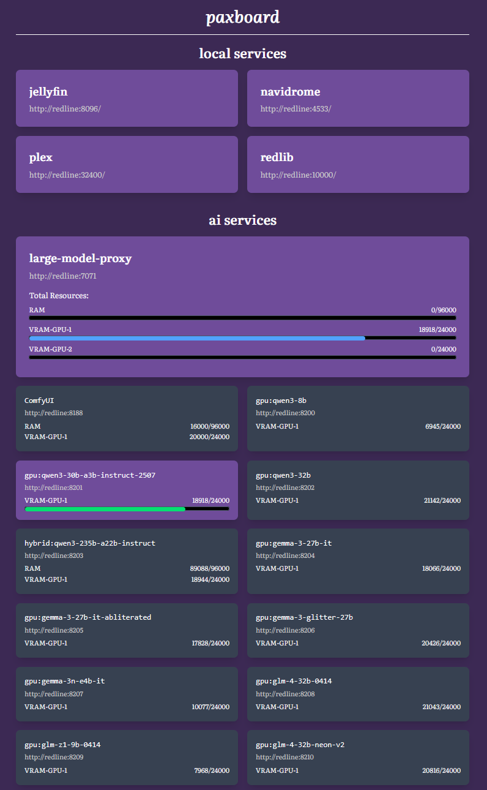

+++
title = "a mostly quiet week"
short = "I had other things to do this week, unfortunately"
datetime = 2025-08-06T03:30:00Z

[taxonomies]
tags=["meta", "paxboard", "nixos"]
+++

Between work and social engagements, I had limited time to work on my own personal projects this week.

<!-- more -->

Still, there are two things of note:

# paxboard

There exist a multitude of projects that are dedicated to giving you a custom homepage, complete with services and information that are relevant to you. Unfortunately, many of them are configured in YAML (instantly disqualifying) or just don't quite meet my sensibilities.

I spent an evening resolving this particular predicament for myself by combining `paxhtml`, `axum` and a copious amount of vibe-coding to produce `paxboard`, a personal home page that shows me my services and AI models:



It works, so I can't complain too much. That being said, I want to give it a styling pass that compacts it (so painfully undense! bluh!) and add more information (weather, clocks, links to other services of note to me, things of that nature). I wisely elected not to spend more time on this week, but I will revisit this in the near-future.

I also had a fairly dangerous idea: `paxhtml`'s element tree is serialisable, which means I should be able to bind it to [`mlua`](https://crates.io/crates/mlua), the Rust library for Lua, and build a Lua DSL for building webpages. I suspect it may be much nicer and faster to work with than my `paxhtml` HTML proc-macro, which I like, but cannot accuse of being pretty to look at. I can offer a similar interface to `paxhtml`'s builder functions, but Lua's tables and paren-dropping should make it possible to make a reasonably pretty DSL:

```lua
body { class = "max-w-[860px] mx-auto text-[var(--color)] bg-[var(--background-color)] p-4 transition-all duration-200 font-['Literata',serif]" } {
    header { class = "w-full" } {
        h1 { class = "text-3xl font-bold mx-auto text-center border-b border-white border-dotted pb-4 italic" } "paxboard"
    },
    main { class = "mt-4 space-y-8" } {
        -- elided
    }
}
```

I believe [NotNite](https://notnite.com/) may have already done something similar, but that's OK - the important part is that this sits on _my_ pile of Not-Invented-Here. I could just replace all of this with the JS webstack, but I'm traumatised by anything that requires active maintenance to stay up to date with the norms of the ecosystem (a previous version of this website was written in Ruby). No, I'm quite content to keep adding to my own pile of mud here.

# secret project

I made a fair bit of progress, but not nearly as much as I'd like. I went down several detours that, while useful research, were not ultimately germane to the problem I have at hand. Still, I'm back on track and I think the weekend should be a sufficient opportunity to get back on track. It is a bit sad that I have to sequester myself off to ensure that I continue making forward progress on this, but it should all be over in a few weeks. Aside from having to write the retrospective, anyway.

As part of this project, I trained a FLUX.1-dev LoRA, which is not a conceptually difficult operation, but given that my server runs NixOS, was far more difficult than it needed to be. I've written up my experience in [a note](/notes/ai/training-a-flux-lora-locally-with-nixos/), but man, what a gnarly time. The LoRA doesn't work all that well, which makes me feel great about having spent at least six hours on various attempts, but it's just part of the process.

# website

When I added the above note, I noticed that the code blocks were blowing out the layout's width, despite `css:max-width: 100%` being set. After trying out a few approaches with and without the help of Claude, I eventually threw in the towel and added a numerical `css:max-width` for the code blocks. I'm not really sure why it wasn't working, and I'm sure I could get to the bottom of it, but my patience had very much run out by that point.

Anyway! I noticed it didn't look _terrible_, so I applied the same `css:max-width` for images and varied the `css:max-width` size for this interstital content between posts and notes. The upshot is that I can now call this hackfix an intentional design feature. We take our wins where we can get them.
