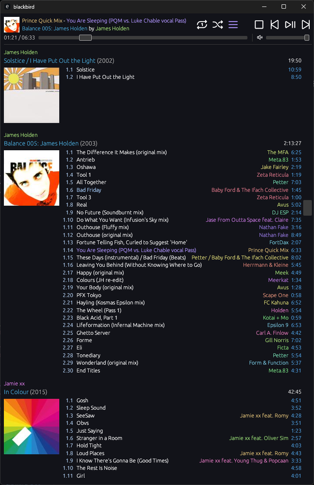

+++
title = "it's finally a music player!"
short = "Who has time to write an update when there's a music player to develop?"
datetime = 2025-09-24T18:00:00Z

[taxonomies]
tags=["blackbird", "website", "music", "hardware", "nixos"]
+++

Hello, hello! It has been just over three weeks since my last update. I'm not proud of that, but it is what it is: I've been doing some work for [Wayfarer Labs](https://wayfarerlabs.ai/), which has dominated much of my free time of recent. It's not always easy working across timezones!

Nonetheless, I'd say it's been a relatively productive three weeks, with the main focus being `blackbird`, my music player, so let's get stuck in:

<!-- more -->

# blackbird

Above is a screenshot of `blackbird`, circa six days ago. It has already changed a bit since then, but I'm still nailing down some of the specifics, so that's a matter for the next update. No, what I'd like to draw your eye to is how different it looks to [the last time it was featured here](../when-you-add-an-updates-section/index.md#blackbird). I have been quite busy indeed!

## korean text

To start off, a relatively small one: I noticed that Korean text did not render correctly, which caused me some consternation when looking at the K-pop in my library. `egui`, which `blackbird` uses for rendering, renders everything itself, which means the choice of font is quite important. In the interest of being able to display as much text as possible in a consistent fashion, I had previously chosen to use [GoNotoCurrent](https://github.com/satbyy/go-noto-universal), a merged multi-language variant of [Noto Fonts](https://notofonts.github.io/).

After hunting around a bit, I discovered that GoNotoCurrent included Chinese and Japanese, but frustratingly, not Korean hangul: as it turns out, there's a limit of 65,536 glyphs to a font, and GoNotoCurrent had to make executive decisions about how to allocate those glyphs. Luckily, I wasn't the only one to encounter [this issue](https://github.com/satbyy/go-noto-universal/issues/39), and switching to GoNotoKurrent[^kurrent] resolved my issues.

[^kurrent]: the K is, of course, for Korean: it drops symbols/emoji/math in favour of hangul

## refactoring

I then spent some time on a not-insignificant refactoring effort to clean up code and to better separate functionality, including switching to more of an event-driven architecture. Its development to date has been ad-hoc: I wrote - or, more realistically, _vibed_ - functionality into existence to meet my requirements, but this approach had led me somewhat astray, especially when it came to implementing more complex functionality. The refactoring finally freed me to make the changes I wanted to make.

## queueing

And what a change I started with! It would have been a stretch to call `blackbird` of the past a music player: after all, it was limited to playing _one_ track on repeat. It did not have a functional queueing system, and the existing "attempt" was limited by my overconfidence in Claude 3.7's abilities, which had made a right mess of things. This was something I needed to address for `blackbird` to actually be useful, but there was always something else pulling at my attention.

Eventually, I reached my frustration threshold with not being able to automatically traverse my library, which led me to write a basic spec of how I expected the queue system to work. once I was happy enough with it, I gave it to [OpenAI Codex, the CLI coding agent](https://github.com/openai/codex) (not to be confused with [OpenAI Codex, the cloud coding platform](https://openai.com/index/introducing-codex/), or [OpenAI Codex, the now-deprecated autocomplete model](https://openai.com/index/openai-codex/)), and told it to get it to work.[^codex]

[^codex]: Codex is interesting; it's not as polished as Claude Code, and it routes all of its system interaction through PowerShell, which means you _have_ to use YOLO mode for it to be usable on Windows. Still, GPT-5 has a different kind of work ethic to Claude; I can't quite put my finger on it, but it seems to generally work smarter, not harder.

A few back-and-forths later, I had something that worked! Not something I was happy with, per se - the models still don't write idiomatic Rust - but something that _functioned_: and that was the most important part, as it meant that I could escape the blank-page problem and shape it to what I wanted it to be. With a bit more work, I finally had my three playback modes: Sequential, Repeat One, and Shuffle. That's right - after **seven months**, my music player finally plays music by itself!

I had to take additional care to ensure that the modes were entirely algorithmic and reversible; that is, given the same track and mode, I should be able to go back and forth to my heart's content without maintaining explicit history in memory. GPT-5 came up with a solution using a priority heap and shuffle keys, and after some refactoring and optimisation work on my part (...there were a lot of O(N) allocations and traversals), everything now works reasonably well.

The queue is also backed by a caching system, which automatically caches several tracks to the left and right of the current track, as to remove the delay from having to load the next track. This is not quite sufficient for gapless playback - I need to keep the audio sink fed with the next track, so that it doesn't have to wait for the next track to be transferred betwen threads - but it's good enough to enjoy most albums, outside of mixes with track-to-track transitions.

## ui tweaks

### auto-scroll

A feature that I'd quite grown to like from foobar2000 was automatically scrolling the library view to the currently-playing track. This immediately situates your view of the library around what you're hearing, which aligns with my "spatial" memory for how the library is laid out. I have a vague idea of the neighbourhood of each track, so I can immediately switch to a track or album in the vicinity that might be of interest to me.

This took a bit of work to implement: I had to calculate the exact position of the target track to scroll to, then rebase it to the correct location in the local egui coordinate system (which is not the most intuitive, as widgets outside the `ScrollArea` count towards the height), and then plumb everything through to allow for autonomous movement. Still, it was totally worth it.

### volume slider

I added a quick volume slider underneath the primary playback buttons. My original plan was to leave it out: each OS has its own way of doing per-application volume control, and I didn't see much point in duplicating it. As it turns out, though, that's the exact reason I needed a volume slider: I wanted a consistent way to control the volume, regardless of what operating system I'm using `blackbird` on.

However, I suspect I might need to do some remapping. The relationship between the slider and the perceived volume does not seem linear; it doesn't really start getting quieter until the first 25% of the slider. This is to be somewhat expected; [human perception of volume is logarithmic](https://old.reddit.com/r/explainlikeimfive/comments/3xcul9/eli5_why_do_volume_sliders_in_applications_never/), so I just need to replicate that. At the same time, I was expecting `rodio` to do this for me; I guess they're leaving the mapping up to developer taste.

### library

I also wanted to use the "sort name" for each artist, which is a secondary name that normalises aspects of their names (including e.g. transliteration) to make them more amenable to sorting. I was able to get this working, but it's still imperfect:

- the sort names in use don't seem to match what's on MusicBrainz. I'm not sure _where_ they're coming from, actually.
- I had to reinsert the articles for the names (I want "The ..." artists to be next to each other), which is [a bit gnarly](https://github.com/philpax/blackbird/blob/445494a97829b03fb0b57f03299f6be18e1bbc0a/blackbird-state/src/lib.rs#L205-L231)
- non-Latin-alphabet artists still largely hang out near the end of the library

That being said, it was still a notable improvement, and with the help of an innovation I'll describe later, I can [show you what that improvement looked like](https://github.com/philpax/philpax.github.io/commit/820974ab13434dcde644348ad9aa4a79bd160077). The accents are sort of in the right place now!

As an aside, I also removed the margin between track names. The original spacing was an artifact of using `egui`'s text widgets, which apply margins by default; I carried this over into the virtual rendering implementation to mirror the existing behaviour. Having used it for some time, though, I realised that I can't escape my love for density. Look at how many more tracks can be fit within the same vertical space!

## album art

One of the bigger visual improvements is the presence of album art. This was present in an earlier version of `blackbird`, but was disabled as a result of suffering from two major faults: playing poorly with line-based virtual rendering, and crashing from repeatedly reloading the same album art. Well, I switched to truly-virtual rendering some time ago, so I really had no excuse not to do this properly!

I started my work here by getting the rendering right: I used placeholder imagery and ensured the album arts rendered correctly in both the Now Playing view and the library itself. Some iteration was required here to get the spacing right - and truth be told, I'm still not happy with it - but once it was good enough, I could move onto the next stage: loading images.

My previous implementation used an explicit cache, where the view would request arts to render based on what was immediately visible on screen. This led to an enormous amount of chugging while scrolling, as it would try to load all of the arts in-between. That simply wouldn't do, especially as I have over a thousand albums. Additionally, this cache lived in `blackbird-core` - that is, the logic layer - which just didn't seem right to me. A terminal UI over the core doesn't need to care about album art.

Instead, I chose to build an implicit cache that lives in the UI layer. When the UI wants to render an album art, it requests the image from the cache. If there's no art immediately available, the UI is given a placeholder image to render. However, we do not immediately request the art from the server: instead, we wait for some number of milliseconds (currently 100) to ensure that flyover albums don't have their arts requested in a scroll. This, as well as dialing in the caching behaviour, has given me an experience that I'm happy enough with.

...well, that's a lie: its deficiencies still bother me. For example, visiting the next track in shuffle mode will almost always lead to a spread of unloaded art, and it takes several seconds for it to fully resolve. I'm planning on working around this by preloading the arts surrounding the next track in the library, but that seems quite ugly.

Another hack I'm considering is storing extremely low-resolution variants of the arts, so we have something to show while the higher-resolution versions are loading in. Of course, that begs the question: why not just store the high-resolution arts? And I suppose that would be possible, but I'd like to minimise the on-disk footprint if possible.

## misc

In addition to the three modes mentioned above, I wanted to be able to properly enjoy albums. Something that Spotify encourages - and is a big part of why I wanted to move away from it - is the atomisation of music, such that you are constantly listening to individual tracks and not the albums that they're supposed to be a part of.

To help avoid this, I added the Album Shuffle and Album Repeat modes, which do what they say: I can now listen to a random album in its entirety, and then when I'm done, either listen to it again from the beginning, or move onto another random album. I can finally experience the dark corners of my library.

Conversely, I spent a bit of time adding basic support for liking (see: starring) tracks, with support for liking albums coming later. I'm thinking that I'm going to add Liked Track Shuffle and Liked Album Shuffle as playback modes, so that I can hone in on the bangers when desired. Of course, this comes at a cost: there will be _seven_ playback modes, covering the full spectrum of the exploit/explore spectrum. It's a bit absurd, but this is a vanity project for myself, so I'm allowed to be absurd.

With that being said, I'm really quite happy with how things have turned out. In the span of the last three weeks, I have managed to finally construct a functional music player that I can use as my _primary_ music player! I can finally move off Spotify, and free myself from its yoke of algorithmic mediocrity.

# music library

Of course, with a functioning music player, I now need a music library worthy of it. I already had quite the hearty library prior to this, thanks to services that are no longer with us, but it hadn't seen much growth in the last few years thanks to my use of Spotify. In addition to that, it was kind of messy: the tags weren't perfect, album art was missing, etc.

## backfilling

For the first problem, I started backfilling as much of my library from Spotify as possible. I did this using [`blackbird-spotcheck`](https://github.com/philpax/blackbird/tree/main/blackbird-spotcheck), a tool that I'd built that took my Spotify history dumps (thank you, GDPR!) and correlates them with my Navidrome library to find the most-listened-to-on-Spotify-that-were-missing-locally albums.

I then found as many of them as I could on Bandcamp, and waited for the next Bandcamp Friday. [I've been busy](https://bandcamp.com/philpax). Unfortunately, not everyone puts their work up on Bandcamp, and it's not always the easiest to find digital downloads for the rest, especially if you care about archival-quality audio and want to compensate the artists. I've done my best, nonetheless.[^ototoy]

[^ototoy]: Did you know that [Ototoy](https://ototoy.jp) won't let you buy certain albums from outside of Japan? Similarly, did you know that a Japanese VPN will unlock these for you with no additional verification? I love regional restrictions. They make so much sense.

There's still plenty to backfill, but I'm off to a good start, and the local GDPR dumps mean I can continue to do this without an active Spotify subscription. The plan is to cancel mine sometime in the near-future; I just need to make sure I'm ready to fully disconnect.

## mending my library

Once I had the raw material for my library, I needed to retag it to bring it to its full potential. To do this, I initially started fixing them up by hand, but after investigating my options, I started to use [beets](https://beets.io/) for this work. I'll be honest: I was initially avoiding it because it was written in Python, which I [do my best to avoid](../../notes/Programming/Reasons_I_do_not_like_Python.md), but NixOS made it easy enough to ignore the sickness that laid underneath.[^naming]

[^naming]: That being said, the project is called _beets_, but the CLI is called `beet`. Sickness. I blame Python for this, one way or another.

At first, I did a straight import of my library without any retagging to establish a baseline. I then looked over the library and used `beet import` to manually rectify the most glaring deficiencies, and then continued to do this for dozens - possibly hundreds - of albums, before the worst of it was dealt with. I did this over the course of a few days, and took the time to dial in my [beets settings](https://github.com/philpax/nixos-configuration/blob/main/dotfiles/.config/beets/config.yaml) in the process.

While waiting for something long-lived to run, I decided I'd go for a full retag import of the library, which took over two hours and required frequent manual intervention to deal with the edge cases (especially singles, less-well-attested albums, comingled albums, multi-disc albums split across two albums, and more). Of course, while doing that, I changed my import strategy for compilation albums, so I had to do it _again_. Probably not the best use of my time, but it's done now.

With that, I finally have semi-decent tagging across the board. It's not perfect, especially with artists that have changed their performing name over time (this was partially dealt with by using the `artist_credit` beets setting), and with non-English artist names, which end up being a mix of inconsistent transliterations and original-language names (unfortunately, made worse by `artist_credit`). I think I'll just have to go in and manually fix these.

Finally, after implementing album art in `blackbird`, I realised that a great many of my albums did not have any album art: now, I know for a fact they did at some point, but I assume they were lost in the initial beets import. Luckily, it was pretty easy to solve this with [beets' `fetchart` plugin](https://beets.readthedocs.io/en/stable/plugins/fetchart.html); some configuration later, and the majority of my library now has album art. Now, the album art isn't all perfect - there's some real stinkers in there - but it's good enough. It can't all be perfect!

## ios playback?

Speaking of things that aren't perfect: I have a problem. Specifically, there's nothing that gives me a `blackbird`-like experience - my full music library in one list - on iOS, which is, for better or for worse, my current phone OS. I've tried [Amperfy](https://github.com/BLeeEZ/amperfy), [play:Sub](https://apps.apple.com/us/app/play-sub-music-streamer/id955329386), [Arpeggi](https://old.reddit.com/r/arpeggiApp/), asked [ChatGPT](https://chatgpt.com/share/68d41d83-a040-8003-9b0c-4ea184d12d7e) to track clients down for me, and have installed and uninstalled the active iOS clients out there.

I'm not really sure what to do here; the existing options aren't really compatible with how I listen to music. I have four potential solutions, but none of them are ideal:

- build a [PWA](https://en.wikipedia.org/wiki/Progressive_web_app) that offers a `blackbird`-like experience on mobile. To be honest, I'm not even sure this is possible: iOS is not really amenable to PWAs, and even if it were, I would assume it has strong feelings about long-lived applications that are constantly streaming data and playing music.
- beg the author of an existing app to add a song-based library view. I've asked the developer of Arpeggi, but I suspect it's too divergent from their vision to be supported.
- fork Amperfy and add my own library view
- write my own iOS app

The latter two require me to have a personal macOS environment to make apps with, which I don't currently have and can't justify. I could run macOS in a VM, but that's messy, especially as it's losing support for x86 soon. The play, I think, would be to get a Mac Mini, but I'm not going to do that for a single app.

Honestly, I'm not sure what to do here. I think I'll continue to suffer through the hierarchical categorisation of the existing iOS apps, and decide what to do from there. I could try writing a website-based frontend to Blackbird and see if it works as a PWA, I suppose?

# website

The last time I wrote an update, I was thinking about converting this website to Lua, based on the initial success I had with paxboard. After thinking about it some more, I decided that was another form of wheel-spinning procrastination, and decided to leave it as-is.

## music library

I think that was the right decision, because it's enabled me to build this [music library note](../../notes/Personal/Music.md), which presents my library with styling designed to ape `blackbird`. This is statically generated - it's quite the large HTML file - and it's based on a JSON export from `blackbird`. I was able to do this with relative ease by pulling in the export types from `blackbird`; it wouldn't have been that much harder in Lua, but having type safety is always welcome.

The fun thing about this is that the JSON is versioned, so I can see how my music library changes over time, including albums coming and going, changing of tags, and starring of tracks. This has already proven to be quite helpful for observing the changes made by the retagging process; you can see the full history [here](https://github.com/philpax/philpax.github.io/commits/main/assets/baked/music.json), in which you can see my tagging rework bordered on the obsessive.

That being said, parsing that much JSON and emitting that much HTML actually takes a noticeable amount of time in the iteration process, adding around a second. There are definitely optimisations I could do there, but I've worked around this for now by having `--fast` builds skip over the music library.

## misc writing

I wrote up some not-blog-post notes in the last three weeks. The first is a small treatise on [studying Swedish and Japanese simultaneously](../../notes/Personal/Studying_Swedish_and_Japanese_simultaneously.md); it's not all that detailed right now, but I hope to extend it over time. As with the music library, I look forward to seeing how this changes over time; I want it to reflect my thinking on the most productive way to study.

The second is a brief note on [shipping Python code to users' machines using uv](../../notes/Programming/Using_uv_to_ship_a_Python_application.md). I really, really don't think you should do this. It's messy and prone to breaking, even with the angelic presence of `uv`; Python is just not well-designed for operation in arbitrary environments. Still, I managed to get it working in a relatively reproducible fashion, so I've documented it for whatever poor soul needs to do this next.

# system administration

Finally, to close things out, some relatively sedate system administration business. I finally set up automatic internal backups on [my home server](../../notes/Hardware/Server.md) with the help of Claude; every week, my data is synchronised to other internal hard drives to provide some degree of redundancy. However, I'm not really happy or done with this: the hard drives are heterogeneous, there's no remote backup, and the source of truth is an external hard drive.

I'd like to fix this by replacing all of the internal hard drives with a ZFS drive pool of high-capacity HDDs, making those the source of truth, and then making the external drive the backup. Additionally, for the most important data, I'd like to back everything up to a Hetzner storage box automatically. The only reason I haven't done this yet is because the capital outlay for such a HDD array is quite high, especially in Europe; I'll re-evaluate once [Datablocks' white-label definitely-not-Seagate-despite-what-the-link-says 22TB hard drives](https://datablocks.dev/products/seagate-exos-x22-22-tb-sata-white-label-hard-drive) are back in stock.

I mentioned setting up [a study machine](../two-weeks-go-by/index.md#study-machine) to help me with my language study. The grinding noise eventually got to me; after investigating my options to rectify it, I gave in and ordered a slightly newer machine from Tradera (the Swedish equivalent to eBay): a HP EliteDesk 800 Generation 2. Unfortunately, I did not look closely enough at the photos: it's not thin-client sized, and is closer to a mini-ATX HTPC. Still, it's small enough to not be an issue.

It is much quieter than the Dell machine it's replacing, and it's capable of doing 4k60Hz[^refreshrate]. I was hoping that I could just carry my existing install over to the new machine, but the HP UEFI refused to boot the MBR-based NixOS install. Luckily, it being NixOS, it was trivial to reinstall and redeploy: I was back to where I was within an hour. I just had to back up my home directory, reinstall, copy my home directory back, and run my configuration-sync script. Sometimes, using NixOS is actually worth it! ...only sometimes, though.

[^refreshrate]: You would think that 30Hz wouldn't matter: after all, I'm primarily looking at dictionaries and Anki. Turns out it's pretty hard to ignore the latency and sluggishness of interacting with the UI.
