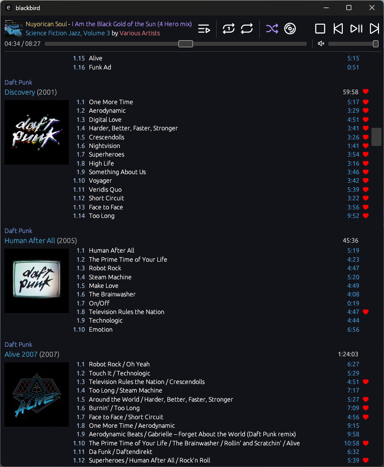

+++
title = "mending photos, not hearts"
short = "Because when you build a server, you should put it to good use."
datetime = 2025-10-06T03:30:00Z

[taxonomies]
tags=["blackbird", "website", "nixos", "photos"]
+++

Pretty small update to cover these last 12 days. I've been busy with [OWL Control](https://github.com/Wayfarer-Labs/owl-control), the project that I maintain for [Wayfarer Labs](https://wayfarerlabs.ai/), but the main thing I completed was to finally set up my own personal photo library.

<!-- more -->

# prismata

[Prismata](https://github.com/philpax/prismata) is an old prototype that I built at [Ambient](https://ambient.run/); I recently received permission to make it public. It's a voxel world sculptor, built in Rust and Bevy, and attached to ComfyUI for _prism projections_. These projections take a screenshot of the scene, paint over it with an AI image model (SDXL Turbo, for most of my testing), and then project the resulting paintover back into the world as voxels. It was very interesting to build out, but ultimately didn't go anywhere, due to two significant issues with the projections.

Firstly, lighting was baked into the voxels (e.g. the AI render would generate images with lighting already applied, and these would then carry over to the generated voxels). At the time, there were no good AI models for taking a rendered image and splitting it into its constituent components for re-rendering (diffuse, albedo, etc). These models now exist, but I'd have to figure out how to integrate them.

Secondly, and more critically, I was unable to automatically estimate depth for the rendered images. The overarching goal was to be able to rapidly craft a scene by repeatedly reprojecting new AI generations into it; something like [Viewfinder](https://store.steampowered.com/app/1382070/Viewfinder/), but instead of extruding existing imagery, you would be able to extrude entirely dreamt-up imagery on the fly.

Unfortunately, I just couldn't get this working; the depth estimation models weren't good / consistent enough between renders, and I couldn't get the maths right for unprojection (with both relative and metric depth). I'm certain that this _can_ be done, but I had to call it at some point and move onto other things.

For the problem of correlating different estimations, I came across [a paper which documented a method for aligning depth-estimated segments of a panorama](https://arxiv.org/html/2503.16611v1#S3.SS2.p2.3.1), which I think should work here; similar amounts of overlap need to be present, and human intervention should be possible if necessary. The primary point of contention that I can see is that that panoramas gracefully wrap around and connect, while a piecemeal generation may not; this would definitely require experimentation.

After failing to get automated scene extrusion working, there was a brief reinforcement learning arc, with the goal being to train a physics-based agent to achieve an outcome in the world. The hope was that the user would be able to evolve both the agent and the world towards new and exciting outcomes (e.g. as either a playful activity or as a research environment).

To the surprise of nobody who's tried doing it before, however, reinforcement learning is hard, and I could never get it to converge, even with a relatively simple problem that even a PID controller could solve ("make this plate hover above the ground with perfect sensors and repulsors"). I'm still not sure if it was a problem with my reward function, my choice of RL function, my integration of RL with the Bevy world, or something else entirely.

In any case, I don't think I'll pick it up any time soon, but I wanted to preserve it and make sure it wasn't completely lost to time. It runs on the web, so I would like to update it to the latest Bevy and push it up (perhaps to this very website!) at some point.

# blackbird

I spent the better part of a day investigating why blackbird couldn't deal with switching the default audio device (e.g. plugging in/unplugging headphones); the audio would continue to play back on the original device, or if that device was unplugged, the audio thread would simply crash and I'd have to restart blackbird.

I discovered that `cpal`, the library used by `rodio` (which I use for audio playback), selects the default device once, and doesn't update it afterwards. I tried at first to automatically update the default device when it changes, through Windows's [notification mechanism for such things](https://learn.microsoft.com/en-us/windows/win32/coreaudio/relevant-device-notifications-for-stream-routing), but then discovered that this would require a significant refactoring of `cpal`'s stream implementation to support having its device changed from underneath it.

Instead, I decided to resurrect an [old PR](https://github.com/RustAudio/cpal/pull/754) that used a Windows 8-upwards API to activate the stream with a virtual output that would automatically reroute when the default device is changed. I did that [here](https://github.com/RustAudio/cpal/pull/1027), and it works; I can now switch between devices to my heart's content! I'm unsure if it will be merged: `cpal` seems somewhat unmaintained, and the caveats mentioned in the PR might make it unappealing to the maintainers. Still, it solves my immediate problem, and that's all I care about.

Aside from that, I added album starring in addition to track starring. I still haven't implemented the shuffle methods I mentioned last time, but I suspect that an AI agent would make quick work of that; the only reason I haven't done it yet is because I need to figure out what icons I'll use for those modes. I'm kind of tempted to collapse these modes and have them be submenus under Repeat and Shuffle.

I'm also not really sold on the way likes/stars are shown; the red heart is quite garish, and the transition between the states (the 4 permutations of `{starred, hovered}`) is not always obvious. Nonetheless, I've replicated the hearts on the [music page](../../notes/Personal/Music.md).

Finally, I introduced localiser-based case-insensitive alphanumeric sorting for the library, so that artists and albums are sorted more in line with how a human (e.g. me) would expect them to be. This was most useful for `Various Artists`, as I've special-cased that to ignore the date (given that none of these albums are by the _same `Various Artists`_). The main payoff is that _Science Fiction Jazz, Volume 3_ is sorted before _Science Fiction Jazz, Volume 10_, but you can see the full diff [here](https://github.com/philpax/philpax.github.io/commit/fb88976b454862d4329b475465b0813ccc11fd61).

# photo library

Finally, I spent some time setting up an [Immich](https://immich.app/)-based photo library. This was long overdue; I have fifteen years of photos, arranged somewhat haphazardly amongst subfolders in a 1TB Photos folder, that desperately required a solution for viewing in a unified chronological timeline. I've documented the process of doing this in [a note](../../notes/Server/Self-hosted_photo_library.md), which I'll update over time as I improve things. Unfortunately, this also implies that I should probably write a similar note to document how my music library functions; I'll do that... at some point.

In any case, this involved simultaneously more and less work than I was expecting. Setting up Immich was surprisingly straightforward, especially with NixOS; the pain came in realising that my photo library - especially the older half - had missing metadata, and that I had to rectify that to get the unified timeline of my dreams. This required a combination of automatic and manual intervention, which I've described in that note.
