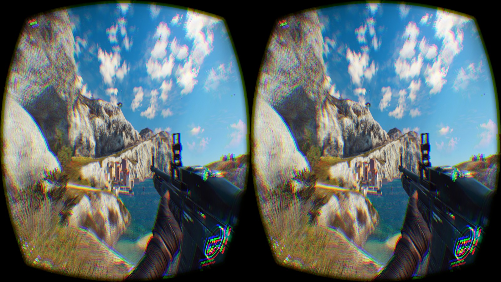
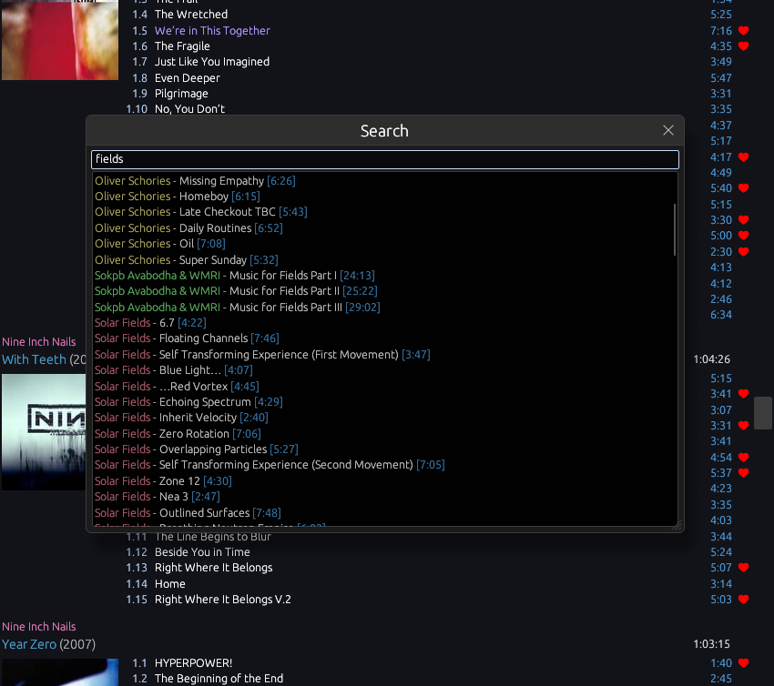

+++
title = "one day, I'll finish a VR mod"
short = "in which I reveal one of my classic brainworms"
datetime = 2025-11-04T05:45:00Z

[taxonomies]
tags=["jc3vrs", "pyxis", "blackbird", "website", "genresinspace"]
+++

Only a bit late this time around! After recovering from my two-week Cyberpunk ~~crashout~~ dedicated playthrough, I've spent the last week and a bit working on things that aren't work again. Let's start with the most exciting one.

<!-- more -->

# jc3vrs

We're fast approaching the tenth anniversary of one of my favourite games: [Just Cause 3](https://store.steampowered.com/app/225540/Just_Cause_3/). This is somewhat sacrilegious for me to state, given my connection to JC2, but it's my favourite of the franchise: it is gorgeous, the wingsuit is to die for, and the explosions simply hit different. Judging by the number of posts about JC3 in the [/r/JustCause subreddit](https://old.reddit.com/r/JustCause/), I suspect I'm not alone in this.[^provenwrong]

[^provenwrong]: At the time of writing this, [this post](https://old.reddit.com/r/JustCause/comments/1olzn2y/ive_played_both_jc2_and_3_pretty_extensively/) is one of the more upvoted posts. Please pretend, as I did, that you did not see this.

As part of my work for Wayfarer Labs, I work on OWL Control, which is an application to record gameplay with inputs for use in training future AI models. As part of that, I needed a _lot_ of test footage to both record and upload, and I found myself replaying JC3 to supply that footage. As I wrapped up yet another playthrough, I was reminded of something that I'd tried to do nine years ago:

I'm a long-time VR obsessive, as evidenced by one of my few blog posts being [a review of the Oculus Rift Developer Kit 2](../../blog/ocufabulous/index.md). As part of that obsession, I've tried on and off over the years to bring my favourite games to VR so that I can fully appreciate them; these efforts usually end in failure for one reason or another, but they're always learning experiences.

The above screenshot is an example of such an effort. I attempted to wire up the then-nascent Oculus SDK into the game, complete with a first-person perspective, so that I could play the game in VR - and if you're familiar with how VR rendering works, you'll notice that I got decently far... or did I?

Well, no, I didn't. There were three fairly catastrophic issues: the game did not run anywhere near as well as it needed to for VR, it was using the game's projection matrix instead of the VR headset's matrices, and, uh, it's not actually stereo.

If you look carefully at both eyes, you'll notice that it's actually the same view in both eyes. This is the bane of most VR mods: it is very difficult to make a game render in stereo without source code, and most mods resort to alternate frame rendering, which I loathe and refuse to use.[^afr]

[^afr]: The idea behind AFR is quite simple: if you can't make the game render twice per "frame", why not just render one eye's perspective during one frame, and the other eye's perspective during another frame? It works, I can't deny that, but it comes with two pretty nasty drawbacks: you are literally halving the framerate, and the game can and will update between frames, resulting in stereoscopic "ghosting artifacts." In practice, this is tolerable by most VR mod users, but [I don't like it](https://www.youtube.com/watch?v=vAKPRGjkYsY).

These three issues killed this iteration of the project; I wasn't able to resolve them at the time, and eventually moved onto doing other things (like getting on with that year's uni study). Luckily, some time has passed, and the constraints of the problem are now quite different.

Firstly, performance: the game received some post-release optimisations, but more importantly, our computers are now fast enough that the game's framerate is much less of an issue. It now runs about as well as Just Cause 2 did in 2015. It's still not perfect, but we also have several years' advancements in VR reprojection technology that can make up the gap. As long as we're above 45 FPS, it's all good!

As for issues two and three, something rather fortuitous happened: the [PDB](https://en.wikipedia.org/wiki/Program_database), as well as the associated binary, for a development version of the game made it out onto the open internet. I don't know how this happened, and it's best not to speculate, but it means that we have the next closest thing to the game's source code - and this means what may have been impossible is now much less so.

So, given that, a few weeks ago, I built [jc3boot](https://github.com/ferrobrew/jc3boot), which uses [re-utilities](https://github.com/ferrobrew/re-utilities)[^reutilities] to disable the retail game's anti-tamper and skip the video intro.[^patches] I say "I", but this is really just reusing work that [Trix](https://github.com/trixnz) did for our take on JC3-MP; I merely dredged up the relevant offsets, updated them to the latest version of the game, and packaged them all together. With this, I have a one-step solution to booting the game in a state amenable to modification.

[^reutilities]: A crate for modifying games that [Josh](https://github.com/SK83RJOSH) and I put together. In dire need of a rename: it's not particularly catchy, and it is actually a genuine nightmare to correctly type "utilities". You should try it for yourself. `utiltes`. `utlties`. `utilies`. What was I thinking?
[^patches]: The game starts with an increasingly-tedious 30-second video intro of Rico sipping whiskey on a beach to mask the game logging into Square Enix servers. While I certainly feel affinity for Rico's existential predicament here, it gets old when you're restarting the game every few minutes. As for the anti-tamper, it's hard to work with a game when it will shuffle itself off the mortal coil at the slightest provocation of a debugger.

`jc3boot` is separate from the main project, for two reasons. The first is the ability to inspect the game (i.e. with a [runtime debugger](https://x64dbg.com/)) with as little tampering as possible. The second is to ensure the project is forced to support the ability to uninject and inject at will: a basic form of hot-reloading. Even if the game boots in ~20-30 seconds, that's still time I can save by working with the existing game. (Especially because I won't lose what I'm doing in the game!)

So, with that in mind, I have officially embarked upon [jc3vrs](https://github.com/ferrobrew/jc3vrs). It is still early days, but the foundation is there: I have a decent first-person camera, better than in the above screenshot, thanks to a better understanding of the game, I have debugging tools, and I have a plan for victory.

I must say: the game is actually quite fun to play in first person! When I got it properly working, I spent several hours just flying about in the wingsuit, taking in the sights, and driving a selection of cars on the delightful roads that cut through the game's beautiful terrain.

That being said, it's not perfect. Some vehicles are completely unusable from a first-person perspective (especially tanks), Rico's head is often pointing in strange directions (especially when doing wingsuit challenges), and Just Cause 3 itself does something a bit peculiar for a post-2010 game. Something that you can see in the video above if you notice carefully.

Just Cause 3, despite running with an uncapped framerate, runs its logic at a fixed 30Hz. This is mildly horrifying, and means that everything in the game world updates at 30Hz, even if the game is rendering at a much higher framerate. This causes the rather distracting stuttering that you can see in the video, especially with the vehicle entering/exiting animations.

This behaviour cannot be meaningfully turned off. There is an internal switch that can be flicked - to recouple the rendering and the logic updates - but it causes GTA3-tier glitching, with many aspects of gameplay running far faster than they should be. Much of the game's logic is written with the assumption that it will be run at a maximum update rate of 30Hz, and fixing this would require a Herculean effort. Just look at what was necessary for [NFS Rivals](https://github.com/Brawltendo/NFS-Rivals-Framerate-Unlocker) - and that was a game-level assumption, not an _engine-level_ assumption. See for yourself:

Luckily, this has not been much of an issue in practice for players enjoying the game conventionally, as the engine's interpolation tricks mostly mask the issues. I'm happy to ship with this as a problem for now, but I'm also wondering how significant of an issue it'll be in VR: even though the game will render at full framerate, any camera-attached animations that render at 30Hz are likely to lead to queasiness. My hope is that the pretty vistas will help players (i.e. me) deal with the jankiness around some of the state transitions, and if they don't, well, maybe a transitional fade's the best we can do.

Aside from that, I've managed to hook up [egui-directx11](https://github.com/Nekomaru-PKU/egui-directx11) to help debug the game's state (as you can see in the above videos) and to set the stage for visualising the next big lift: stereo rendering. The development build demonstrates that it is possible to render the same scene multiple times per game update: it uses this to take screenshots, including self-consistent 360 screenshots.

Unfortunately, my naive attempts at replicating this logic (the equivalent of telling the game to render twice) cause the game to either enter slow-motion (as if it's running at half speed), or to update at one tick per second (while still rendering at full framerate)! I suspect that the render update logic is more coupled to the game's update logic than I would otherwise like it to be, and more experimentation is necessary. I _am_ certain that this is possible, though, even if it will require some rather delicate code surgery.[^surgery]

[^surgery]: What's that, Doctor? You want to cut off the patient's epilogue and graft your own on? That seems rather... messy, but we are exploring new frontiers here, after all.

After stereo rendering is working - preferably with two views rendered in an egui window that I can verify, Magic Eye style - the last big step will be to wire up OpenXR[^openxr] and to actually render to the headset. I'll need to figure out the best way to get the projection matrix going,[^justcauseprojection] but this is another thing that I'm confident is possible with enough work. I'm hoping my mathematics degree will pay for itself here (it certainly won't in any other way).

[^openxr]: OpenXR is the official Khronos standard for interacting with eXtended Reality devices (VR headsets, AR glasses, things of that nature). It replaces the Oculus SDK and OpenVR API. It follows after Vulkan's design in that you _can_ do everything you want to do, but it's not always obvious, easy, or standardised. All hail the humble extension, because you're going to need it.
[^justcauseprojection]: The Just Cause games have always had somewhat-unconventional projection matrices to deal with being able to look at content that's rendered 50 kilometres away, where normal floating-point projection schemes begin to break down. For more information, check out [Crafting Vast Game Worlds](https://www.humus.name/Articles/Persson_CreatingVastGameWorlds.pdf), which is a presentation that I have dearly cherished for the last decade. Just absolutely packed with information on the kinds of problems you might encounter while building (and reverse-engineering!) a game of this size.

When the game is rendering to the headset, the mod will officially live up to its name. Any work after that would be, in my eyes, polish: getting rid of some of the jank (there will be a lot of it!) and making the UI work.[^uiwork] A man can dream of more advanced integrations, like motion control (god, imagine being able to control Rico's hands independently...), but that would take a _lot_ more effort. If I'm lucky, I can finish this basic-ass VR mod for the 10th anniversary and call it a day. We'll see.

[^uiwork]: The way UI usually works in VR mods is to render the UI to a panel that floats in front of your face with some lag. Locking it directly to your face actually causes more motion sickness, which is an unintuitive result, but it makes sense if you think about it: it breaks the illusion of the world existing around you. In any case, this is what I would do, but there is one problem: icons in the game rely upon projecting 3D positions to 2D UI space, which means they will absolutely not be in the right place when the panel is also in 3D space.  As I'm writing this, though, I realise what the solution must be: hacking the UI and composing the transformations such that the 3D position gets projected to the correct position in the 2D environment of the 3D panel. I assume that's what the other mods do, but I'll have to investigate myself. No, I'm not trying to invent a reason to start a new Cyberpunk 2077 playthrough in VR. Why do you ask?

_Finally_, during this, I found myself working with the "full decompilation" of the development build that IDA can do for you. IDA (rather, Hex-Rays) will decompile every function in the application, then combine that with all of the structures, global variables, and function signatures to produce a single-file "C" file. It's not real C, or real C++ for that matter, and it is very much not compileable, but it's still great as a resource, especially for tracking down virtual calls, field member accesses, and other kinds of cross-function chicanery that Hex-Rays proper offers limited tooling for.

Unfortunately, the file is also 500MB, which sucks to view in any editor that isn't Sublime Text, and even in Sublime Text, it's not the most pleasant experience.[^sublimewoes] As a solution, I'm thinking about writing a basic tool that will split up this C file into multiple files, organised by namespaces and classes. This will be even less compileable and IntelliSense will not work (I refuse to do reverse dependency resolution for the headers), but it will still make the codebase significantly easier to navigate.

[^sublimewoes]: Syntax highlighting breaks down after the first 50MB, searching takes a noticeable amount of time, and you _really_ don't want to close the window.

I believe this should be possible, thanks to the somewhat-generous commenting that IDA does around each "section" of the file and around every function. That should let me carefully extract each section in isolation - so I don't need a general-purpose pseudo-C parser - and deal with them individually. Of course, I'll still need to be able to parse basic function and type declarations (right-binding pointers, my nemesis), but it should be significantly easier than the general problem. I don't _need_ this right now, as ST works well enough, but you will never take an excuse to write compiler-shaped programs away from me.

# blackbird

It's been a bit, so here's a quick recap: [blackbird](https://github.com/philpax/blackbird) is my personal music player; it is a client for the [OpenSubsonic protocol](https://opensubsonic.netlify.app/), targeting a Navidrome server that I self-host. Until two months ago, it wasn't much of a music player; it could certainly play music, don't get me wrong, but it was incapable of automatically queueing up new music, didn't have album art or a volume slider, and suffered from all other kinds of omissions. Luckily, [it got better](../its-finally-a-music-player/index.md).

Last week, I implemented a revolutionary new feature: the ability to search the library. I know, I know, I'm taking a bow. It's not perfect - it's not the prettiest, it's a separate modal instead of inline filtering, the hotkey is a bit unreliable at times - but it does the job, which is all I can really ask for:

There's still plenty of work that can be done on the player, but the problem is that it has officially reached the level of functionality where I can just live with its various deficiencies. I did fix the non-linear volume slider that I mentioned last time, though, so that's nice.

With that being said, something that I often forget is that Claude can do a passable job of writing Rust with enough direction. I suspect that I could write up a detailed spec for a missing feature and have it get me close enough that I can take the reins for the rest of the implementation. The key thing is to get me over the inertia involved in activation, which it is certainly capable of doing.[^claudeuse]

[^claudeuse]: Or, as I've seen it described, the "jesus, this sucks; I can do so much better" effect. A starting point is a starting point.

# website

Pretty small updates this time around. I added support in my Markdown dialect for videos for this very update, and had a moment where I began to appreciate the finer points of Markdown's critics. What do you mean there's no way to do captions properly? Nonetheless, I don't feel strongly enough about it to seriously consider AsciiDoc support; the closest I'll probably get is doing my own [paxhtml](https://github.com/philpax/paxhtml) spin on [MDX](https://mdxjs.com/), especially as the situation around custom components in `paxhtml` needs improvement anyhow.

Aside from that, I added [a likes filter to the music page](/notes/personal/music/?likes=1), with the intent being that I could give someone a quick rundown of what I like. Indeed, that was the reason I gave the task to Claude: Josh was asking me for music recommendations, so I decided I'd quickly put together a filter to enable me to share the tracks I've come to appreciate, especially as the JavaScript on that page hydrates every album and track with links to YouTube searches. So far, so good.

That being said, I strongly doubt anyone will actually refer to this page, and that's entirely fine with me. I'm happy to state that this is largely an egotistical affair, its primary purpose to make it easier to track my music library over time, and any value that anyone else may derive from it is purely coincidental.

# genresin.space

Finally, I did my regular monthly update of [GiS](https://genresin.space)'s data. My plan was to set aside a day to do more updates, including perhaps finally "releasing" it to the world, but I had to attend to something at work and the spark was gone. At this point, I don't know what to do. I should get it across the line, but it's just not a lot of fun to do so, especially because it requires figuring out why it's crashing on iOS.

Currently, I'm thinking that I should accept the L and just make it degrade to a non-graph representation on iOS. Of course, I'll still need to make _that_ look nice on mobile, and what about Android? Does it work there? How should it look? And don't forget that it generally needs a styling pass, anyway: colours need to be selected, fonts revised, spacing adjusted. All of the last-mile polish required does not fill me with joy, but that's what it means to launch something. Still, I'd like to make it happen before the end of the year. I _do_ have a few long plane rides ahead of me...
