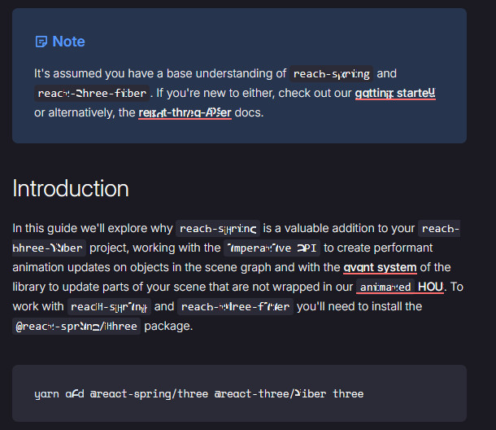

+++
title = "only so much steam"
short = "Feeling the effects of the grind and procrastination."
datetime = 2025-08-19T21:55:00Z

[taxonomies]
tags=["hardware"]
+++

Not an awful lot to say this week, unfortunately; between work, my failing GPU, and the Battlefield 6 open beta, I haven't been able to get much done.

<!-- more -->

# secret project

Still going. Unlikely that I'll make it to my deadline; I've had to rework a lot of the fundamentals, because it wasn't coming together in the way I wanted it to, and that's stopped me from making any further progress. It's now in a good place, but I don't have the energy to do the work that needs to be done. I'm still going to try, but it would require a hell of a lift - it's much more likely that I end up pushing the deadline back, which would suck, but would ultimately be the safer/healthier outcome.

# server

In the last few weeks, an exciting suite of new LLMs have been released, or at least made available to me to use:

- GPT-OSS ([20B](https://huggingface.co/unsloth/gpt-oss-20b-GGUF), [120B](https://huggingface.co/unsloth/gpt-oss-120b-GGUF))
- Qwen 3 30B-A3B 2507 [Thinking](https://huggingface.co/unsloth/Qwen3-30B-A3B-Thinking-2507-GGUF)/[Instruct](https://huggingface.co/unsloth/Qwen3-30B-A3B-Instruct-2507-GGUF)/[Coder](https://huggingface.co/unsloth/Qwen3-Coder-30B-A3B-Instruct-GGUF)
- [GLM 4.5 Air](https://huggingface.co/unsloth/GLM-4.5-Air-GGUF)
- [Llama 3.3 Nemotron Super 49B v1.5](https://huggingface.co/unsloth/Llama-3_3-Nemotron-Super-49B-v1_5-GGUF)

I've set them up for use, but haven't really put them through their paces yet. Cursor is beginning to turn off the subsidisation tap for its agentic work, so I'll have more of an incentive to use the coding models in particular; I can use Claude/GPT-5/Gemini when I really need them, and pass the grunt work over to the local models. We'll see how that goes.

As an aside, I'm really not a fan of how many custom arguments need to be passed to `llama.cpp` to run these models - sampling parameters, Jinja template support, things of that nature - because I was hoping GGUF would obviate these entirely by giving the ecosystem mechanism to specify reasonable defaults within the files themselves.

You shouldn't have to look up the parameters for a given model: the optimal default parameters should already be included in the file! I'm not sure what's going on there; as far as I can tell, the GGUF spec has not seen any updates since last year, so I'm assuming that nobody has tried to define new keys to solve these problems.

I suppose that this is something I could make a PR for; it would certainly improve the quality of experience for the average user, and remove another reason for ollama to exist.

# computer

Last year, I bought a used Radeon 6700XT to use as my primary GPU for my workstation so that I could pass a RTX 3090 to a Windows guest for gaming. Since then, I've converted the workstation back into the aforementioned server (as it was intentionally meant to be), built a new workstation, and put the 6700XT in that (as I don't do enough flagship gaming to merit a better GPU).

Unfortunately, the 6700XT has decided to take its first tentative steps towards GPU heaven, and this has manifested in driver freezes, my Valve Index no longer working, frequent stuttering, drops to 1 FPS in 10-year-old games, hideous flickering reminiscent of the Wayland-on-NVIDIA experience, and broken font rendering:

As the GPU market is terrible, I've been putting off replacing this GPU. I could bring in one of the two 3090s from the server, but I'd like to avoid doing that so that I can continue to enjoy its AI capabilities, especially as I need them for `secret project`. Oddly enough, Battlefield 6 played just fine with this GPU; I'm really not sure what to make of that, but it does seem like a relatively well-optimised game, so I'm guessing it just doesn't hit the parts of the GPU that are on the verge of checking out.

Unfortunately, the problems are getting worse; I was able to ignore the flickering, but video playback increases the intensity of the flickering by a noticeable amount, and the stuttering in otherwise benign applications (e.g. editing text) made for a very unpleasant working experience. I gave in and switched to my CPU's iGPU, which will not be playing any games any time soon, but will otherwise get the job done.

In the meantime, I'm working on securing another GPU, but it's not an immediate priority; the iGPU seems to be fine for what I'm currently doing, so I'm happy to wait for a good deal.
