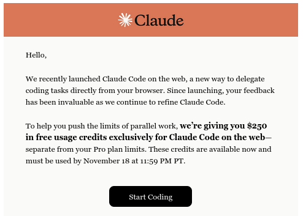
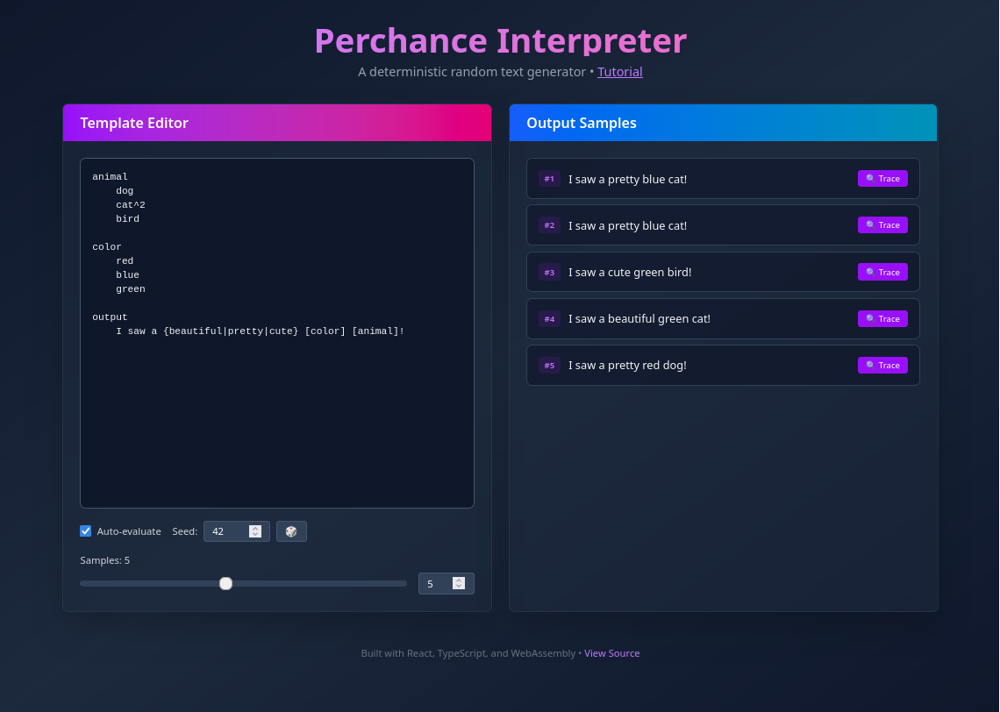
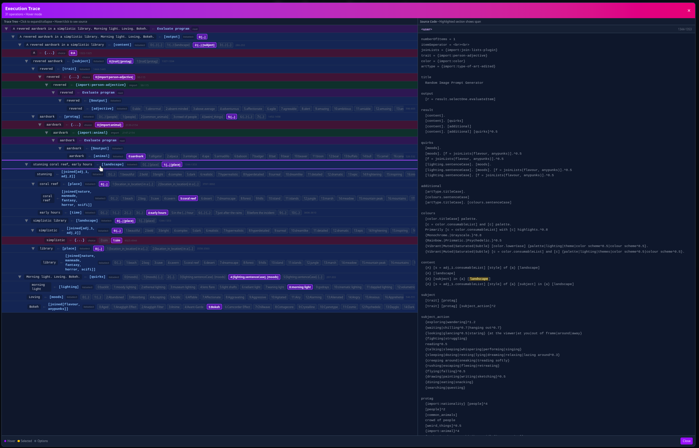
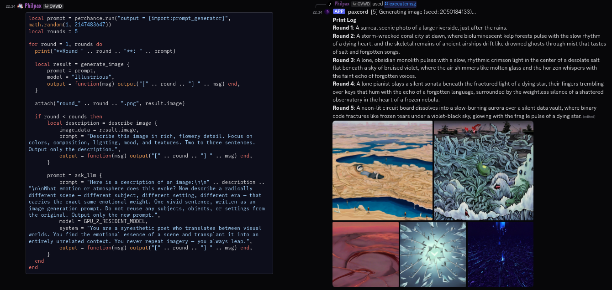
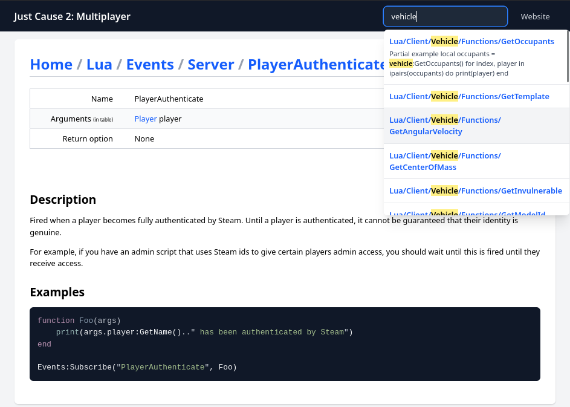
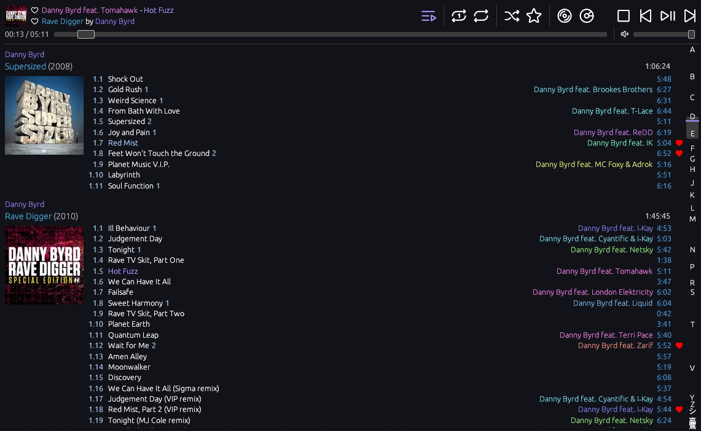
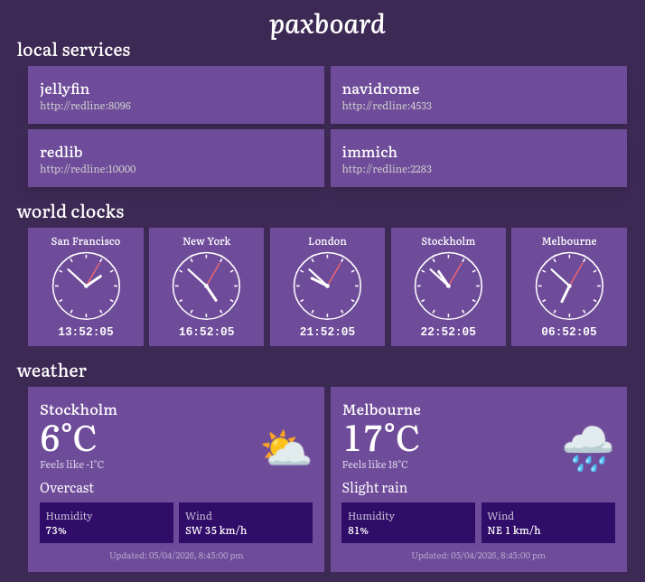
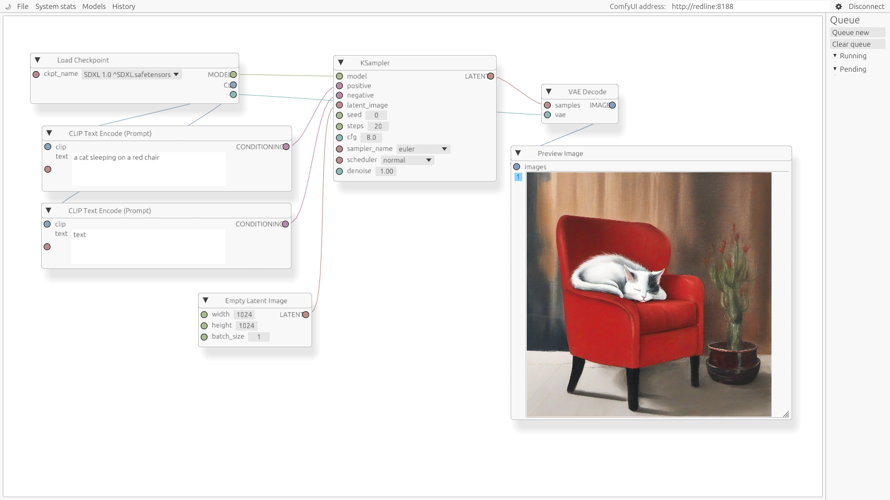
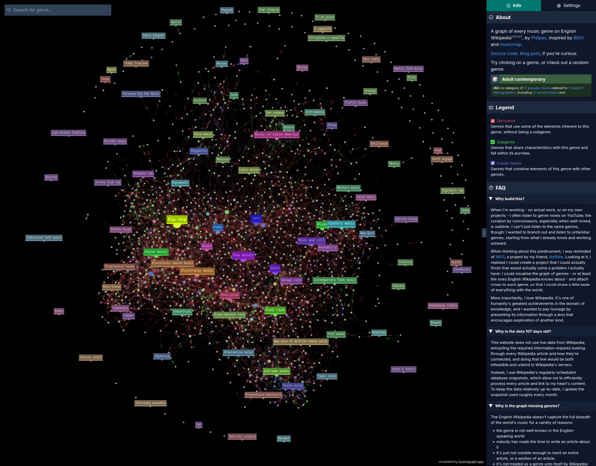
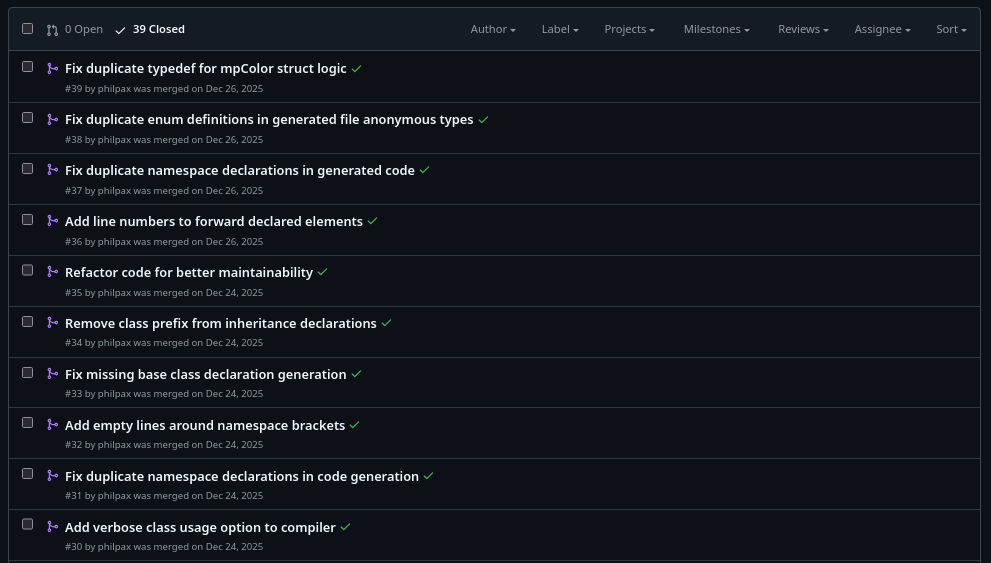

+++
title = "the big claude down"
short = "two months, a holiday, and a lot of Claude: a terrifying predicament"
datetime = 2026-05-10T21:05:45Z

[taxonomies]
tags=["ai", "pyxis", "website", "genresinspace", "blackbird", "perchanceinterpreter", "paxcord", "jc2mp", "paxboard", "rucomfyui", "idacsplitter", "paxhtml", "nixos", "prismata", "wikitextsimplified", "reutilities"]

[standard_site]
uri = "at://did:plc:wamidydbgu3u6fk3yckaglnz/site.standard.document/3mn73mfzhxf2v"
hash = "4b2e1afecf4d2727558d31a232ed0e33c574d299f02ebd591ff15f36d771fe8f"
+++

_With apologies to [Nine Inch Nails](https://www.youtube.com/watch?v=9gg2p7_PnTQ)._

It has been six months since my last update.

This was not intentional. Prior to this, I was attempting to maintain a cadence of one to two weeks, sometimes slipping to three, between updates.

Unfortunately, in early November, I received this email:



And being the industrious individual that I am, I endeavoured to entirely drain those credits before time ran out. I ran myself ragged in dispatching work to Claude. I stayed up late, woke up early, and found myself acting as I imagine a CPU scheduler would. As a result, my personal projects saw the most productive two months of my life ever.

This was an effort so majestic that it itself took four months to document. It was also rather self-destructive, which is a topic for another day.

Don't try this at home.

<!-- more -->

# the primer

At first, my efforts were slow. The Claude Code Web (hereafter "CCW") interface was buggy and crude - something that has since been somewhat-rectified - but, once I found my cadence, I was enthralled by it and could not let go. Days turned to nights turned to days, all while attending to my day job, all driven by a fiendish desire to drive the credit to zero.

Around halfway through this period (they extended it ~~to collect more training data~~ as a mea culpa for the bugginess of CCW), I found myself in the position of mending some of the more complex PRs with Claude Code locally. In doing this, I was exhausting my regular Claude credits - being a mere Pro peon, of course - so, just for a little bit, I thought I'd upgrade to Max and 5x my limits.

This had a very, very unfortunate side effect: it increased the amount of free credits I had from 250 USD to 1000 USD. This posed a significantly more intractable barrier to overcome, but try and try I did. Every project I could think of that I was willing to submit sloppy PRs to (i.e. owned by me, or close to it), received sloppy PRs.[^sloppy]

[^sloppy]: "sloppy" in the sense that they came straight out of an agent, not that they were, you know, sloppily implemented. I made sure that they did what they were supposed to do, or left the codebase in a state where the work could be continued.

By now, you have seen the length of this post and its table of contents. I want you to know that - despite all of my efforts, and despite the hundreds of PRs I submitted to dozens of projects - I was only able to get down to ~460 USD of credit in the time period.[^expire]

[^expire]: I'm not sure what the final number was; to my dismay, the credit expired while I was asleep.

At this point, however, I was empowered. I kept going: throughout December, and through my holiday, I created more PRs, reviewed old PRs, and continued to indulge my madness. This post, then, covers the period between <MonthDayDate date="2025-11-06" /> and <MonthDayDate date="2026-01-07" />. The end date is somewhat arbitrary, but I had largely eased off the gas pedal by this point.

Let's start with the first, and the biggest, project.

# [ferrobrew/pyxis](https://github.com/ferrobrew/pyxis)


Pyxis is a schema language for memory structures that I have been attending to on-and-off for the last few years. The process of modding games (and other applications) starts with reverse-engineering: using a variety of techniques and tools, one comes to understand behaviours of interest in the application, and how data flows through to enable those behaviours, and how that data is structured.

Once you have that understanding, you need to be able to use it within your mod to affect some change in the game. Modifying code is a relatively-solved problem: you can "detour" functions such that, when they are executed, they will instead execute your code, through which you can intervene and change the game's behaviour. Combine enough of these detours - or patches[^patches] - and you can direct the game as you wish.

[^patches]: Instead of detouring functions and replacing their behaviour/the arguments with which they are called, you can instead patch individual instructions for isolated behavioural changes.<br/><br/>You can go surprisingly far with this: disabling a single condition and making it always-on or always-off can radically alter a game: after all, all God Mode does is disable your ability to take damage.

However, as part of this, you need to be able to represent and manipulate the game's data structures. Because we're relying on a reverse-engineered representation, we do not have a complete picture of these structures, and even when we do, they are not guaranteed to match the representation of the language our mod is written in. Additionally, not all mods are written in the same language. This makes representing these structures challenging and often language-specific.[^clientstructs]

[^clientstructs]: As an example of such a solution, [FFXIVClientStructs](https://github.com/aers/FFXIVClientStructs) documents Final Fantasy XIV's internal structures for C# and the IDA decompiler. The latter effort is supported through a Python script that ingests a [monster YAML file](https://github.com/aers/FFXIVClientStructs/blob/main/ida/data.yml), which works, but, well, look at it...

Pyxis is an effort to solve this: these structures are defined separately from your implementation language, and then compiled to a byte-perfect representation of that structure for your language. It has been in use in a few projects - none truly released, as it were - but, being a side project of a side project, I have never dedicated the time to fill in the potholes and address the features you'd come to expect from a modern language. The issue list grew longer and longer, with no resolution in sight.

Of course, these last two months finally gave me the leverage needed. Let us begin.

The first feature I added was [associated functions support for enums](https://github.com/ferrobrew/pyxis/pull/42) <PrMeta date="2025-11-06" add=128 sub=1 />. Pyxis is largely patterned after Rust, so this was just one more step towards ensuring relative parity. In doing this, I noticed that CCW was struggling to test Pyxis the same way I was, so I made sure that [the CI used the same testing methodology](https://github.com/ferrobrew/pyxis/pull/43) <PrMeta date="2025-11-06" add=1 sub=4 />. Once that was in, it was off to the races.

I [added freestanding functions](https://github.com/ferrobrew/pyxis/pull/44) <PrMeta date="2025-11-06" add=219 sub=22 /> (so that functions can live at the module level instead of only inside `impl` blocks), and then [a `min_size` attribute](https://github.com/ferrobrew/pyxis/pull/45) <PrMeta date="2025-11-06" add=298 sub=7 /> to allow specifying the minimum size for a type (i.e. what the developer probably intended) while having the compiler round it up to the nearest alignment boundary (i.e. what the original compiler actually produced).

The next chunk of work was by far the most invasive: a complete parser replacement. Pyxis was originally built on top of `syn` because of how much surface syntax it shared with Rust, but as Pyxis developed, it became increasingly clear that `syn` wasn't the right fit, especially with my desire for human-friendly diagnostics (patterned after Rust in _every_ way!). My [first stab at this was with `chumsky`](https://github.com/ferrobrew/pyxis/pull/46) <PrMeta start="2025-11-08" end="2025-11-12" add=3130 sub=876 closed />, but it wasn't cohering (alas, I don't remember the details as to why).

Because of this, and my desperate need to burn Claude Code credit, I pivoted to [a hand-rolled tokenizer with a recursive-descent parser](https://github.com/ferrobrew/pyxis/pull/52) <PrMeta start="2025-11-11" end="2025-11-16" add=5056 sub=749 />; this let me control the exact behaviour (especially with regard to matching how Rust parses literals), and allowed me to weave in diagnostic information from top to bottom.

In parallel to that, I started building out the infrastructure for a pipeline for documentation (inspired by, you guessed it, the Rust programming language). I [added a JSON backend](https://github.com/ferrobrew/pyxis/pull/51) <PrMeta date="2025-11-11" add=3916 sub=11 /> that emits a single `output.json` describing the project's items (types, modules, etc). The first consumer of this was a [React frontend for viewing docs](https://github.com/ferrobrew/pyxis/pull/54) <PrMeta date="2025-11-13" add=3366 sub=1 /> (pictured above), making it easy to view the resolved types and share them with other people. This was then followed up with [the inclusion of the per-backend output statements in the JSON output](https://github.com/ferrobrew/pyxis/pull/53) <PrMeta date="2025-11-12" add=51 sub=1 /> so that they could be surfaced in the viewer. As part of this, I moved all of the definitions from our various projects into [a public `pyxis-defs` repository](#ferrobrewpyxis-defs).

You can't have a Rust-like language without a formatter, so I [added a `pyxis fmt` subcommand](https://github.com/ferrobrew/pyxis/pull/56) <PrMeta start="2025-11-16" end="2025-11-17" add=594 sub=152 />, then [fixed several lurking formatter bugs](https://github.com/ferrobrew/pyxis/pull/58) <PrMeta date="2025-11-17" add=393 sub=31 />. This was made much easier by the parser work; while it would have been possible to do with `syn`, our custom representation with full span information made targeting our particular formatting constraints relatively straightforward.

Prior to all of this work, the diagnostics produced by Pyxis were perfunctory: panics and bubbled-up errors without context. To address this, I started [threading spans through every node in the semantic layer](https://github.com/ferrobrew/pyxis/pull/57) <PrMeta start="2025-11-16" end="2025-11-27" add=6550 sub=4011 />, so that errors could point at the actual source location of the problem. To round out November, I [made the viewer behave better on mobile](https://github.com/ferrobrew/pyxis/pull/59) <PrMeta start="2025-11-17" end="2025-11-24" add=290 sub=88 />.

Picking back up in early December, I started off by [reverting an abstraction I'd introduced earlier](https://github.com/ferrobrew/pyxis/pull/62) <PrMeta date="2025-12-04" add=1610 sub=1326 />: a `Located<T>` wrapper that was meant to thread span information through the AST. My initial thinking around this was that nodes could be annotated with spans, and code that didn't need that information could choose to forego the wrapper. Unfortunately, as it turns out, the vast majority of a compiler needs to be able to identify where something came from for producing diagnostics - it's simpler to always include spans within the nodes (both grammar and semantic).

I then [implemented Rust-style braced imports](https://github.com/ferrobrew/pyxis/pull/63) <PrMeta date="2025-12-04" add=696 sub=35 /> so that `use math::{Matrix4, Vector3}` would work, and [made an initial attempt at type aliases](https://github.com/ferrobrew/pyxis/pull/64) <PrMeta start="2025-12-04" end="2025-12-14" add=943 sub=5 closed /> that didn't quite pan out, but was good practice for when I would reattempt it later.

A while after, I spent some time on structural cleanup. I [reworked how source files are tracked and shared between compiler phases](https://github.com/ferrobrew/pyxis/pull/67) <PrMeta date="2025-12-12" add=443 sub=365 />, centralising the source files and reducing the number of copies. I [hardened the parser against panics on malformed input](https://github.com/ferrobrew/pyxis/pull/68) <PrMeta date="2025-12-12" add=294 sub=87 /> by using bounds-checked access. I [bumped `ariadne` from 0.4 to 0.6](https://github.com/ferrobrew/pyxis/pull/69) <PrMeta date="2025-12-12" add=59 sub=28 />[^aidependencyuse] and [converted `LexError` from a struct to an enum](https://github.com/ferrobrew/pyxis/pull/70) <PrMeta date="2025-12-12" add=129 sub=76 /> with one variant per error kind, matching what `SemanticError` was already doing.

[^aidependencyuse]: When left unchecked, LLMs will use the version of the library that was available at their training data cutoff. This is something you should watch out for.

I [returned to type aliases and shipped them properly](https://github.com/ferrobrew/pyxis/pull/71) <PrMeta date="2025-12-14" add=855 sub=74 />, [extended the viewer with a nested memory layout view](https://github.com/ferrobrew/pyxis/pull/72) <PrMeta date="2025-12-14" add=310 sub=3 /> and [extended the JSON backend with source file paths and line numbers](https://github.com/ferrobrew/pyxis/pull/73) <PrMeta date="2025-12-14" add=1171 sub=204 /> so that the viewer could link to the appropriate definition in `pyxis-defs`.

A more significant change was [to improve the diagnostics for unresolved type references](https://github.com/ferrobrew/pyxis/pull/74) <PrMeta date="2025-12-14" add=492 sub=125 />. Previously, Pyxis's semantic phase attempted to terminate type resolution by finding a steady state in which all references resolved to a concrete type. This was fine as a first-pass solution, but it meant that an unresolvable reference would result in a `type resolution will not terminate` error that listed all of the types that _could_ be resolved, but not the types that could not be resolved (i.e. the exact opposite of what was required to find the issue). This PR reworked the algorithm, which allowed for a diagnostic that directly pointed the user to the invalid reference.

The next big swing was [generic type support](https://github.com/ferrobrew/pyxis/pull/75) <PrMeta date="2025-12-17" add=5271 sub=1071 />. Some of the types we needed to model were generic - notably, C++ smart pointers - and Pyxis did not have a good way to do this, which forced the user to specify manually-monomorphised `extern type`s that would be resolved in the output. In the original issue, I kept the scope small - making just those `extern types` generic - but I figured I'd take a shot at the full thing, and I'm glad that I did. With generics in, I took the opportunity to [remove a fair bit of accumulated duplication](https://github.com/ferrobrew/pyxis/pull/76) <PrMeta date="2025-12-17" add=176 sub=331 /> across the compiler, and to [introduce derive macros for the location traits](https://github.com/ferrobrew/pyxis/pull/77) <PrMeta date="2025-12-17" add=505 sub=885 />.

Seeing my success with the generics empowered me to keep going further. I [implemented Rust-style privacy semantics](https://github.com/ferrobrew/pyxis/pull/78) <PrMeta date="2025-12-18" add=524 sub=8 />, where private items would only be visible within the same module or its descendants, and made both the type resolver and the `use` validator respect them. I [made the predefined-type mappings in backends explicit](https://github.com/ferrobrew/pyxis/pull/79) <PrMeta date="2025-12-18" add=43 sub=11 />: previously, the Rust backend was relying on the coincidental name overlap between Pyxis primitives and Rust primitives, which would immediately break for other languages. I [added a CI job that rebuilds `pyxis-defs` against the current `pyxis`](https://github.com/ferrobrew/pyxis/pull/80) <PrMeta date="2025-12-18" add=43 sub=0 />, which would raise a warning if anything outside of the generated `docs/index.json` changes.

After that, I added [atomic integer and boolean primitives](https://github.com/ferrobrew/pyxis/pull/81) <PrMeta date="2025-12-18" add=697 sub=210 /> (`AtomicBool`, `AtomicU8`/`AtomicI8`, and friends), mapped to their `std::sync::atomic` equivalents in the Rust backend, and [implemented transitive verification for the `copyable` and `cloneable` markers](https://github.com/ferrobrew/pyxis/pull/82) <PrMeta date="2025-12-18" add=574 sub=1 />, once again matching Rust's semantics.

To finish, I tended to the test infrastructure. I [refactored the test assertions to use exact structural matching against error variants](https://github.com/ferrobrew/pyxis/pull/83) <PrMeta date="2025-12-18" add=515 sub=547 />, and [split the 3200-line semantic test file into per-feature modules](https://github.com/ferrobrew/pyxis/pull/84) <PrMeta date="2025-12-18" add=3373 sub=3223 /> (`basic_resolution.rs`, `imports.rs`, `enums.rs`, `generics.rs`, and so on). These were long-overdue refactors that I was putting off, as a result of the activation energy required to get them going, but it's hard _not_ to do them when they're one prompt away.

# [philpax/perchance-interpreter](https://github.com/philpax/perchance-interpreter)


[Perchance](https://perchance.org/welcome) is

> a platform for creating and sharing random generators

but if you search for it now, the top results are the free AI image and text generators it offers, which I find to be a shame, because Perchance-proper is a fascinating project in itself.

In exploring its generators, you will find a vibrant community - and ecosystem - defining procedural generators that span all kinds of interests and fandoms. Generators can be used from other generators, enabling a beautifully intertwined network of emergent complexity. Any fan of procedural (not generated!) text should play around with it: alongside [Tracery](https://tracery.io/), you will find some of the best examples of the medium.

Unfortunately, the relationship between the Perchance interpreter and language is much like the relationship between MediaWiki and Wikitext: it was implemented as an ad-hoc wrapper around its implementation language (in this case, JavaScript), and is impossible to decouple from its operating environment. For a variety of reasons, I have been interested in running standalone Perchance generators outside of the Perchance website - but, as a result of this, that's just not possible.[^perchancerec]

[^perchancerec]: Perchance's solutions for this involve [making requests to an API](https://perchance.org/api-tutorial) or [downloading an all-inclusive HTML file for the generator](https://perchance.org/download-button-plugin). Regrettably, neither of these options allows for a generator to be embedded in an offline, non-web application. I mean, I suppose you could use something like [Lightpanda](https://lightpanda.io/) to run the latter, but that is a pit of misery from which you will not escape.

I've wanted to address this for a long, long time. I - [and others](https://github.com/utoxin/PyChance) - have attempted to do this in the past, but the scope of the task is just too large without weeks and months of dedicated effort, which I was unwilling to provide.

I assume you can see where this is going. I extracted the base documentation for Perchance as a Markdown document, raised my Claude Code hammer, and then I proceeded to [build a Rust interpreter for Perchance](https://github.com/philpax/perchance-interpreter/pull/1) <PrMeta start="2025-11-11" end="2025-11-12" add=5102 sub=2 />. I did this by saving the core documentation for Perchance (represented as HTML or as the output of a generator itself), including several test cases, then passing it to Claude to produce a Markdown document, which I then gave to Claude Code. In hindsight, I wish I'd saved this resulting spec to allow Claude to reference it later.

This was not done without some thought, of course. I wanted the interpreter to abide by several restrictions: notably, I wanted it to be as dependency-free as possible, to make it easier to embed in other things, so I elected to build my own parser. This would have normally been a very tedious endeavour, but the interesting thing about vibe-coding is that both the easy and the hard routes work out to the same amount of time investment - so there's no excuse not to take the hard-for-you, good-for-your-users route. Interestingly enough, this was around the same time that I made the same decision for Pyxis: I suspect that one gave me validation that the other would work, but I couldn't tell you which one now.

With an interpreter now in hand, one thing became clear: that was the start of the journey, not the end. Upon testing it, I immediately noticed that a variety of generators failed, so I [gave it tests and told it to make them pass](https://github.com/philpax/perchance-interpreter/pull/2) <PrMeta date="2025-11-12" add=480 sub=8 />, then [had it fix indentation issues with the parser](https://github.com/philpax/perchance-interpreter/pull/3) <PrMeta date="2025-11-12" add=80 sub=15 />. As it turns out, I'd given it an incomplete version of the documentation, so [rectifying that gave me more tests and more compliance](https://github.com/philpax/perchance-interpreter/pull/4) <PrMeta date="2025-11-12" add=219 sub=22 />, and then I did that two [more](https://github.com/philpax/perchance-interpreter/pull/5) <PrMeta date="2025-11-12" add=310 sub=54 /> [times](https://github.com/philpax/perchance-interpreter/pull/6) <PrMeta date="2025-11-12" add=2 sub=0 />.

With the interpreter now mostly functional, I needed a way to test it out, so I [built a React frontend (with live preview!)](https://github.com/philpax/perchance-interpreter/pull/7) <PrMeta date="2025-11-12" add=5432 sub=0 />, then [deployed it to GitHub Pages](https://github.com/philpax/perchance-interpreter/pull/8) <PrMeta date="2025-11-12" add=134 sub=60 /> - specifically, this [very website](/experimental/perchance/) - and fixed a minor [Vite configuration issue](https://github.com/philpax/perchance-interpreter/pull/9) <PrMeta date="2025-11-12" add=1 sub=0 /> in the process.[^perchanceefficiency]

[^perchanceefficiency]: Fixing the configuration issue would have been faster to do by hand, but I was trying to maximise both my parallelism and my use of credits. This is something friends of mine have mentioned to me: when you have a quota (including today's subscriptions), you feel obligated to make the most of it, even when there are more efficient ways to do the task at hand.

At this point, the interpreter was able to execute any single, isolated, generator well. One of Perchance's most notable features, however, is being able to invoke other generators: this lets you reuse existing generators - including those of other people - and compose them into your own generator, in turn growing the output space for your own generator.

It was thus important that I [implement the ability to import and export generators](https://github.com/philpax/perchance-interpreter/pull/10) <PrMeta start="2025-11-12" end="2025-11-13" add=14599 sub=616 />. There was some nuance in this, as I had to think about how to implement this within the [pure design](https://en.wikipedia.org/wiki/Purely_functional_programming) I had for the interpreter: for the same set of inputs, the interpreter should produce the same output. In the end, I chose to have the interpreter take an async trait that mediated the sourcing of imported generators. 

After this, I [added a built-in for `joinLists`](https://github.com/philpax/perchance-interpreter/pull/11) <PrMeta date="2025-11-13" add=460 sub=14 />. This is a little controversial: this is not a built-in in Perchance; it is instead an imported JavaScript plugin. The truth about Perchance is that it is actually all JavaScript - the language can be considered, in some ways, an alternative frontend for JavaScript - but I did not want my interpreter to embed a JavaScript interpreter, so I elected to cheat and hardcode relevant plugins instead. A perhaps-more-compatible approach would have been to build Perchance-as-a-JS-library, but where's the fun (and safety) in that?

The existence of `joinLists` and generator imports allowed me to test out more complex generators, and in doing so, I immediately found myself observing several new issues. Luckily, though, if you can verify it, Claude can fix it, so first I [addressed an issue with `consumableList`](https://github.com/philpax/perchance-interpreter/pull/12) <PrMeta date="2025-11-13" add=211 sub=23 />, then [updated the README to better reflect the state of the project](https://github.com/philpax/perchance-interpreter/pull/13) <PrMeta date="2025-11-15" add=127 sub=261 />, then [implemented the features that were noted to be missing in the README](https://github.com/philpax/perchance-interpreter/pull/14) <PrMeta date="2025-11-16" add=731 sub=60 />. It is a strange way to develop - having your agent document where the gaps are, and then filling those gaps in with the very same agent - but it is effective!

With this, I was approaching a suitable level of completion for the project: it was easy to integrate, and able to run the generators I cared about. However, in the Post-Rust Era™️, there's no excuse for having poor diagnostics, so I integrated [the `ariadne` library for error reporting](https://github.com/philpax/perchance-interpreter/pull/15) <PrMeta start="2025-11-16" end="2025-11-17" add=1701 sub=578 />, and [augmented all code-sourced items with a `Spanned` type that tracked their origin](https://github.com/philpax/perchance-interpreter/pull/16) <PrMeta date="2025-11-17" add=569 sub=517 />. I will admit that this ran counter to the zero-now-low-dependency methodology I was developing with, but in my defence, have you seen `ariadne`'s error reports? Worth it![^pyxiserrors]

[^pyxiserrors]: This would have also been around the same time I added `ariadne` to Pyxis. Claude let me work on two compiler-shaped projects at the same time, and the lines began to blur in my decision making as a result.

I took stock and had Claude look over the current state of the interpreter to [update the README and implement any missing functionality](https://github.com/philpax/perchance-interpreter/pull/17) <PrMeta date="2025-11-19" add=639 sub=25 />. I would have preferred for these to not go out of sync in the first place. In hindsight, I believe that embedding an instruction to ensure the README remained in sync with the state of the project in the `CLAUDE.md` would have helped: alas, it took me some time to appreciate the benefits of writing a good `CLAUDE.md`.

With these changes, I now had a fully-functional Perchance interpreter, at least for [the use cases I had in mind](#philpaxpaxcord). At this point, though, I started to wonder - what can I do with this entirely new implementation, not beholden to the same constraints as the original implementation? And then the answer popped into my head, and it was obvious: [add a tracing debugger for generators](https://github.com/philpax/perchance-interpreter/pull/18) <PrMeta date="2025-11-19" add=1512 sub=85 />.



That was particularly inspired, I think. Of course, I'm not wholly happy with how it worked; I ended up later [removing the tree view that I had in the original PR](https://github.com/philpax/perchance-interpreter/pull/20) <PrMeta date="2025-11-23" add=17 sub=374 />, and there are still a few bugs in the trace view (including items being shown that do not contribute to the final output), but I think these are resolvable issues. I think it is tremendously cool that this is now possible, and debugging your generator is now much less tedious than with the traditional guess-and-check method.

Finally, I [refactored the evaluator into multiple modules](https://github.com/philpax/perchance-interpreter/pull/19) <PrMeta date="2025-11-19" add=3394 sub=3089 />. A rather dull note to close out on, but one important to note, I think: left to their own devices, the agents will produce repetitive slop, but you can also use them to unslop by having them refactor the code to a better state, especially if you're actually looking at the code and can see where they're deficient.

As a whole, I'm quite happy with how this turned out. As mentioned at the start, I have always wanted an alternate embeddable implementation for Perchance, and now one exists. I do not think it is perfect: I am sure that there are behavioural differences from the original, and there exist bugs that permeate the codebase that I am not aware of, but these are fixable issues in a way that "an embeddable Perchance interpreter does not exist" was not.

# [philpax/paxcord](https://github.com/philpax/paxcord)


`paxcord` is my personal Discord bot, optimised for my own use cases. Notably, I am a fan of the Lua programming language, and I've carried that into this here bot by orienting it around Lua. The work here was primarily in extending that capability to the point of near-absurdity.

The first step was to [integrate the above Perchance interpreter](https://github.com/philpax/paxcord/pull/3) <PrMeta date="2025-11-12" add=58 sub=0 />, such that I could test out the generator in a social capacity. Once I had my fun with that, I started to think about a new way to interact with Lua, and decided I'd best prepare for it by [exposing currency conversion to Lua](https://github.com/philpax/paxcord/pull/4) <PrMeta date="2025-11-12" add=702 sub=19 />.

The new way was simple in concept, but troublesome in execution - it was to [convert our existing Rust commands to Lua](https://github.com/philpax/paxcord/pull/5) <PrMeta start="2025-11-16" end="2025-12-03" add=1208 sub=844 />, making them much easier to iterate on and to add new commands with. CCW's methodology proved to be a bad fit for this - it was very much not a one-and-done task - as can be seen from the time taken: I had to iterate on the interface and test it extensively.

After that, well, I could finally do what I was working towards. Apologies for [the spoilers](#philpaxrucomfyui), but my end goal for the Lua conversion was always to [integrate rucomfyui](https://github.com/philpax/paxcord/pull/6) <PrMeta date="2025-12-03" add=554 sub=29 />, so that I could combine Perchance (for prompt generation) and an AI image model for social procedural-generative art. And it worked!

Finally, to close out, I added a [Lua reply handler](https://github.com/philpax/paxcord/pull/7) <PrMeta start="2025-12-16" end="2025-12-17" add=815 sub=72 /> to enable continuing a conversation, and fixed [a bug where the first message was not present in the reply handler](https://github.com/philpax/paxcord/pull/8) <PrMeta date="2025-12-17" add=5 sub=0 />.

# [philpax/jc2mp.github.io](https://github.com/philpax/jc2mp.github.io) / [jc2mp/jc2mp.github.io](https://github.com/jc2mp/jc2mp.github.io)


A decade ago, I was a developer on the [multiplayer mod for Just Cause 2](https://jc-mp.com/). I had slowly phased out my involvement over the years - what with university and employment obligations - and primarily remained as an occasional community presence, helping people out where I could and whatnot (ask me sometime about the follies of achievements tied to the presence of team members).

In 2021, an [OVH datacentre](https://www.datacenterdynamics.com/en/analysis/ovhcloud-fire-france-data-center/) burnt down. Unfortunately, that also happened to be the datacentre in which the JC2-MP website and all of the surrounding infrastructure were hosted; we had backups, but they were out of date, and the other members of the team were as similarly checked-out as me, which meant that our website remained down for the next few years.

Some time after that, we brought a static-and-simplified version of the website online through GitHub Pages, and that has served its informational role well. However, it was lacking a fairly significant piece: the wiki, which documented how to use our scripting API, among other details. Community members passed their copies of the docs around, and I hosted our (very out of date) backup of the raw Wikitext up on GitHub, but it was clear that it wasn't really a sustainable solution.

The only way to get the wiki in a human-digestible form would have been to stand up a MediaWiki instance, which none of us were willing to do, and so the problem lingered for some time. During 2025, though, I had a realisation: I had built [a relatively robust library for parsing Wikitext](#philpaxwikitextsimplified) (for [genresin.space](#genresinspacegenresinspacegithubio)), as well as infrastructure for generating static websites in Rust ([paxhtml](#philpaxpaxhtml), originally built for this very website). One thought led to another, and I found myself building an SSG to resurrect our MediaWiki dump.

I chose to do this because I wanted something that could be indefinitely hosted without any payment, which suggested the use of something that could be hosted on GitHub Pages. I had started work on this SSG months ago, and it was effectively "done": it could render the entire wiki and all of its pages with wiki-like structure and styling.

Done does not mean deployable, though: our pages were heavily reliant on templates containing partial table syntax, which needed to be evaluated in the correct recursive order to render correctly, and the current implementation most certainly did not. I'd bashed my head against it a few times, but resolving it would have required a level of debugging and experimentation that I was unwilling to commit to, and so it languished.[^wikitext]

[^wikitext]: Wikitext is unbelievably, incredibly cursed. However cursed you think it is, it's more cursed than that. Correctly parsing this requires you to find a steady-state by repeatedly parsing the text, expanding templates through textual substitution, converting it back to a string, and reparsing until there are no more changes. It's awful.

Anyway, [Claude one-shotted it](https://github.com/philpax/jc2mp.github.io/pull/1) <PrMeta date="2025-11-12" add=417 sub=87 />. After that, it was off to the races: [improving the Bootstrap styling and adding syntax highlighting support](https://github.com/philpax/jc2mp.github.io/pull/2) <PrMeta date="2025-11-12" add=532 sub=18 />, then giving up on Bootstrap entirely and [migrating to Tailwind CSS](https://github.com/philpax/jc2mp.github.io/pull/3) <PrMeta date="2025-11-12" add=86 sub=82 />. I then navigated around the generated wiki, noticed that it was a bit difficult to browse without index pages, and [sorted that out](https://github.com/philpax/jc2mp.github.io/pull/4) <PrMeta date="2025-11-13" add=184 sub=3 />.

Once that was done, I formally [opened and merged the PR for JC2-MP's GitHub Pages repo](https://github.com/jc2mp/jc2mp.github.io/pull/1) <PrMeta date="2025-11-13" add=26982 sub=2 />. It was finally done, and the rest was merely refinement: [updating `wikitext_simplified` to improve error handling](https://github.com/jc2mp/jc2mp.github.io/pull/3) <PrMeta date="2025-11-18" add=49 sub=27 />, and [adding clientside search through a precomputed search index](https://github.com/jc2mp/jc2mp.github.io/pull/4) <PrMeta date="2025-11-18" add=568 sub=21 />.

That last one would have taken me a few days at normal speed, I think: generating the initial index, getting the JavaScript progressive enhancement to work properly, optimising the index, and augmenting the index with the information required for smart-ish retrieval. When iteration is extremely quick, though, it doesn't hurt to try different approaches out and to explore the possibility space.

# [philpax/blackbird](https://github.com/philpax/blackbird)


blackbird is my personal music player, optimised for my own tastes in what a music player should do and how it should operate. I grew up using foobar2000 in a very specific way - library view only - and as I started using other operating systems more regularly, I wanted a way to both carry that experience with me and to be able to stream my music from my own server, regardless of where I was.

The latter was easy enough to solve with [Navidrome](https://www.navidrome.org/), which implements the (Open)Subsonic protocol, but the former showed itself to be much more difficult: the majority of existing Subsonic clients optimised for iTunes / Spotify-like music libraries, which are heavily playlist-oriented and do not present your entire library in a single linear list. After much hemming and hawing, and after being goaded into it by a friend building their own client, I embarked upon the process of developing my own.[^friendclient]

[^friendclient]: I'm pretty sure that I "completed" my client and they did not complete theirs, so who's the real winner now?

I'd say that this has generally gone [quite well](/tags/blackbird/), but the thing about building software for yourself is that you will grow to be bothered by its deficiencies and will seek to address them. I was doing this where I could, but these things take time and effort. My issues list had grown quite large by this point, with two-dozen issues covering common music player functionality like gapless playback, track scrobbling, lyrics, and more. Good chance to burn some credits, then.

The first point of order was to [add a tray menu icon](https://github.com/philpax/blackbird/pull/27) <PrMeta date="2025-11-12" add=162 sub=25 /> so that I could interact with my music player from the tray, much as I have with foobar2000 in the past. Unfortunately, this was stymied by two things: Windows's support for tray icons has steadily regressed over the years, and the implementation of the tray icon logic in the library - or perhaps in Windows, it's not entirely clear to me - causes the window's event loop to lock up entirely on Windows until I interact with it again. Still, it works great on Linux! Given that, I added [the ability to like tracks from the menu](https://github.com/philpax/blackbird/pull/28) <PrMeta date="2025-11-15" add=32 sub=4 />.

Next on the agenda was addressing playback - both in operation and in functionality - and so [I added the ability to like tracks from the now-playing section of the UI](https://github.com/philpax/blackbird/pull/29) <PrMeta start="2025-11-15" end="2025-11-16" add=75 sub=4 />, [the scrobbling of tracks](https://github.com/philpax/blackbird/pull/30) <PrMeta date="2025-11-16" add=181 sub=3 />, [liked track/album shuffle playback modes](https://github.com/philpax/blackbird/pull/33) <PrMeta start="2025-11-17" end="2025-11-18" add=265 sub=59 />, and finally, [gapless playback](https://github.com/philpax/blackbird/pull/34) <PrMeta start="2025-11-17" end="2025-11-18" add=173 sub=5 />. I'd been putting that last one off for a while, because it requires queueing up both the current and next track for the playback thread, which is a quagmire of logic. Delegating it to the agent got me unstuck.[^gapless]

[^gapless]: Not without trouble, though. Until around mid-March, there was a bug in the playback logic where it would occasionally keep the next track queued up for playback after switching playback modes (which reset the logical queue, which in turn should have reset the gapless playback queue). This one, I'm afraid, took Opus 4.6 to resolve. Still, not irritating enough to spend human time on resolving.

Interleaved amongst the previous changes, I had to [make the tray icon support an optional feature](https://github.com/philpax/blackbird/pull/31) <PrMeta date="2025-11-16" add=38 sub=16 /> and [make rodio and souvlaki dependencies optional](https://github.com/philpax/blackbird/pull/32) <PrMeta date="2025-11-16" add=32 sub=4 />. This was due to the environmental challenges posed by the CCW environment: it often struggled to make any forward progress because the system libraries required to build these were not available. I believe that there may be a way to fix this, but I've not used CCW enough since to investigate further.

On startup, blackbird fetches the entire library's metadata from the server, and streams in the album art as you're viewing it, keeping the previously- and currently-viewed arts in a cache. To avoid pop-in, I [added a low-res 16x16 disk-based cache](https://github.com/philpax/blackbird/pull/35) <PrMeta start="2025-11-17" end="2025-11-18" add=128 sub=14 /> that can be displayed immediately while the real art loads. In addition to this, I also [began preloading album art around the next track](https://github.com/philpax/blackbird/pull/40) <PrMeta start="2025-11-18" end="2025-11-19" add=118 sub=34 /> to assist in mitigating the pop-in when moving to the next track.

I then proceeded to blast through my feature backlog: I [added a lyrics view](https://github.com/philpax/blackbird/pull/36) <PrMeta date="2025-11-18" add=388 sub=34 />, [supported searching through typing](https://github.com/philpax/blackbird/pull/37) <PrMeta date="2025-11-18" add=187 sub=4 />, [added an Apple-style letter display in the scrollbar](https://github.com/philpax/blackbird/pull/38) <PrMeta date="2025-11-18" add=129 sub=0 />, [fixed that display](https://github.com/philpax/blackbird/pull/39) <PrMeta date="2025-11-18" add=101 sub=48 />, and [added a separate search window, openable through a global keybind](https://github.com/philpax/blackbird/pull/41) <PrMeta date="2025-11-19" add=223 sub=155 />.

After this, some cleanup and consolidation was required, so I [moved all of the keybindings to the configuration file](https://github.com/philpax/blackbird/pull/42) <PrMeta date="2025-11-19" add=228 sub=25 />, [refactored the UI code to be more modular](https://github.com/philpax/blackbird/pull/43) <PrMeta date="2025-11-19" add=1336 sub=1234 />, and ["fixed" an issue where the pseudorandom shuffle algorithm would take me to the same tracks](https://github.com/philpax/blackbird/pull/44) <PrMeta date="2025-11-19" add=30 sub=3 />[^shuffle]

[^shuffle]: Another case where I'm not sure it's actually been fixed properly, but it doesn't bother me enough to look further into it. I should do a statistical analysis of where the shuffle algorithm leads me over time, though. Claude! _Claude!_ We have work to do!

Closing out the feature work, I elected to [display the playcount for each track within the library itself](https://github.com/philpax/blackbird/pull/45) <PrMeta start="2025-11-19" end="2025-11-20" add=54 sub=14 />, to [add an indicator for the current track within the scroll bar](https://github.com/philpax/blackbird/pull/46) <PrMeta date="2025-11-20" add=77 sub=7 />, and attempted to [make the application name show up in the media controls](https://github.com/philpax/blackbird/pull/47) <PrMeta date="2025-11-22" add=182 sub=0 closed />. As always, Windows made this [annoyingly challenging](https://github.com/Sinono3/souvlaki/issues/67), and I ended up giving up on it.

To close out, I [applied a few fixes to the `nix-shell`](https://github.com/philpax/blackbird/pull/48) <PrMeta date="2025-11-23" add=8 sub=0 /> and made [the tray icon initialize properly under GTK](https://github.com/philpax/blackbird/pull/49) <PrMeta date="2025-11-23" add=21 sub=3 />.

As a whole, I would argue that the use of Claude Code (Web) was worth it for blackbird alone: within a span of a few days, I was able to burn through my entire feature backlog and make it the music player that I wanted - nay, _needed_ - it to be. I'm quite happy with the outcome here.

# [philpax/paxboard](https://github.com/philpax/paxboard)


paxboard is my personal self-hosted home page. I am pathologically afraid of YAML, so existing solutions like [homepage](https://gethomepage.dev/) didn't sit right with me; additionally, I wanted to be able to easily display custom information, like the status of my AI models. My initial version of this was written in Rust and was entirely server-rendered using [paxhtml](#philpaxpaxhtml), as I was in a particularly `paxhtml`-y mood.

However, I'd grown to reconsider this, especially because I wanted cleanly-delivered live updates. As a result, one of the first things I did was to [rewrite the codebase in TypeScript and React](https://github.com/philpax/paxboard/pull/11) <PrMeta date="2025-11-14" add=4521 sub=2515 />, making it much easier to iterate (especially with regard to letting me work on the running version). I then proceeded to [add world clocks for the cities most relevant to me](https://github.com/philpax/paxboard/pull/12) <PrMeta start="2025-11-14" end="2025-11-15" add=160 sub=0 /> and made it possible to [copy the times of those world clocks to the clipboard](https://github.com/philpax/paxboard/pull/13) <PrMeta date="2025-11-16" add=81 sub=1 />.

I then rounded things out by adding [weather displays for Stockholm and Melbourne](https://github.com/philpax/paxboard/pull/14) <PrMeta date="2025-11-16" add=295 sub=2 /> and [a system stats view for monitoring the state of my server](https://github.com/philpax/paxboard/pull/15) <PrMeta date="2025-11-23" add=1724 sub=20 />.

This is a relatively small bit of bespoke software, but it's something that I would have otherwise given up on if it weren't for the ease of maintenance. Of course, one could argue that the correct thing to do would have been to use the existing software - but like with blackbird, I wanted something for _me_.

# [philpax/rucomfyui](https://github.com/philpax/rucomfyui)


[ComfyUI](https://www.comfy.org/) is an open-source node-based program for composing AI synthesis workflows (image generation, video generation, etc). The user composes a graph of nodes that describes the flow of data through the various steps in a synthesis pipeline, and then runs this graph to produce an output.

To help external users make use of the wide ecosystem, it offers an API that can be used to run these workflows. Unfortunately, this API is poorly-designed and even more poorly documented, so using it correctly is both troublesome and tedious. In late 2024, I developed a Rust library for interfacing with this API with a _very_ strongly typed approach in mind, as befitting the Rust ethos: the goal was to make it difficult to "hold it wrong", while simultaneously guiding users through the happy path.

To achieve this, it uses code generation to create strong representations of the dataflow types (the types of the data being transmitted between nodes), as well as of the nodes themselves. This means that a full ComfyUI workflow can be composed from Rust types and be statically checked by the compiler for correctness before being run; in addition, these representations also appear in autocomplete, making it much easier to discover nodes.

I have yet to release it to [crates.io](https://crates.io), as I wanted to complete some polish work on it first. I made a few steps towards that in this period. (For the record, at the time of writing, I still haven't. I'm pretty sure it's more-or-less ready, though.)

The code generator was fairly heavily-coupled to the internals of the library, so my first point of order was to [split the generator out into its own library that could be used externally](https://github.com/philpax/rucomfyui/pull/12) <PrMeta date="2025-11-16" add=918 sub=639 />. In hindsight, I'm not convinced that this fully solved the problem that I wanted it to solve; it's still somewhat unclear how to wire custom nodes in while still using the existing exposed types. With that being said, though, it does get much closer than it was before.

One of the demo application/libraries for the library wires its semi-typed representation to an egui-based node graph - in this case, [`egui_node_graph2`](https://github.com/trevyn/egui_node_graph2) - to demonstrate that it is possible to replicate ComfyUI's user-facing interface. Unfortunately, `egui_node_graph2` is no longer actively maintained, which meant that I'd never see resolutions to some of the bugs that ailed my use case, and I'd be limited to the versions of egui that it would support.

I considered working around this by bringing the library up to date, but instead opted to [port the node graph to the actively-maintained egui-snarl](https://github.com/philpax/rucomfyui/pull/13) <PrMeta start="2025-11-17" end="2025-12-23" add=586 sub=363 />. The initial port was straightforward, but getting all of the functionality to work required extra polish, which led to it dragging on for an entire month.

In the meantime, owing to what [paxcord](#philpaxpaxcord) needed, I [added a Lua interface for ComfyUI nodes](https://github.com/philpax/rucomfyui/pull/14) <PrMeta date="2025-12-03" add=1103 sub=1 />, which proved to be surprisingly easy. Most of the work was in planning out what that interface should look like, and I'm pretty happy with how it turned out - it's a very fluent API.

During the process of getting Lua support in, I noticed that the Rust code's formatting was not being enforced at all, so I addressed that with [a PR to add the usual kinds of CI](https://github.com/philpax/rucomfyui/pull/15) <PrMeta date="2025-12-03" add=192 sub=70 />.

Finally, I built [a tool to take an arbitrary API workflow graph and convert it to its equivalent Rust and Lua `rucomfyui` representations](https://github.com/philpax/rucomfyui/pull/16) <PrMeta start="2025-12-07" end="2025-12-11" add=2712 sub=0 />. This is something that most other ComfyUI consumer libraries have, and it is very handy: you can interactively build up your workflow in the regular ComfyUI UI (or, say, our very own node graph), and then convert that to a programmatic description that can be parametrised as required.

# [ferrobrew/ida-c-splitter](https://github.com/ferrobrew/ida-c-splitter)


While working on [my VR mod for Just Cause 3](../one-day-ill-finish-a-vr-mod/index.md), I found myself wanting to explore the entirety of IDA's decompilation output for the debug build of the game. This representation makes it _much_ easier to search for references to fields and members of classes; IDA's decompiler is very function-oriented, which makes it difficult to cross-reference ("x-ref") class state across functions.

Unfortunately, IDA's feature for collecting all of the decompilation output produces a single C file for an executable, and that file for JC3 is 500MB. The vast majority of text editors will break down at that size, and it's hardly an ideal experience in the ones that _do_ survive. After staring at the output for a while in Sublime Text, I noticed something: it was well-structured enough to enable the construction of a tool to split the output into a hierarchical folder structure, organised by classes and such, which would make it significantly more legible to traditional tooling.

I scoped out the task, and then started by [parsing function signatures](https://github.com/ferrobrew/ida-c-splitter/pull/1) <PrMeta start="2025-11-17" end="2025-11-18" add=3910 sub=5 />, using test cases extracted from the binary itself. Actual [file tree generation](https://github.com/ferrobrew/ida-c-splitter/pull/2) <PrMeta date="2025-11-18" add=132 sub=3 /> was pretty straightforward after that, but both the code and the output were still quite messy.

To help with the code, I tasked Claude with [making it a bit more production-ready](https://github.com/ferrobrew/ida-c-splitter/pull/3) <PrMeta date="2025-11-18" add=525 sub=105 /> (consisting of reshaping it into something a bit closer to a typical Rust CLI application, adding parallelisation, and generally documenting things).

I then started looking a bit closer at the output, and noticed that it was misbehaving around function pointers, calling conventions, and templated parameters (you know, the usual nightmares associated with parsing the C++ grammar). These were relatively quick to fix [here](https://github.com/ferrobrew/ida-c-splitter/pull/4) <PrMeta date="2025-11-19" add=23 sub=5 /> and [there](https://github.com/ferrobrew/ida-c-splitter/pull/5) <PrMeta date="2025-11-19" add=169 sub=20 /> once I'd identified what the correct behaviour should be.

The next problem was with typedefs, which required a slightly more complete type parser. Again, [pretty straightforward, with the bulk of the PR being tests](https://github.com/ferrobrew/ida-c-splitter/pull/6) <PrMeta date="2025-11-20" add=12292 sub=438 />. Finally, to close things out, I cleaned things up with [another refactoring PR](https://github.com/ferrobrew/ida-c-splitter/pull/7) <PrMeta start="2025-11-20" end="2025-11-21" add=414 sub=742 /> and [setting up CI](https://github.com/ferrobrew/ida-c-splitter/pull/10) <PrMeta date="2025-11-21" add=89 sub=0 />.

I'd like to say that this helped me continue my work on JC3, but as you can see, I was preoccupied by other matters.[^jc3]

[^jc3]: Also, Square Enix released a patch to de-Denuvo the game, which I would appreciate in any other context, but it would have required me to rework all of my existing reverse engineering work to target the clean binary instead, which I haven't been able to motivate myself to do. I would quite like to return to this some day.

With that being said, though, I suspect that the split-decompilation would be quite amenable to analysis by a coding agent, and I'm excited to give that a try sometime - perhaps it can answer questions about the decompiled code the same way it can with regular codebases?

# [philpax/paxhtml](https://github.com/philpax/paxhtml)
```rust
pub struct HeadingAnchorProps {
    pub target: String,
}
impl DefaultIn<'_> for HeadingAnchorProps {
    fn default_in(_bump: &Bump) -> Self {
        Self {
            target: String::new(),
        }
    }
}

/// An anchor link used before headings and in TOC entries.
#[allow(non_snake_case)]
pub fn HeadingAnchor<'bump>(
    bump: &'bump Bump,
    props: HeadingAnchorProps,
) -> paxhtml::Element<'bump> {
    paxhtml::html! { in bump;
        <Link target={props.target} underline additionalClasses={"mr-1".to_string()}>"#"</Link>
    }
}
```

paxhtml is a Rust library for generating HTML primarily used by my website. The existing solutions that I found for this were incomplete, not pragmatic enough, or not really appropriate for use in an SSG. It offers both a builder API and a proc macro for building trees of elements, which are then processed into "render elements" that represent the actual HTML to be generated.

I have updated the library as required to accommodate the needs of its consumers (i.e. my other projects using it). One of the bigger changes was to [add support for interpolating custom components in the macro](https://github.com/philpax/paxhtml/pull/1) <PrMeta date="2025-11-17" add=334 sub=32 />, so that I could easily embed bespoke components in larger views. This was previously done by interpolating a function call without named arguments or optionals, which was rather poor UX; instead, the macro now expands a custom tag into a function call with a struct for args, similar to what other Rust JSX-likes do.

Of course, having empowered my JSX-like with custom components, I now needed a way to use those custom components within the Markdown used within this website. That, too, was a simple matter of [making the HTML parser available at runtime](https://github.com/philpax/paxhtml/pull/2) <PrMeta date="2025-11-22" add=860 sub=314 />. Not too difficult conceptually, but tedious to do by hand, and trivial to vibe out.

Later on, I was doing some performance optimisations on my website - which builds everything per execution, to ensure hermetic builds - and realised that `paxhtml` produces many small allocations that would no longer be necessary after the page they belong to was written out. In a domain where the memory allocations are numerous and very clearly bounded, there is but one obvious thing to do: [use a bump allocator for everything](https://github.com/philpax/paxhtml/pull/3) <PrMeta start="2025-12-30" end="2025-12-31" add=1171 sub=532 />. I wouldn't have bothered if I were doing this by hand, but Claude made quick work of it.

Finally, as part of the above bump allocator work, I discovered that I had to keep a non-bump-allocated representation around for the Lua bindings I'd produced for `paxhtml` in a [previous edition, for paxboard](../an-even-quieter-week/index.md#paxboard). As I'd already stopped using these bindings in [paxboard](#philpaxpaxboard) in November, I weighed up my options, and came to a conclusion: [it was time for the Lua bindings, and their vestigial owned representation, to go](https://github.com/philpax/paxhtml/pull/4) <PrMeta date="2025-12-31" add=1 sub=744 />. Claude had surfaced this earlier in the planning phase, but I hadn't realised how much I'd hate having two representations until it was laid bare to me.

# [philpax/philpax.github.io](https://github.com/philpax/philpax.github.io)


This very here website. A long, long time ago, I hosted a Ruby/[Sinatra](https://sinatrarb.com/) server for my website that was completely unreproducible, but was fully hackable; a less-long time ago, I switched this over to a [Zola](https://getzola.org/)-generated static site, which was fully reproducible, but completely unhackable.

In an effort to thread the needle and set up a reproducible _and_ hackable solution, I developed my own Rust SSG. As with many of these things, I didn't do it because it was easy; I did it because I _thought_ it would be easy. It took me the better part of a year to put together a design and structure I was happy with, which was largely an unforced error: as it turns out, people pre-design their websites in Figma for a reason.[^figma]

[^figma]: Ironically, the needle has swung back in the opposite direction these days: it is so easy to iterate on design with an agent that at least a few people are opting to skip the Figma phase entirely. I certainly did for my most-recent work project.

With that being said, though, it's done, and it works, so the only thing that remained was to make it better, which I did.

I introduced custom component support for the compile-time JSX-like syntax in [paxhtml](#philpaxpaxhtml), so it was only natural to [port my existing custom components over to it](https://github.com/philpax/philpax.github.io/pull/13) <PrMeta start="2025-11-17" end="2025-11-18" add=122 sub=78 />. This is something I should have done much sooner: it made interacting with these custom components much nicer, especially for things like links, which are rather commonplace.

After I saw one of [Jake Lazaroff](https://jakelazaroff.com/)'s social media preview images (i.e. OpenGraph images, shown when the page is posted to social media), I was suitably inspired and elected to build my own [preview generator](https://github.com/philpax/philpax.github.io/pull/14) <PrMeta start="2025-11-22" end="2025-11-23" add=755 sub=48 />, the result of which you can see below. As you might expect, CCW did _not_ execute on the design I'd described in an aesthetically-pleasing way, but it did set up the necessary rendering scaffolding. I iterated on it locally until I had something that I was happy with.


I've never been truly satisfied with the light mode on my website; it is as perfunctory as it seems. I let Claude [have a go at it](https://github.com/philpax/philpax.github.io/pull/15) <PrMeta date="2025-11-23" add=4 sub=4 />, including [adding support for light mode to code blocks](https://github.com/philpax/philpax.github.io/pull/16) <PrMeta date="2025-11-23" add=148 sub=8 />, and it's better now, but I'm still not truly happy with it. I fear a general redesign is in my future, but I will stave that off for as long as I can.

Speaking of code blocks, around this time, [fasterthanlime](https://fasterthanli.me/) published [arborium](https://fasterthanli.me/articles/introducing-arborium), a crate offering all-in-one syntax highlighting. To this point, I had been using [syntect](https://github.com/trishume/syntect/), which has served me well, but required additional infrastructure on my part to support the theme and syntax sets used by my website. I saw an opportunity, and decided I'd try it out by having Claude [replace syntect with arborium](https://github.com/philpax/philpax.github.io/pull/18) <PrMeta start="2025-12-30" end="2026-01-03" add=383 sub=1659 />. As you may be able to tell from the diff, this reduced a fair bit of bloat; the only downside is that it slowed down my builds, which gave me a good excuse to do performance optimisations elsewhere.

So that's what I did: I switched [paxhtml](#philpaxpaxhtml) over to use bump allocators, and then I [integrated that work into the website proper](https://github.com/philpax/philpax.github.io/pull/19) <PrMeta date="2025-12-31" add=479 sub=302 />. The time savings were quite significant - we generate quite a lot of garbage in the process of rendering a single page, it turns out - and with that success, I figured I'd let Claude [squeeze out a bit more juice](https://github.com/philpax/philpax.github.io/pull/20) <PrMeta start="2025-12-31" end="2026-01-01" add=490 sub=215 />. This was successful, but not significantly so - but hey, a free improvement's a free improvement!

Finally, my SSG shells out to `git` to get the update dates for each document. I consider this to be inelegant - my generator shouldn't need to run `git` to build properly - so I figured I'd try out an experiment and [use the Rust-native `gitoxide` instead](https://github.com/philpax/philpax.github.io/pull/21) <PrMeta date="2026-01-07" add=1805 sub=157 closed />. Unfortunately, this came with multiple costs: `gitoxide` does not have a convenient operation for getting the last-update-timestamp of a given file (which led to an immense amount of code bloat), and compiling `gitoxide` requires compiling much of a VCS (which led to an immense amount of compile-time bloat). As a result, I chose not to merge this: but I'm glad that it only took me a few hours to figure this out, and not the better part of a day!

# [philpax/nixos-configuration](https://github.com/philpax/nixos-configuration)
The majority of my systems run on NixOS. Without LLMs, I would have given up on Nix almost immediately: but they have freed me to overlook its incredibly ugly language and focus on effectively administering my systems.

During early November, I acquired [a ThinkPad T480s](../../notes/Hardware/Laptop.md), and had to effect a few refactors to enable the bring-up of NixOS and associated configs. My sync script was copying _all_ of my dotfiles over to every machine, including irrelevant ones; thankfully, it was straightforward enough to [break them up](https://github.com/philpax/nixos-configuration/pull/14) <PrMeta start="2025-11-17" end="2025-11-18" add=16 sub=9 />. I then added [automatic locking to Niri](https://github.com/philpax/nixos-configuration/pull/15) <PrMeta date="2025-11-20" add=42 sub=2 />, and properly [set up my SSH agent across machines](https://github.com/philpax/nixos-configuration/pull/16) <PrMeta date="2025-11-20" add=19 sub=7 />.

The last thing I did here was to [extract out common developer tooling and services](https://github.com/philpax/nixos-configuration/pull/17) <PrMeta date="2025-11-20" add=36 sub=34 /> so that my laptop could benefit from the same tooling as my server, and vice versa.

# [philpax/prismata](https://github.com/philpax/prismata)


Prismata is a research prototype that I built out at one of my former employers, with the intention of experimenting with an AI co-creation workflow in a voxel world. After receiving permission, I open-sourced it and did some minor cleanup work to make it usable once again.

The first thing I did in this batch of work was to [set up a frontend deployment workflow](https://github.com/philpax/prismata/pull/8) <PrMeta start="2025-11-17" end="2025-11-18" add=91 sub=0 />; unfortunately, in doing so, I discovered that the version of Bevy/wgpu in use required experimental rendering features that were no longer supported in modern browsers.

Normally, I would have given up about here, but on a lark, I decided I'd let my buddy at it: I tasked Claude with [porting it to the then-latest Bevy version](https://github.com/philpax/prismata/pull/9) <PrMeta date="2025-11-18" add=3484 sub=2527 closed />. And it was actually making decent headway! Unfortunately, CCW broke down and refused to accept any more prompts, which forced me to create [a new PR to complete the migration](https://github.com/philpax/prismata/pull/10) <PrMeta start="2025-11-18" end="2025-12-25" add=4112 sub=3444 />.

I had to go in there towards the end to restore some of the behaviour that had broken between ports, but given that I was jumping this across three versions of Bevy and through several major changes to the ECS, I'm quite happy with how everything worked out. Not sure if I'm emotionally ready to queue up the update to Bevy 0.18, though.[^bevyupdate]

[^bevyupdate]: Truth be told, this would not be that difficult. The most frustrating part is that I had to fork several dependencies to update them to Bevy 0.17, so I'd have to do the same thing again for 0.18. Not difficult, just annoying.<br/><br/>**EDITOR'S NOTE**: In the time it has taken for me to write this, Bevy 0.19's release is fast-approaching. Guess I'll wait for that!

# [philpax/wikitext_simplified](https://github.com/philpax/wikitext_simplified)


As part of my work for [genresin.space](#genresinspacegenresinspacegithubio), I needed a way to reliably parse wikitext within Rust. I use [a fork](https://github.com/philpax/parse-wiki-text-2) of [parse-wiki-text-2](https://github.com/soerenmeier/parse-wiki-text-2), which is itself a fork of [parse_wiki_text](https://crates.io/crates/parse_wiki_text) (wherever you are, Fredrik, thank you for your service 🫡). However, PWT produces a stream of nodes: it does not actually produce a tree, at least not in the sense you'd expect from a traditional parser.

I believe that this was an intentional decision, as anyone who has worked with wikitext can tell you that it is a demonic format that will accept all kinds of malformed input and keep on trucking. For my purposes, I needed something that could take the tag soup and pull it into an AST that I could then render or process as required; from this, `wikitext_simplified` was born, and it has been evolved since to support more and more of the madness that permeates the wikitext of both Wikipedia and [the JC2-MP wiki](#philpaxjc2mpgithubio-jc2mpjc2mpgithubio).

The first change that I tasked Claude with completing was to propagate the start and end positions of every node through [Span and Spanned types](https://github.com/philpax/wikitext_simplified/pull/1) <PrMeta start="2025-11-17" end="2025-11-18" add=510 sub=457 />, allowing for better downstream handling. Unlike with Pyxis, I think using externally-spanned types made sense here: there's a lot more bullshittery involved in parsing, and not everything has a meaningful span associated with it.

Some time after this, I realised it would be beneficial to demonstrate what the library actually does, so I had a [React frontend](https://github.com/philpax/wikitext_simplified/pull/2) <PrMeta date="2025-12-25" add=5710 sub=1 /> built. It is subject to the Pure Vibe Code aesthetic, much like [the Perchance interpreter](#philpaxperchance-interpreter), but I'm okay with that: it's just [a demo](https://philpax.me/experimental/wikitext/), after all.[^design]

[^design]: That being said, I'd be lying if I said I wasn't considering setting up a unified design language and using it across all of my tools.

# [genresinspace/genresinspace.github.io](https://github.com/genresinspace/genresinspace.github.io)


[genresin.space](https://genresin.space/) is a project I've been noodling on for the last year. Using `wikitext_simplified` and a lot of machinery, it extracts information about every music genre with an infobox from the English Wikipedia (using the monthly dumps - I'm not hitting the live website!), and then renders it as an explorable graph (as in graph theory, not charts), so that you can explore how genres influence and are influenced by each other.

It has been functionally complete for some time, but polishing it to the point where it captures what I'm going for and works well on every platform has proven to be troublesome. Thankfully, Comrade Claude has been able to unblock some of the more pernicious work. The first change was purely procedural: [splitting the build and deploy CI workflows](https://github.com/genresinspace/genresinspace.github.io/pull/36) <PrMeta date="2025-11-20" add=23 sub=44 />.

What I actually needed Claude for was something that had been bothering me for a long time: mobile support. I'd designed GiS with desktop in mind, but still wanted to provide a decent experience on mobile. Unfortunately, there was a particularly troubling issue that had me tearing my hair out: after a few seconds, the graph would crash Safari on iOS, and without a Mac, I had no way of debugging the problem, outside of disabling things at random. To my pleasure - and I'll admit, to some degree, annoyance - Claude was able to resolve this by [tweaking a few parameters](https://github.com/genresinspace/genresinspace.github.io/pull/35) <PrMeta date="2025-11-20" add=223 sub=51 />.

The next steps were to improve the UI on mobile by [making it properly responsive, including handling a vertical layout](https://github.com/genresinspace/genresinspace.github.io/pull/37) <PrMeta start="2025-11-20" end="2025-11-21" add=195 sub=52 />, and by adding [snap positions for the sidebar](https://github.com/genresinspace/genresinspace.github.io/pull/38) <PrMeta date="2025-11-21" add=41 sub=10 />.

Finally, I'd been unhappy with the colour scheme in use for some time _and_ wanted to support light mode, so I [let Claude take a crack at that](https://github.com/genresinspace/genresinspace.github.io/pull/39) <PrMeta start="2025-11-23" end="2025-11-24" add=282 sub=110 />. It wasn't perfect, but it was certainly an improvement, and one that I have continued to iterate upon. (But that's for the next update.)

# [philpax/openxrs](https://github.com/philpax/openxrs)
[openxrs](https://github.com/Ralith/openxrs) is a Rust library (not mine!) for interacting with OpenXR, the standard for interfacing with XR hardware. As part of my work on the VR mod for JC3, I wanted a D3D11 integration example for `openxrs`, so I used my pre-existing fork and produced such [an example](https://github.com/philpax/openxrs/pull/1) <PrMeta date="2025-11-21" add=914 sub=0 closed />, which worked beautifully.

I then closed this PR and extracted the example into an [independent repo](https://github.com/philpax/d3d11-openxr-example). I would have preferred to skip directly to this step, but I wanted to make sure Claude had the necessary context to navigate `openxrs` without having to look up individual files.

# [philpax/dwarf-c-reconstructor](https://github.com/philpax/dwarf-c-reconstructor)


After completing [ida-c-splitter](#ferrobrewida-c-splitter), I posted about it in a reverse-engineering-related Discord, and someone messaged me to ask if I could vibe-code something for them with my credits. As I was still nowhere near credit-exhaustion, I took them up on their request, and started piping their prompts and test files directly into Claude.

This essentially makes this a vibe-vibe-coded project: not only was the actual programming delegated, the task of issuing the delegation was itself delegated. I find this amusing.

In terms of methodology, my operator gave me test cases and problems they'd encountered after running the application; I would then ensure the test cases were in the repository, including everything required for complete reproduction, and then I would operate CCW with the raw problem statements. I was a little foolish in how hands-off I was being, because I found myself constantly having to explain where it could find the tests and what it was working on: spending five minutes writing a `CLAUDE.md` up immediately paid dividends.

With that being said, I don't think CCW was quite the right fit for this workflow. Aside from the loss of information involved in iterated-vibe-coding, its limited environment made it difficult for it to retrieve the tools required to further examine failures (e.g. utilising existing decompilers and such). Working on it locally would have also driven me to address the lack-of-context issue much sooner: my reticence to do so was borne out of a desire to touch the codebase as little as possible, but I must admit that being that hands-off was counterproductive.

I won't detail the PRs here - there were nearly forty of them, and it involved a significant amount of back and forth between all three parties involved. It exists now and it works, but I haven't personally used it, and I couldn't tell you how any of it works. How do I feel about that? Unsure; I certainly don't claim any ownership over it, despite it being under my username. Indeed, despite this being ostensibly aligned with [ferrobrew](https://ferrobrew.github.io)'s mandate, I explicitly chose not to put it there: I'm not comfortable with associating my comrade with something for which neither of us have looked at the code.

# [ferrobrew/egui-directx10](https://github.com/ferrobrew/egui-directx10)


[egui-directx11](https://github.com/NekomaruQwQ/egui-directx11) is a DirectX 11 renderer for the [egui](https://egui.rs) immediate UI library. I had a project for Just Cause 2 that I wanted to use `egui` for, but unfortunately, JC2 uses DirectX 10 (one of the few games to do so!). A friend and I backported `egui-directx11` to DirectX 10 some time ago, and that served us well.

However, I found myself wanting to update that project to the latest version of its dependencies, and that included `egui`, which meant I'd have to update `egui-directx10`. Nail, hammer, etc: I [sent it off](https://github.com/ferrobrew/egui-directx10/pull/2) <PrMeta start="2025-11-23" end="2025-11-24" add=1662 sub=773 />. This was largely successful, but there remains a persistent bug with the text rendering that neither Claude nor I were able to figure out.

Luckily, this project is non-essential, and I'm pretty sure that we're the only people on this planet who want to use `egui` with DirectX 10, so I'm content with leaving it as-is.

# [ferrobrew/re-utilities](https://github.com/ferrobrew/re-utilities)
`re-utilities` is a library that my friend and I created to house, you'll never believe this, Utilities for Reverse Engineering. (Honestly, I can't stand the name, but we have yet to choose a better one.)

This was a comparatively mild batch of work, with only two tasks: [updating windows-rs to version 0.62](https://github.com/ferrobrew/re-utilities/pull/11) <PrMeta date="2025-11-26" add=73 sub=27 />, and [replacing anyhow with custom error enums](https://github.com/ferrobrew/re-utilities/pull/12)[^anyhow] <PrMeta date="2025-11-26" add=610 sub=129 />. Nothing too difficult, but certainly not without tedium for a human.

[^anyhow]: `anyhow` is a Rust library for catch-all errors that makes it easy to handle any kind of error at the cost of removing specificity as to what the error was. The general guidance is to "use `anyhow` for applications, use `thiserror` for libraries", where `thiserror` is a library that offers code generation for structured errors through a procedural macro.<br/><br/>With the power of LLMs, it is now trivial to manually maintain these errors, and one fewer proc macro reduces compile times, even if only slightly.

# [ferrobrew/bevy-headless-console](https://github.com/ferrobrew/bevy-headless-console)


As part of the JC2 work mentioned [above](#ferrobrewegui-directx10), I also had to update `bevy-headless-console` (our fork of `bevy-console` to remove all UI integration) to Bevy 0.17. We've graduated from beating this dead horse to eviscerating it, but [this was one prompt](https://github.com/ferrobrew/bevy-headless-console/pull/2) <PrMeta date="2025-11-26" add=65 sub=53 />.

# [ferrobrew/pyxis-defs](https://github.com/ferrobrew/pyxis-defs)


As part of the work done for [pyxis](#ferrobrewpyxis), I introduced a monorepo of all known Pyxis definitions for use in the viewer and to make it easier to test and develop sweeping changes to Pyxis itself.

The biggest change was to switch our existing definitions over to use [real generics](https://github.com/ferrobrew/pyxis-defs/pull/1) <PrMeta date="2025-12-17" add=2472 sub=2570 />, as part of the companion change in Pyxis. Watching all of the redundancy disappear brought a tear to my eye.

# conclusion

As mentioned at the start, these two months were some of the most productive of my life. During this period, I blew away the vast majority of my backlog - to the point where I was struggling to find work to give to Claude - and, for a time, that was liberating in itself. My grasp has always exceeded my reach by some margin, and for a brief moment, it felt like they were going to equalise.

<PrTimeline />

But I'm writing this four months on, and I'm still at it. I'm still grasping for total control over dozens of projects, and it's possible that AI is enabling my worst tendencies instead of freeing me from them. This, I'm afraid, is a subject for another blog post.[^reflections]

[^reflections]: I had a set of reflections within this post, and realised that I'd best split them out once I saw its word count steadily ascending over four thousand. Indeed, it's a subject befitting actual study, and not as a sidebar to a mere update. (Even if it is quite the update.)

What I can say, however, is that I'm very glad that I achieved what I set out to achieve, and I can only hope that my next update will come much, much sooner than this.
