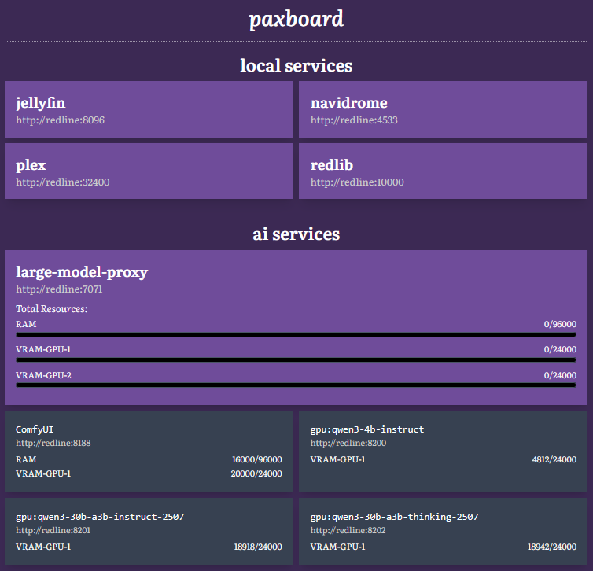
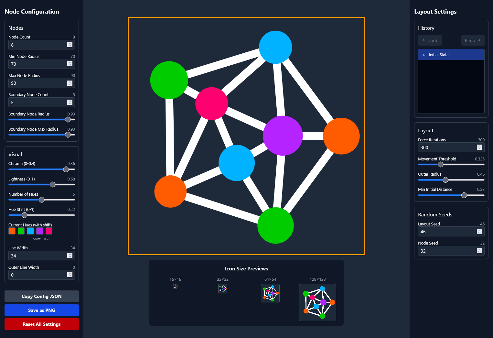

+++
title = "two weeks go by, but not uneventfully"
short = "As usual, recapping the happenings, even if the pace has slowed down"
datetime = 2025-09-03T03:30:00Z

[taxonomies]
tags=["hardware", "paxboard", "genresinspace", "nixos"]
+++

It has been over two weeks since my last update. I've worked on a few things, but not a lot: I realised that, after my last update, that I was running myself ragged, and I'd be better served by taking my foot off the pedal and taking things a bit more leisurely, so that's what I did. That's not to say that I did nothing, though...

<!-- more -->

# secret project

First up: the secret project. As I suggested last time, I was not going to make the deadline, so I pivoted to see if there was something else that was thematically related that I could produce in time. Unfortunately, my efforts fell through there as well, and the experience was sufficiently demotivating for me to cease working on the project entirely.

I haven't touched the project since then, which has put me in a bit of a holding pattern. With the deadline having come and gone, there's no immediate reason to work on it, but I'd still like to get it done, even if my excuse for it not meeting my quality bar - the pressing deadline - is no longer valid. Something I need to get better at is tolerating mediocrity: even if it's not _good_, I should still see it through to completion.

So I don't know. I might pick it up and finish it, just so that it's done, and so that I can write something about it. For now, the frustration involved in its production is acting as a deterrent to revisiting it, but I assume that will clear in due time.

# paxboard

When last this project was touched, I had just ported its rendering to Lua. The ergonomics of that weren't perfect, but they were much nicer than having to recompile my Rust code every time. In the intervening time, I've applied a few updates, but there's nothing particularly exceptional.

The most visible change was to adjust the styling, which was made easier by my setting up Tailwind in watch mode (it was previously run once at startup, as inherited from its previous execution model). It is now significantly more to my sensibilities, and less to Claude's: denser and more angular, what's not to love?



Aside from that, it's mostly been internal changes. Inspired by [Lustre](https://hexdocs.pm/lustre/index.html)'s namespaced HTML elements, I moved all of the HTML element constructors into a `lua:h` namespace, which stops them from polluting the global scope,[^table] but also helps clearly delineate view-shaped code:

[^table]: The Lua `lua:table` library being replaced by a HTML `html:table` constructor is not ideal.

```lua
local function layout(body)
	return h.html { lang = "en-AU" } {
		h.head {} {
			h.title {} "paxboard",
			h.meta { charset = "utf-8" },
			h.meta { name = "viewport", content = "width=device-width, initial-scale=1" },
			h.link { rel = "stylesheet", href = "/styles.css" },
		},
		h.body {
			class = "max-w-[860px] mx-auto text-[var(--color)] bg-[var(--background-color)] p-4 transition-all duration-200 font-['Literata',serif]",
		} {
			h.header { class = "w-full" } {
				h.h1 { class = "text-3xl font-bold mx-auto text-center border-b border-white border-dotted pb-4 italic" } {
					"paxboard",
				},
			},
			h.main({ class = "mt-4 space-y-8" })(body),
		},
	}
end
```

There were other minor code changes, like refactoring and formatting the view code ([StyLua](https://github.com/JohnnyMorganz/StyLua) is quite impressive - I was not expecting it to work as well as it did!), and switching to a Claude-grown eager functional programming library. I was previously using [luafun](https://luafun.github.io/), but the ergonomics of it in Lua aren't very fun,[^falseadvertising] and I'm not processing enough content to require lazy iteration anyway.

[^falseadvertising]: Is this a form of false advertising?

That's not to imply the ergonomics are ideal now: Lua can support functional programming, but the syntax isn't really designed for it, with relatively-verbose function literals and FP chains growing leftward, as opposed to rightward. There's some work I can do on the library side of things to improve this, still, but there's a limit to what I can accomplish from that end.

As a solution - or at least as a salve - I'm considering switching to [Pluto](https://pluto-lang.org/docs/Introduction), which is a Lua 5.4 superset that aggressively extends it with features from other languages, including ternaries, string interpolation, switch expressions, and a pipe operator, all of which would be very welcome for this use case, but this is currently held up on [support in mlua](https://github.com/mlua-rs/mlua/issues/354). Another alternative would be [fennel](https://git.sr.ht/~technomancy/fennel), which wouldn't necessarily solve my problems, but it could give me a new set of potentially more exciting problems!

Anyhow, the more I play around with this, the more convinced I am that I want to spin it out into a semi-general-purpose Lua-dynamic-website-in-a-box solution. This is a space that's already covered by [OpenResty](https://openresty.org/en/) (especially with [Lapis](https://leafo.net/lapis/)) and [redbean](https://redbean.dev/), but the former is more heavyweight than is required for my use cases, and the latter isn't to my design sensibilities. I'd really just like a single-executable[^tailwind] platform that is pointed to a folder and runs that folder as a website: something like [LÖVE's execution model](https://love2d.org/wiki/Game_Distribution), but for websites. I think I'll noodle around with this and see how far I can get with the least amount of effort.

[^tailwind]: or two, with Tailwind. I've considered getting Claude to write a micro-Tailwind-as-a-library implementation that supports everything I care about, but I'm already oversubscribed on projects, so I'll only do this if it bothers me that my 1MB server needs to download and run a 125MB node.js application just to generate its styles. Well, it's certainly inelegant.

Similarly, I'm considering backporting all of this Lua tech to this website: essentially rewriting the majority of it in Lua, and in turn building the SSG variant of what I'm describing above. This might not be the best idea - I'd lose the type safety that I've so come to cherish,[^teal] and the performance might be worse - but it might be worth it, if only because it would drop the friction of changing the website to almost nothing.

[^teal]: unless I set up [Teal](https://teal-language.org/), but that's not compatible with the alt-Lua languages I'd like to use

There are optimisations that are available to me: the Rust SSG is built in debug mode and generates the entire website every time, which means that building the Lua-SSG-host in release mode and pairing it with a persistent DAG that only rebuilds what's necessary would immediately cut down the generation time. I'll figure it out once I come to it; I suspect that this website is small enough that the overhead is basically irrelevant.

Anyway! Lua! What a language! Twenty years on from my first use of it, and I'm still finding ways to experiment with it. It's by no means a perfect language, but its cuteness and pragmatic design makes up for that in spades. As I suggested in [reasons I do not like Python](/notes/programming/reasons-i-do-not-like-python/), it's honest about what it is.

# genresin.space

More work in the eternal slog towards release. I am definitely dragging this out longer than I need to, but _secret project_ made this less of a focus for the last month, and I'm trying to work my way back into it. Anyhow, I pulled the 2025-08-20 update data update in, implemented the resulting missing templates, and populated mixes for the genres that had been documented on Wikipedia between dumps.[^genrecount]

[^genrecount]: 23 of them! It almost makes me wonder if there's some kind of movement that's pushing for these to be filled in. I'm not complaining; after all, the GiS FAQ has a call-to-action that asks the reader to document their favourite genres.

After that, I decided to take care of a long-standing issue - the existing icon for GiS was not legible at small resolutions:


This is because I'd designed it as a logo with a larger resolution in mind:


I'd been hemming-and-hawing about the best way to fix this, but the answer was always going to be obvious: simplify the logo and ensure it pops at icon-size resolutions. Thankfully, due to a decision I made when I originally designed the logo, this ended up being relatively easy.

Reader, I have lied to you. I said that "I" "designed" this icon, but what I actually mean is that I had Claude design a bespoke `html:canvas`-powered interface for deterministically generating the logo. This was absurdly overkill, but it let me spend less time in graphic design applications, so it served its goal well.

Because of this, I was able to direct Claude to do follow-up work on the interface, including adding previews for different sizes, generating colours using [OKLCH](https://evilmartians.com/chronicles/oklch-in-css-why-quit-rgb-hsl), and assigning those colours through basic iterative graph colouring[^graphcolouring]. After making these changes, I then proceeded to tweak the settings until I found a variant of the logo that I was happy with:

[^graphcolouring]: One of the reasons I love working with AI is for matters like this. I can just tell it to implement a graph colouring algorithm that works for this, and it does! Something that would have taken me a day to even test ends up being workable and usable in five minutes. For experimental programming like this, there's simply nothing like it.


This is _significantly_ simpler - we're down to a mere eight nodes, and we've lost the outer circle - and this enables it to finally be legible at smaller resolutions:


I'm happy with it. It no longer looks like a smear in my tablist, and that's really all I can ask for. With that being said, it's still not perfect: the right node rides the right edge a bit too closely, and I could perhaps change how the icon is downscaled to better preserve the whiteness of the lines. However, in the spirit of getting this out the door, I'm happy to say that I'm putting the Claude down and will leave this icon as-is.

By the way, if you're curious, this is what the logo design interface looks like:



As I was saying, this is complete overkill. It has history tracking. It doesn't need history tracking. When you're in a vibe-coding spree, though, the stupidly unnecessary is only a few keystrokes away, so why not?

_Aaaanyway_, I did a few minor fixes and added YouTube search links to each artist shown for a genre, so that you can quickly peruse their oeuvre. All that really remains is to lock in and take care of the things that I've been procrastinating on:

- having a look at _every single genre_, as rendered, one-by-one, to ensure that there aren't any major issues. Annoyingly, I've discovered that the YouTube playlist embeds break if the first video in the playlist has been taken down, and because it's _music on YouTube_, this is rather common.

  I've tried automating the detection of this, but as I'd have to run API queries for each playlist, I'm likely to hit the quota relatively quickly. It deserves a manual examination anyway; I need to see what remains with my own eyes.

- a _styling pass_ to clean up some of the messier aspects of its visual appearance. The more time I spend with it, the less happy I am with it, but again, it's gotta get out the door. I think I'll keep it to tweaking the colour scheme, spacing, and fonts. There will always be more time to fix it later.
- and the thing I'm fearing the most: _mobile and tablet support_. GiS is currently desktop-only. This is a two-part challenge: the first is getting the damn graph to work on mobile, which is non-trivial (see [my previous musings on this](/updates/ups-and-downs-and-sides-to-sides/#genresinspace)), and the second is to make the UI work in space-constrained environments (e.g. a portrait phone).

  I think I just need to sit down and work this out. Worst comes to worst, I can disable the graph entirely and let users explore graph-space by clicking through links: it won't be ideal, but it'll at least let them interact with the data.

# gpu

As mentioned in [the last episode](/updates/only-so-much-steam/#computer), my GPU - a 6700XT that really should not have been failing so soon - was struggling to maintain its grasp on life, which forced me to switch to my iGPU. Unfortunately, I was still seeing issues with random freezes, which I assumed was due to a lack of VRAM on the iGPU, and I was missing my ability to attend the weekly VRChat meetups I run, so I accepted my friend's offer of a RTX 3080 at mates' rates.

It has been wonderful being able to play games again - I replayed the entire Battlefield 3 campaign to test the 3080 - and to participate in social VR events. Delightfully, I'm discovering that this performs better than the 6700XT by some margin, even though they shouldn't be _that_ far apart: I'm getting a solid 144FPS in Beat Saber, which is genuinely surprising, as I just assumed that the game couldn't actually run at full framerate. A silly assumption, perhaps, but a 6700XT should have been plenty for that! I assume that it was struggling in other ways.

Speaking of struggles: I was still getting random freezes and flickering after switching to the 3080, which certainly made me a bit cross. I began to fear that I was a victim-in-the-making of the [9950X3D meltdowns](https://www.extremetech.com/computing/another-amd-9950x3d-cpu-died-asrock-motherboard), especially given the fact that I have an ASRock motherboard that I neglected to update until the freezing started. It was a real vibe-harsher to join a VRChat meetup, only to have my system lock up for two minutes straight.

As a Hail Mary before I started tearing things apart, I installed the latest milestone Windows update. I would have done this earlier, but Windows Update kept failing to do so; this time around, it looks like it took some kind of more severe action to enable it to apply the update. In any case, after waiting nearly an hour, the update was complete and my system has been stable since. I'm not really sure what to make of this: is it possible my 6700XT was fine and my Windows install was just broken?

I wouldn't put it past Windows, but I also can't be bothered to reinstall the 6700XT to find out. I'll keep it around in case something else melts down and evaluate it then.

# study machine

As an aside, I have an old Dell workstation of roughly 2012 vintage from a former employer. Its primary role in recent months has been to shield cables from my robovac, but I was thinking... I have a spare monitor and peripherals, and I'm prone to getting distracted during language study, so why don't I set that machine up with nothing but what's necessary to facilitate study?

I'm pleased to report that I have not only done that, but I've finally partially justified my use of NixOS by partially sharing my existing configuration with that machine's configuration. The declarative dream is finally paying off after years of suffering!

Still, it's not all perfect. Because it's a proprietary Dell machine of a particular vintage, it is rather quirky to work with; I have limited room for modification, which wouldn't be a problem, except the power supply's fan is demented and occasionally makes incredibly loud grinding noises. I think this could be fixed by lubricating the fan and/or replacing the power supply entirely, but as it's a Dell case, extracting the power supply is non-trivial.

For now, I'm applying a little bit of percussive maintenance and wearing headphones. This works for now, but I do wonder at what point I'll be forced to investigate other alternatives. I'd like to keep this machine working so that I don't contribute to the e-waste problem, but at the same time, I could replace it with a 100 USD mini-PC that does the same thing but smaller, better, and quieter. We shall see.
