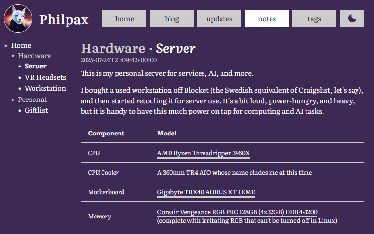
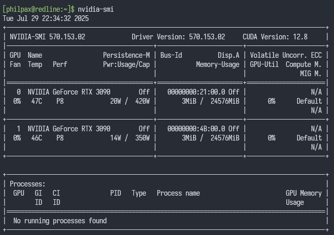
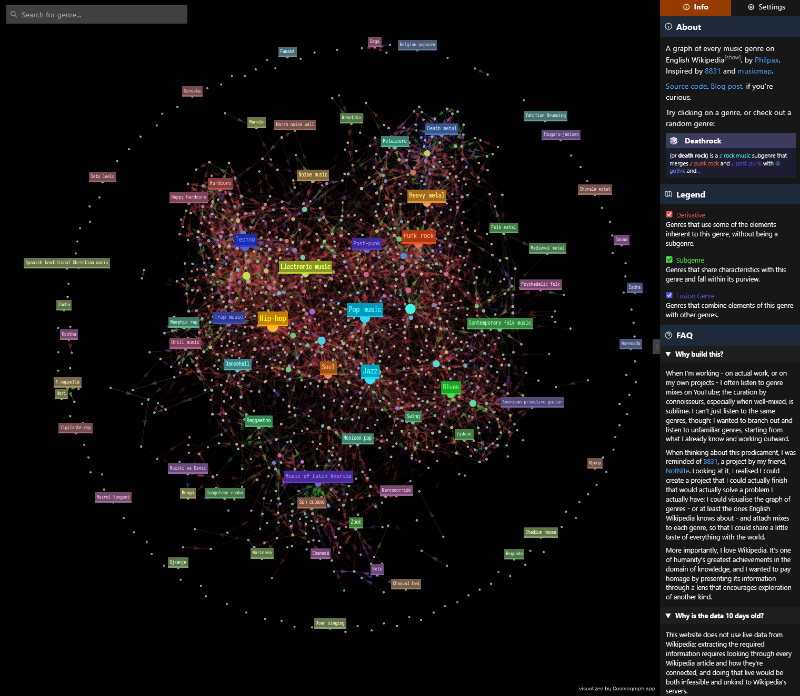

+++
title = "ups and downs and sides to sides"
short = "Taking a Discord break does make you more productive, but it wears off quickly"
datetime = 2025-07-29T21:30:00Z

[taxonomies]
tags=["meta", "genresinspace", "hardware", "nixos"]
+++

My pet project for the last week and a half has been to stay logged out of Discord, my primary social platform, through which I stay in touch with my friends, group chats, and niche news. The goal behind this was simple: I spend a _lot_ of time talking to people on Discord, especially when I'm waiting on things to complete (long-running processes, AI agents, etc) or as junk-food-stimulation for when my brain simply refuses to shift out of neutral. Taking a break should, theoretically, force me to spend more time actually doing the things that I am supposed to be doing.

<!-- more -->

For the first few days, I suppose you could say it worked - I wrote my first update post, and generally had quite a productive week at both work and in my personal endeavours (second-last column):

I'll detail what that involved shortly. Before I do, though, I want to touch upon the natural consequences of doing this: people will ask where you are, you will miss out on things happening, and it gets much more difficult to stay in touch with the Discord-first people who you care about. Much of this can be avoided with prior planning. Indeed, that is something I should have done - but I was obstinate and didn't know for how long I would extend this little vacation, so I just peaced out and let people reach me through alternate means. It worked out, but it probably wasn't the kindest thing to do.

It also put a damper on ongoing Discord-originating events that I was to attend - the regular VR meetups I host, as well as the media-watching I do with my partner and others. For the former, I just didn't attend[^technicalissues], and the latter required me to log onto Discord in appear-offline mode thanks to all of the alternatives being surprisingly terrible.[^facetime] I carefully resisted the temptation to respond to any of my notifications, but I did notice them piling up.

[^technicalissues]: I'm having some technical issues with my workstation that may or may not involve my GPU inching towards another plane of existence.
[^facetime]: FaceTime on macOS ducks system audio when the other participants speak, even when _you're the one screensharing_. There is no way to turn this "feature" off. The recommended method, circa Stack Overflow 6 years ago, was to use `lldb` to patch FaceTime at runtime to disable this functionality. Absolutely insane.

In any case, after this update, I will go ahead and hop on Discord for an hour and clear out my notifications, which I believe to number over ninety now. The majority of them are irrelevant `@everyone`s from servers, but I'm sure there's at least a few that I probably should have looked at a week ago. Ah well. Anyway...

# this website

Something I've wanted for a while is a set of public notes, inspired by existing solutions like my friend [lun-4](https://l4.pm/)'s [wiki](https://l4.pm/wiki/) and [Andy Matuschak's notes](https://notes.andymatuschak.org/About_these_notes). As with the updates, I want a low-friction way of sharing information that I can later polish into a blog post if I see fit. I decided to spend a bit of time implementing this (e.g. tree of Markdown documents -> section), and it works well enough:

I can't complain. There are plenty of improvements I could make; for example:

- there's not enough content, duh
- I don't have a great solution for cross-linking; I can link to the HTML pages that are output, but I should probably resolve links to Markdown documents properly
- the sidebar is _fine_ but it could be better
- there are no tags for the pages

but, realistically, this will serve my needs for the next while, so it's sufficient. Can't let perfect be the enemy of good, no matter how much I want to add per-page versioning. Aside from that, I did some general styling work to better integrate the notes and make things a bit less of a mess on mobile. Nothing significant.

Oh, and I added support for tables. They're fine, I guess. The library I use for Markdown parsing in Rust doesn't handle table headers, so I'm manually bolding them, which is not the visual affectation that I would want to imbue upon them. I could fork the library and try to fix this,[^markdownfix] but it's another thing I'm willing to live with today.

[^markdownfix]: _see:_ "hey Claude, can you add support for parsing GitHub Flavored Markdown table headers in a backwards-compatible way? make sure to add tests"

I'm excited to add more to the notes over time, especially as I can probably just start pasting in my AI notes wholesale and publishing them with just a dash of annotation. Removing them from my personal knowledge base is basically the same as having accepted their knowledge into my mindspace, right?

# my not-so-lil' ai server

Qwen 3 Coder 480B came out last week. I started jokingly looking up the price for the RAM required for a CPU offload, then not-so-jokingly looked at the price of RTX 3090s on Blocket (c.f. Swedish Craigslist). I was able to find an Alienware OEM RTX 3090 at 6,000 SEK (~620 USD), and at a price that comparatively low, I couldn't say no.

This is exciting because it lets me run bigger models at GPU-native speeds.[^models] It also offers me the ability to run the chonkier image / video models, finetune larger models with the same batch size / smaller models faster with a higher batch size, and to multiplex more effectively, so that I can run multiple models simultaneously.

[^models]: e.g. I can now run 70B models with a 4-bit quant with no offloading, and further down the scale, I can run something like Qwen 3 235B with a 2-bit quant and CPU offload

There are two problems with this development. Problem the first is relatively simple: I need to reconfigure my software stack to handle two GPUs, including distributing work and freeing resources accordingly. I've already started by reconfiguring my [`large-model-proxy`](https://github.com/perk11/large-model-proxy) to [split across GPUs where appropriate and handle CPU offloading](https://github.com/philpax/nixos-configuration/blob/c05521cce6b7949b0cfb765dfacb57470b31a6ea/nixos/ai/llms.nix), but there's still some unexplored territory here that will most likely require me to make changes to LMP.[^lmpchanges]

[^lmpchanges]: `large-model-proxy` is relatively naive in how it allocates resources: you define arbitrary resource pools (e.g. `RAM`, `VRAM-GPU-1`, etc), and then indicate ahead of time how much of each resource a given application will take. This works as a first-order approximation, but struggles with dynamic loads (like ComfyUI loading and unloading models) and with dynamic allocation (e.g. `VRAM-GPU-1` is full, spawn tasks on `VRAM-GPU-2`). Fixing both of these is non-trivial; I've started initial discussions with the author on how to do this, but it's not a high priority for either of us.

The second issue is much more irritating to me: two 350W GPUs, as well as an AIO for a Threadripper, produce not-insignificant heat and noise, and it's summer here, and the buildings are well-insulated; I am doing a _lot_ more sweating at my desk than was initially budgeted for. I'm intending to address this to the best of my ability by undervolting the GPUs and dropping power limits on them, as well as leaving the windows open when I can, but it is an unfortunate issue that arises from running a power-hungry beast like this in the corner of my apartment.

# genresin.space

More polish work this week, and some experimental not-so-polish work.

First: editing the FAQ to slim it down and focus on the essentials, preparing for centralised restyling of the website, updating to the 2025-07-20 Wikipedia dump, adding missing templates for the previous, and fixing Tailwind hot-reloading (which had been broken for the entire length of the project and which was [depressingly easy to fix](https://github.com/genresinspace/genresinspace.github.io/commit/30f55d91643ad28dc4bc79d65d7dbf5b911777ca)). The slow march towards release continues.

Second: I've been using Cosmograph to render my graph. It is quite performant at rendering large and dense graphs, and is generally quite an impressive project. However, it comes with some downsides:

- it is not truly open-source, so understanding its behaviour is quite frustrating and requires a combination of experimentation and digging through source maps
- as an additional consequence of it not being open-source, the deeper kind of style customisation I'm doing is unsupported, which requires me to patch it at runtime to change how it renders its labels
- its bundle size dominates my bundle, with it responsible for more than 2MB of my 3MB bundle once its dependencies are counted
- it has a tendency to crash on iOS

Honestly, the only one I really care about is the latter. The rest I can live with; it's not as elegant or as efficient as it could be, but it does the job, especially as I've already done the required code surgery.

Crashing on mobile is unacceptable, though - I'm no fool, I know that the majority of people will access websites for the first time on their phones and tablets, and not many will migrate to their PC. Even accounting for audience selection,[^audience] how many people are _really_ going to reopen the website on their computer after it crashes on their phone?

[^audience]: While I hope that this will make it out to some form of the general public, and that they can use it to undertake their own journeys of sonic exploration, I am realistic and believe that it will primarily be seen by a small technical crowd at most. Even then, though, that crowd would visit it on their phone while on the porcelain throne, because that's what I would do.

Anyway, I'm trying to get around this by experimenting with `react-force-graph-2d`, which solves all of the aforementioned problems:

- it is very much open-source, through and through
- customisation of node rendering is not just supported, it's encouraged (e.g. you have to set up textual rendering yourself)
- its bundle size is significantly smaller, allowing the final bundle to easily compress to sub-200kB
- it doesn't crash on iOS!

Nothing's straightforward in this life, though, and it brings its own set of problems:

- it does not handle resizing of the graph well, which plays poorly with my sidebar
- it mutates the rendered data in-place, which is extremely bad for the integrity of the data and for how React works
- the performance is worse, especially during the warm-up phase where it's running the force simulation
- getting the actual graph to look as good as the tuned Cosmograph I had - in terms of node spacing and legibility - has proven to be a challenge:

vs today's Cosmograph-based solution:

Still, the experiment is ongoing, and I must admit I enjoy the curved connections. I'll try for a bit longer to get it working, and if I can't, I'll just stick with Cosmograph and figure out another workaround for iOS. Could always degrade the experience into encyclopedia mode and not show a graph at all...

# secret project

I am still working on my secret project, even if progress has been slower than I would have liked. It requires more creative ability than my week-long hot streak of four-hours-of-sleep-per-night was providing, and I've been distracted by other endeavours, as the above shows. Regardless, it is still high up on my priority list, and I am making good progress, including building custom tooling to help me plan things out.

The next step is to build out the framework for the actual project, and start producing content for it proper. Let's hope next week's update can be more substantial in that regard: otherwise, I am going to have a serious problem, and it will probably be resolved through more self-flagellation-adjacent productivity hacking.

# reflection

As far as weeks go, it wasn't the worst, but it also did not live up to the expectations I had. I did not get as much done as I was hoping for, due to a variety of factors:

- the heat is a genuine impediment to clear thinking
- I replaced my Discord fix with Bluesky refreshing. Probably need to phase that out too.
- the lack of sleep led to cumulative cognitive addling, which I was _really_ beginning to feel after day 3 or 4
- my focus was still split between projects, and while that works well with how I work and how my interests shift, it's not great for unbroken streaks of work

For the following week, I'll see what I can do to manage these factors; my current thinking involves finding an air-conditioned cafe, taking a laptop there, and null-routing any source of distractions. The problem, of course, is that I know how to overcome the obstacles I put in front of myself, and I fear that I would circumvent any such restrictions the second I had to wait for something with no sufficiently-productive task queued up.

With that being said, however, I actually did very well at avoiding Discord: the friction of having to start the app on desktop, and having to log back into mobile, was sufficient-enough disincentive to snap out of muscle memory and shut the app down before it could weave its tendrils through my poorly-defended membrane.

Upwards and onwards; this candle still has plenty to burn.
