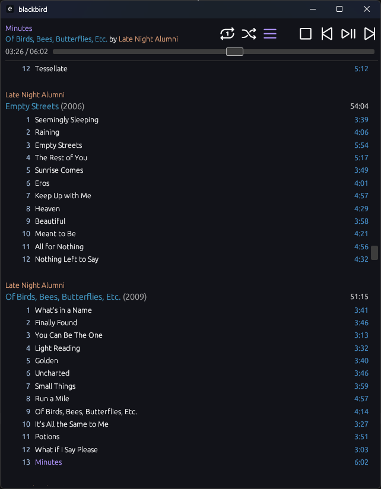
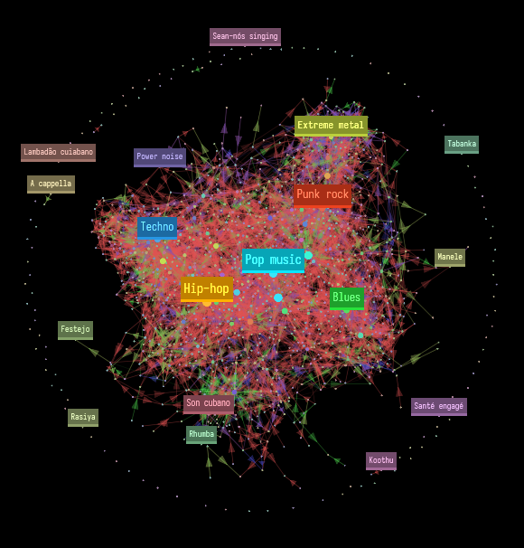
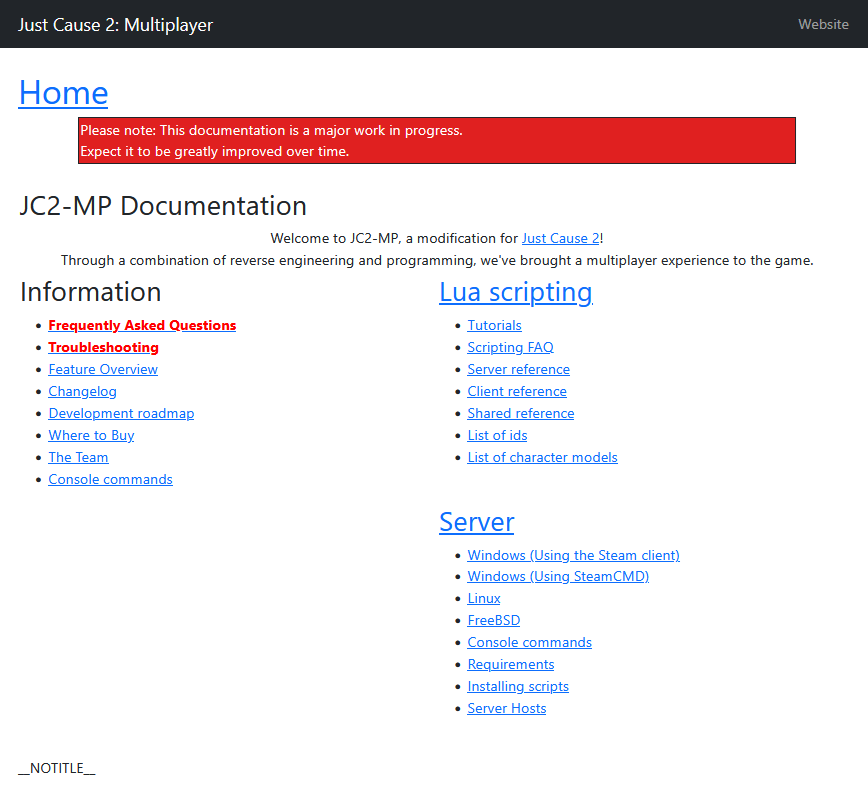

+++
title = "when you add an updates section and then don't use it for two months"
short = "Blog posts have a high bar associated with them. Updates should not. Unfortunately, even that is too much sometimes..."
date = 2025-07-23

[taxonomies]
tags=["meta", "blackbird", "genresinspace", "jc2mp"]
+++

As is usually the case, I find myself in a state of paralysis with regards to writing blog posts: whatever I write needs to be worthy of taking a prominent spot on my front page, which has prevented me from documenting the day-to-day out of a fear of banality. To counteract that, I have brought this section into existence for off-the-cuff updates that don't have to be held to the same standard.

Unfortunately, the work for this was complete over a month ago, and I've been holding off on merging it because I hadn't actually written an update: no amount of website tech can help you if the problem resides between the keyboard and the chair. To force myself to get a move on, here are some relatively succinct summaries of the plates I'm spinning at this moment.[^succinct]

[^succinct]: as I get further into this post, I realise succinctness is hard and this is very much a lie

<!-- more -->

# this website

It took _much_ longer than desirable to ship the initial version of the website by virtue of my needless desire to Rewrite It In Rust, including [my own SSG](https://github.com/philpax/philpax.github.io) and [HTML templating library](https://github.com/philpax/paxhtml) and asset baking and so on and so forth. Anyway, it was done months ago. Still haven't written anything, though.

I added an updates section. I'm about to add a notes section. The buttons on the top are not of even width. This bothers me.

In hindsight, I wish I'd used Figma to design how the website looks; I'm happy with the way it turned out, but I suspect I could have reached this conclusion - and perhaps gone further still - if I wasn't stubborn enough to rawdog the HTML/CSS process.

Speaking of which, I [Tailwind](https://tailwindcss.com/)-ized the website a few months ago. Once I started using Tailwind elsewhere, I found myself unable to tolerate the great big mess of CSS styles that lay beneath the initial version of this website, and I found myself with a burning desire to delete as much CSS as possible. Claude got me a reasonable amount in, but I had to go in and fix a bunch of details, and there's still a few things that are either still using homegrown CSS or are just slightly off from what they should be.

And that's okay! I... can't... let... perfectionism... get... the... better... of... me.[^perfectionism]

[^perfectionism]: you are about to see that this is one of the bigger fibs I tell myself

# blackbird

`blackbird` is my custom OpenSubsonic/Navidrome frontend (i.e. a music player). It's built with Rust, `egui`, and considerable help from Claude.[^claude] It is heavily inspired by a [foobar2000](https://www.foobar2000.org/) theme that I fashioned a great many years ago; as I find myself on other platforms, I yearn for a music player that works how _I_ want it to, not by what seventeen product managers at Spotify believe will make the KPIs go up.[^spotify]

[^claude]: A common theme: the shoemaker's children go barefoot. I dream in features, not in the perfectionism of code.
[^spotify]: No shade on them, I'm sure they're making the company a lot of money, but man, I just want something that plays music from my library in a sequential order and that won't disappear my music overnight.

It's in a largely functional state, if by _functional_, I mean "it plays music, but it is completely incapable of moving to the next track, whether that be by in-order or shuffle." It displays a reasonably-compact-and-pretty UI that's geared to my specific tastes - sans album art, that's simply too hard - and I can pick a track to play on repeat. Happily, I am quite compatible with listening to the same track on repeat, so the lack of a functional queue has not been as much of an impediment as it might be to normal people.

With that being said, I would like to address this and, to the greatest possible extent, remove my dependency on Spotify. I have a vibe-coded queue system that almost works, so the hope is that it's only an hour or two of effort to get it to where it needs to be.

Speaking of Spotify, I built tooling to help me exit. `blackbird-spotcheck` ingests my entire Spotify listening history and other metadata (thank you GDPR), collates albums by the listen count of their constituent tracks, and then fuzzy-matches them against my Navidrome library to determine what heavily-listened albums I need to purchase to address the gap. It works! And it works quite well, as I'm at 41 Bandcamp purchases and counting.[^sinsoftheyouth]

[^sinsoftheyouth]: I work in tech and I have decades of "acquired" music to atone for. I may have feelings about intellectual property, the nature of the music industry, the artist economy, and the unfairness of the economy at large, but I can do this, at least.

Upon downloading said purchases, I realised that I'd need to bring them into my music collection's folder structure. In the olden days, I used foobar2000's native support for this, but I don't currently have it installed and my music lives in another ~~castle~~ PC anyway. This is a solved problem. I know this is a solved problem. [`beets`](https://beets.io/) exists. I might even use it at some point.

Anyway, I'm stupid and stubborn, so I created `blackbird-id3mover` to read the tags of my downloads and to bring them in line with the naming scheme that I've been using for the last decade. Worth noting: I had to go through three Rust libraries to find one that would consistently load the tags of both MP3 and FLAC Files; in the time I spent doing this, I could have set beets up. Can't help it, though. It's just the way I'm wired.[^claudebae] At least I'll never have to set it up again!

[^claudebae]: Also, it helps that Claude wrote all of the code. Well, hard to say about "all", but it wrote over 90% of it, with the rest being taste on my part. It was responsible for switching the libraries over, too. God, I love that AI.

# genresin.space

For some reason, it always comes back to Wikipedia: this absolutely beautiful smorgasbord of information, collaboratively edited by millions over two decades, deserves to have the most made of it and to be recontextualised into as many forms as it can be. For this year, it appears my expression of this sentiment is [genresin.space](https://genresin.space), which parses every genre and every artists' Wikipedia pages to produce a wonderfully-connected graph of genres that enables exploration, discovery, and a greater understanding of what's out there. (My Western arse has seen so little of the world's music: how can Brazil create that many genres?)

It was meant to be a project between jobs, and 90% of it was done back in March or April. The problem is, of course, the remaining 90%: making this the best experience it can possibly be, complete with rendering of wikitext for genres (with hundreds of templates that need to be implemented), a mix or playlist for all 1300 genres (to the greatest possible extent that I could, anyway), hot-patching Cosmograph so that I can style it how I want, making the data extraction/generation process run fast enough for iteration, optimising the resulting data to not make the user download dozens of megabytes on load, dealing with bugs everywhere, and general polish.

So it's not done yet. But it is really, really close. I can feel it: I set myself a deadline of today to be feature-complete, and I have more or less made it. No more features! I simply can't afford to waste more time on this. I have a list of things I need to do and fix before I can call it done, and by Jove, I'm going to do it, because...

# secret project

I have a secret project I am ramping up on. This is going to take the majority of my free time for the next month. I'm not sure how well it'll go, but I have a relatively hard deadline, so I can't tolerate the usual kind of scope creep. It must get done, one way or another. I won't write much about it here, but I may do a retrospective afterwards.

# jc2-mp wiki resurrection

On a sad day in March of 2022, [a datacenter in Strasbourg caught fire](https://www.datacenterdynamics.com/en/opinions/ovhclouds-data-center-fire-one-year-on-what-do-we-know/). This is, in some ways, an incredibly funny event; three years on, I still joke about it: it's just kind of a surreal thing to happen! Unfortunately, however, this datacenter happened to be hosting the website, wiki, and other services for [Just Cause 2: Multiplayer](https://jc-mp.com/), a foundational project that I worked on over a decade ago that's responsible for my current life trajectory. I will always have a degree of nostalgia for it, and some other people, do: they even occasionally want to write scripts for their own servers.

For that, they'll need the wiki with all of the documentation for the API. We have [backups](https://github.com/jc2mp/wiki) - incomplete, but backups nonetheless - and we could bring it back; these days, however, we're cheap fucks and the less server maintenance we do, the better. We were simply not going to run MediaWiki. This put us (well, mostly me: the others have largely moved on) at a bit of an impasse: browsing the wikitext repo dump works, but it _sucks_ as an experience. I mean, come on, you have to read wikitext! I wouldn't wish that on my worst enemy!

So, while working on both my website and GiS one day, I had a realisation: the website features a relatively-strong HTML templating mechanism ([`paxhtml`](https://github.com/philpax/paxhtml)) and GiS features a relatively-strong wikitext "parser" ([`wikitext_simplified`](https://github.com/philpax/wikitext_simplified)).[^wikitext] The usual ADHD thought spiral began: what if I combined these two and built a SSG for the wiki? The very few people who are still interested in editing this are comfortable making PRs, and it would allow them to view the content in a format quite similar to the original wiki.

[^wikitext]: All of the hard work of actually parsing wikitext is done by `parse-wiki-text-2`, which is a fork of `parse_wiki_text`. `wikitext_simplified` wraps around the token-ish interface of PWT and provides more of an AST, which is easier to work with. `parse_wiki_text` was created by Fredrik Portström, who disappeared off the internet some time after publishing this truly beautiful crate; God's angels can't stick around after their work's done, I suppose. No, seriously, I would like to buy this man a beer. I will say as much in the eventual blog post.

I made decent progress, but ran into a few issues:

- wikitext remains a cursed format to handle correctly; there are all kinds of wonderful nuances and quirks around how content should be presented
- template instantiation and substitution is challenging to get right, with instantiation influencing parsing (!!). You have to parse, instantiate any templates, then reparse the output, and do this until you reach a quiescent state. Awful.
- styling the wiki to a standard I'm happy with would require some work. It's currently using Bootstrap, but I don't love how it looks. Once I'm done with functionality, I reckon I'll just let Claude go wild with Tailwind until it looks roughly right.

Anyway, this is pretty low in my priority stack: nobody is really clamouring for this, but it's something I want to get done as a matter of pride. It'll happen some day.

# llmcord

I have [a Discord bot](https://github.com/philpax/llmcord), written in God's own crabby language, hooked up to [a battery of LLMs](https://github.com/philpax/nixos-configuration/blob/main/nixos/ai/llms.nix). As part of my general interest in combining procedural synthesis with NNs, I've wired up a Lua interpreter in-bot to allow for guided LLM generation, including using multiple models to converse with each other. This works as a proof of concept, and it's kind of neat, but, well... I love Lua, but it's not well-suited to this. A LLM produces a stream of tokens; this can be modelled as a coroutine that yields new tokens, and that's indeed what I do, but how do you model _multiple_ LLMs generating tokens concurrently?

I just don't think Lua is a great fit for this, so I've been looking at other languages on the side. Here's a rough list of my thoughts on the matter:

- **Python**: Absolutely fucking not. I despise this language. I refuse to write more of it in my personal time than I have to. The PHP of the 2020s does not need more attention from me.
- **TypeScript**: Maybe. I could embed Deno. Not sure how difficult this would be, and it's quirky in its own way, but I know that muxing async streams is posible.
- **Ruby**: I would love to make this work, but I'm not sure what the current state of Artichoke Ruby is, and I also don't know how well it would deal with managing streams.
- **Rust/WASM**: I've been down this road before. It's hurt me. I know I don't have it in me to fight with the WASM Component Model and compile times again. Something about it compels me, though...
- **C# or F#**: Embedding CoreCLR (or whatever they're calling it this year) is a pain in the arse; it's very obvious that it wasn't meant for this, and there are no facilities for binding host functions for access in the guest. Still, it's compelling; C# is a bit verbose, but F# could be quite nice.
- **Haskell/WASM**: This would be even more miserable than Rust/WASM. Kinda sexy, though.
- **A Lisp of some kind**: Maybe. Not sure about which Lisp or how I'd embed it, but I could imagine a future in which I embed Deno and then run a ClojureScript compiler on the side.
- **Swift**: Is embedding this even possible? Could be quite nice if it was!

In any case, I may have to give up on using Rust as a host language if embedding becomes especially onerous. The .NET languages are far more accessible if you use them as both host and guest, using something like [CasCore](https://github.com/DouglasDwyer/CasCore). I won't rule that out, but it would be a shame if I had to, especially because I have [a wonderful lil' library for operating ComfyUI](https://github.com/philpax/rucomfyui) that would be nice to expose to the guest...

# language study

I've been learning Swedish[^swedish] and Japanese[^japanese] on-and-off for the last few years, with "off" dominating. I am working on kicking things back into high gear, though; I'm fully caught up on my SRS cards, I'm using Babbel instead of Duolingo for Swedish (I wish I had done this five hundred days ago), and I'm making more of an active study plan. I don't expect any kind of fluency in either language any time soon, but I hope to internalise the fundamental lesson: it's a marathon, not a sprint.

[^swedish]: I have lived in Sweden for over four years and hope to gain citizenship in the next 2-3 years.
[^japanese]: I'm a weeb

Also, learning two languages at the same time does strange things to your brain, but that's to be expected. _Jag heter Philpax desu_.

# other things

To wrap things up, I'm not actually wrapping up. There are a few curios worth mentioning:

- I continue to lead [the plugin approval committee for the Dalamud ecosystem](https://github.com/goatcorp/DalamudPluginsD17)
- I'm slowly adding more self-hosted services to my NixOS-powered server; thanks to the power of Tailscale, I can avoid thinking about how to make it public-facing in a safe way
- I have a bespoke personal knowledge base to spec out. The big idea: time as a dimension - I want a graph of knowledge, situated in time, so that I can see how my thinking has evolved and to easily colocate events in time
- I occasionally take my camera out and take photos of things; this has been stymied by the need to edit those photos, which I suspect will require me to pay a monthly tithe to Adobe. I tried using Darktable. I really did, honest.
- I have another secret project that I put on the backburner last year that I would like to revisit some day and ship in some form. Can't talk about it until it gets somewhere presentable.

With that being said, I have undiagnosed ADHD. I look forward to writing the next update, which I hope will be _much_ shorter!
